.. _actionangle:

Action-angle coordinates
=========================

galpy can calculate actions and angles for a large variety of
potentials (any time-independent potential in principle). These are
implemented in a separate module ``galpy.actionAngle``, and the
preferred method for accessing them is through the routines in this
module. There is also some support for accessing the actionAngle
routines as methods of the ``Orbit`` class.

.. TIP::
   If you want to quickly and easily compute actions, angles, or frequencies using the Staeckel approximation, using the ``Orbit`` interface as described in :ref:`this section <aaorbit>` is recommended. Especially if you are starting from observed coordinates, as ``Orbit`` instances can easily be initialized using these.

Since v1.2, galpy can also compute positions and velocities
corresponding to a given set of actions and angles for axisymmetric
potentials using the TorusMapper code of `Binney & McMillan (2016)
<http://adsabs.harvard.edu/abs/2016MNRAS.456.1982B>`__. This is
described in :ref:`this section <aatorus>` below. The interface for
this is different than for the other action-angle classes, because the
transformations are generally different.

Action-angle coordinates can be calculated for the following
potentials/approximations:

* Isochrone potential
* Spherical potentials
* Adiabatic approximation
* Staeckel approximation
* A general orbit-integration-based technique

There are classes corresponding to these different
potentials/approximations and actions, frequencies, and angles can
typically be calculated using these three methods:

* __call__: returns the actions
* actionsFreqs: returns the actions and the frequencies
* actionsFreqsAngles: returns the actions, frequencies, and angles

These are not all implemented for each of the cases above yet.

The adiabatic and Staeckel approximation have also been implemented in
C and using grid-based interpolation, for extremely fast action-angle
calculations (see below).

Action-angle coordinates for the isochrone potential
-----------------------------------------------------

The isochrone potential is the only potential for which all of the
actions, frequencies, and angles can be calculated analytically. We
can do this in galpy by doing

>>> from galpy.potential import IsochronePotential
>>> from galpy.actionAngle import actionAngleIsochrone
>>> ip= IsochronePotential(b=1.,normalize=1.)
>>> aAI= actionAngleIsochrone(ip=ip)

``aAI`` is now an instance that can be used to calculate action-angle
variables for the specific isochrone potential ``ip``. Calling this
instance returns :math:`(J_R,L_Z,J_Z)`

>>> aAI(1.,0.1,1.1,0.1,0.) #inputs R,vR,vT,z,vz
# (array([ 0.00713759]), array([ 1.1]), array([ 0.00553155]))

or for a more eccentric orbit

>>> aAI(1.,0.5,1.3,0.2,0.1)
# (array([ 0.13769498]), array([ 1.3]), array([ 0.02574507]))

Note that we can also specify ``phi``, but this is not necessary

>>> aAI(1.,0.5,1.3,0.2,0.1,0.)
# (array([ 0.13769498]), array([ 1.3]), array([ 0.02574507]))

We can likewise calculate the frequencies as well

>>> aAI.actionsFreqs(1.,0.5,1.3,0.2,0.1,0.)
# (array([ 0.13769498]),
#  array([ 1.3]),
#  array([ 0.02574507]),
#  array([ 1.29136096]),
#  array([ 0.79093738]),
#  array([ 0.79093738]))

The output is :math:`(J_R,L_Z,J_Z,\Omega_R,\Omega_\phi,\Omega_Z)`. For
any spherical potential, :math:`\Omega_\phi =
\mathrm{sgn}(L_Z)\Omega_Z`, such that the last two frequencies are the
same.

We obtain the angles as well by calling

>>> aAI.actionsFreqsAngles(1.,0.5,1.3,0.2,0.1,0.)
# (array([ 0.13769498]),
#  array([ 1.3]),
#  array([ 0.02574507]),
#  array([ 1.29136096]),
#  array([ 0.79093738]),
#  array([ 0.79093738]),
#  array([ 0.57101518]),
#  array([ 5.96238847]),
#  array([ 1.24999949]))

The output here is
:math:`(J_R,L_Z,J_Z,\Omega_R,\Omega_\phi,\Omega_Z,\theta_R,\theta_\phi,\theta_Z)`.

To check that these are good action-angle variables, we can calculate
them along an orbit

>>> from galpy.orbit import Orbit
>>> o= Orbit([1.,0.5,1.3,0.2,0.1,0.])
>>> ts= numpy.linspace(0.,100.,1001)
>>> o.integrate(ts,ip)
>>> jfa= aAI.actionsFreqsAngles(o.R(ts),o.vR(ts),o.vT(ts),o.z(ts),o.vz(ts),o.phi(ts))

which works because we can provide arrays for the ``R`` etc. inputs.

We can then check that the actions are constant over the orbit

>>> plot(ts,numpy.log10(numpy.fabs((jfa[0]-numpy.mean(jfa[0])))))
>>> plot(ts,numpy.log10(numpy.fabs((jfa[1]-numpy.mean(jfa[1])))))
>>> plot(ts,numpy.log10(numpy.fabs((jfa[2]-numpy.mean(jfa[2])))))

which gives

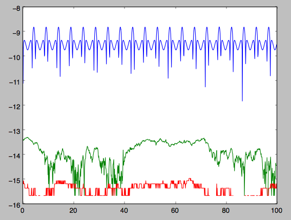

The actions are all conserved. The angles increase linearly with time

>>> plot(ts,jfa[6],'b.')
>>> plot(ts,jfa[7],'g.')
>>> plot(ts,jfa[8],'r.')

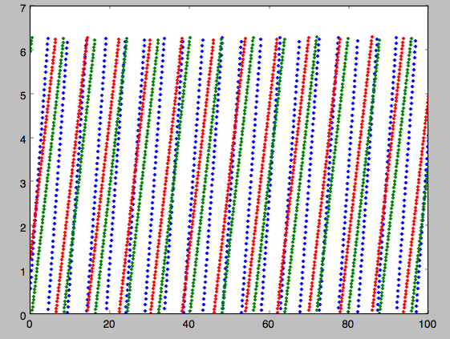

Action-angle coordinates for spherical potentials
--------------------------------------------------

Action-angle coordinates for any spherical potential can be calculated
using a few orbit integrations. These are implemented in galpy in the
``actionAngleSpherical`` module. For example, we can do

>>> from galpy.potential import LogarithmicHaloPotential
>>> lp= LogarithmicHaloPotential(normalize=1.)
>>> from galpy.actionAngle import actionAngleSpherical
>>> aAS= actionAngleSpherical(pot=lp)

For the same eccentric orbit as above we find

>>> aAS(1.,0.5,1.3,0.2,0.1,0.)
# (array([ 0.22022112]), array([ 1.3]), array([ 0.02574507]))
>>> aAS.actionsFreqs(1.,0.5,1.3,0.2,0.1,0.)
# (array([ 0.22022112]),
#  array([ 1.3]),
#  array([ 0.02574507]),
#  array([ 0.87630459]),
#  array([ 0.60872881]),
#  array([ 0.60872881]))
>>> aAS.actionsFreqsAngles(1.,0.5,1.3,0.2,0.1,0.)
# (array([ 0.22022112]),
#  array([ 1.3]),
#  array([ 0.02574507]),
#  array([ 0.87630459]),
#  array([ 0.60872881]),
#  array([ 0.60872881]),
#  array([ 0.40443857]),
#  array([ 5.85965048]),
#  array([ 1.1472615]))

We can again check that the actions are conserved along the orbit and
that the angles increase linearly with time:

>>> o.integrate(ts,lp)
>>> jfa= aAS.actionsFreqsAngles(o.R(ts),o.vR(ts),o.vT(ts),o.z(ts),o.vz(ts),o.phi(ts),fixed_quad=True)

where we use ``fixed_quad=True`` for a faster evaluation of the
required one-dimensional integrals using Gaussian quadrature. We then
plot the action fluctuations

>>> plot(ts,numpy.log10(numpy.fabs((jfa[0]-numpy.mean(jfa[0])))))
>>> plot(ts,numpy.log10(numpy.fabs((jfa[1]-numpy.mean(jfa[1])))))
>>> plot(ts,numpy.log10(numpy.fabs((jfa[2]-numpy.mean(jfa[2])))))

which gives

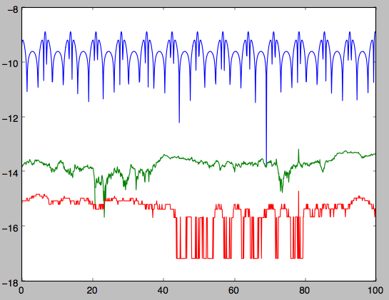

showing that the actions are all conserved. The angles again increase
linearly with time

>>> plot(ts,jfa[6],'b.')
>>> plot(ts,jfa[7],'g.')
>>> plot(ts,jfa[8],'r.')

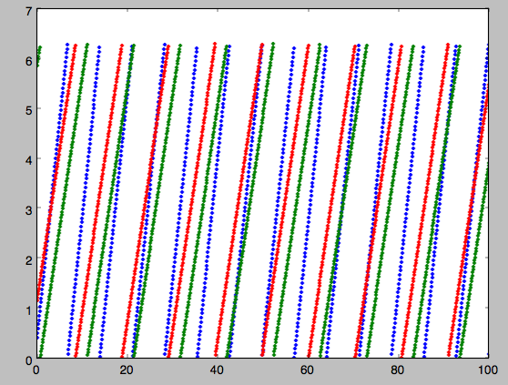

We can check the spherical action-angle calculations against the
analytical calculations for the isochrone potential. Starting again
from the isochrone potential used in the previous section

>>> ip= IsochronePotential(b=1.,normalize=1.)
>>> aAI= actionAngleIsochrone(ip=ip)
>>> aAS= actionAngleSpherical(pot=ip)

we can compare the actions, frequencies, and angles computed using
both

>>> aAI.actionsFreqsAngles(1.,0.5,1.3,0.2,0.1,0.)
# (array([ 0.13769498]),
#  array([ 1.3]),
#  array([ 0.02574507]),
#  array([ 1.29136096]),
#  array([ 0.79093738]),
#  array([ 0.79093738]),
#  array([ 0.57101518]),
#  array([ 5.96238847]),
#  array([ 1.24999949]))
>>> aAS.actionsFreqsAngles(1.,0.5,1.3,0.2,0.1,0.)
# (array([ 0.13769498]),
#  array([ 1.3]),
#  array([ 0.02574507]),
#  array([ 1.29136096]),
#  array([ 0.79093738]),
#  array([ 0.79093738]),
#  array([ 0.57101518]),
#  array([ 5.96238838]),
#  array([ 1.2499994]))

or more explicitly comparing the two

>>> [r-s for r,s in zip(aAI.actionsFreqsAngles(1.,0.5,1.3,0.2,0.1,0.),aAS.actionsFreqsAngles(1.,0.5,1.3,0.2,0.1,0.))]
# [array([  6.66133815e-16]),
#  array([ 0.]),
#  array([ 0.]),
#  array([ -4.53851845e-10]),
#  array([  4.74775219e-10]),
#  array([  4.74775219e-10]),
#  array([ -1.65965242e-10]),
#  array([  9.04759645e-08]),
#  array([  9.04759649e-08])]

Action-angle coordinates using the adiabatic approximation
-----------------------------------------------------------

For non-spherical, axisymmetric potentials galpy contains multiple
methods for calculating approximate action--angle coordinates. The
simplest of those is the adiabatic approximation, which works well for
disk orbits that do not go too far from the plane, as it assumes that
the vertical motion is decoupled from that in the plane (e.g.,
`2010MNRAS.401.2318B
<http://adsabs.harvard.edu/abs/2010MNRAS.401.2318B>`_).

Setup is similar as for other actionAngle objects

>>> from galpy.potential import MWPotential2014
>>> from galpy.actionAngle import actionAngleAdiabatic
>>> aAA= actionAngleAdiabatic(pot=MWPotential2014)

and evaluation then proceeds similarly as before

>>> aAA(1.,0.1,1.1,0.,0.05)
# (0.01351896260559274, 1.1, 0.0004690133479435352)

We can again check that the actions are conserved along the orbit

>>> from galpy.orbit import Orbit
>>> ts=numpy.linspace(0.,100.,1001)
>>> o= Orbit([1.,0.1,1.1,0.,0.05])
>>> o.integrate(ts,MWPotential2014)
>>> js= aAA(o.R(ts),o.vR(ts),o.vT(ts),o.z(ts),o.vz(ts))

This takes a while. The adiabatic approximation is also implemented in
C, which leads to great speed-ups. Here is how to use it

>>> timeit(aAA(1.,0.1,1.1,0.,0.05))
# 10 loops, best of 3: 73.7 ms per loop
>>> aAA= actionAngleAdiabatic(pot=MWPotential2014,c=True)
>>> timeit(aAA(1.,0.1,1.1,0.,0.05))
# 1000 loops, best of 3: 1.3 ms per loop

or about a *50 times* speed-up. For arrays the speed-up is even more
impressive

>>> s= numpy.ones(100)
>>> timeit(aAA(1.*s,0.1*s,1.1*s,0.*s,0.05*s))
# 10 loops, best of 3: 37.8 ms per loop
>>> aAA= actionAngleAdiabatic(pot=MWPotential2014) #back to no C
>>> timeit(aAA(1.*s,0.1*s,1.1*s,0.*s,0.05*s))
# 1 loops, best of 3: 7.71 s per loop

or a speed-up of 200! Back to the previous example, you can run it
with ``c=True`` to speed up the computation

>>> aAA= actionAngleAdiabatic(pot=MWPotential2014,c=True)
>>> js= aAA(o.R(ts),o.vR(ts),o.vT(ts),o.z(ts),o.vz(ts))

We can plot the radial- and vertical-action fluctuation as a function
of time

>>> plot(ts,numpy.log10(numpy.fabs((js[0]-numpy.mean(js[0]))/numpy.mean(js[0]))))
>>> plot(ts,numpy.log10(numpy.fabs((js[2]-numpy.mean(js[2]))/numpy.mean(js[2]))))

which gives

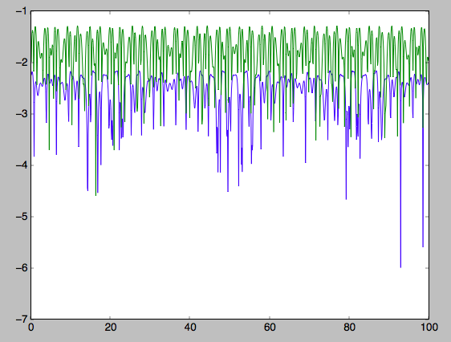

The radial action is conserved to about half a percent, the vertical
action to two percent.

Another way to speed up the calculation of actions using the adiabatic
approximation is to tabulate the actions on a grid in (approximate)
integrals of the motion and evaluating new actions by interpolating on
this grid. How this is done in practice is described in detail in the
galpy paper. To setup this grid-based interpolation method, which is
contained in ``actionAngleAdiabaticGrid``, do

>>> from galpy.actionAngle import actionAngleAdiabaticGrid
>>> aAG= actionAngleAdiabaticGrid(pot=MWPotential2014,nR=31,nEz=31,nEr=51,nLz=51,c=True)

where ``c=True`` specifies that we use the C implementation of
``actionAngleAdiabatic`` for speed. We can now evaluate in the same
was as before, for example

>>> aAA(1.,0.1,1.1,0.,0.05), aAG(1.,0.1,1.1,0.,0.05)
# ((array([ 0.01352523]), array([ 1.1]), array([ 0.00046909])),
#  (0.013527010324238781, 1.1, 0.00047747359874375148))

which agree very well. To look at the timings, we first switch back to
not using C and then list all of the relevant timings:

>>> aAA= actionAngleAdiabatic(pot=MWPotential2014,c=False)
# Not using C, direct calculation
>>> timeit(aAA(1.*s,0.1*s,1.1*s,0.*s,0.05*s))
# 1 loops, best of 3: 9.05 s per loop
>>> aAA= actionAngleAdiabatic(pot=MWPotential2014,c=True)
# Using C, direct calculation
>>> timeit(aAA(1.*s,0.1*s,1.1*s,0.*s,0.05*s))
# 10 loops, best of 3: 39.7 ms per loop
# Grid-based calculation
>>> timeit(aAG(1.*s,0.1*s,1.1*s,0.*s,0.05*s))
# 1000 loops, best of 3: 1.09 ms per loop

Thus, in this example (and more generally) the grid-based calculation
is significantly faster than even the direct implementation in C. The
overall speed up between the direct Python version and the grid-based
version is larger than 8,000; the speed up between the direct C
version and the grid-based version is 36. For larger arrays of input
phase-space positions, the latter speed up can increase to 150.  For
simpler, fully analytical potentials the speed up will be slightly
less, but for ``MWPotential2014`` and other more complicated
potentials (such as those involving a double-exponential disk), the
overhead of setting up the grid is worth it when evaluating more than
a few thousand actions.

The adiabatic approximation works well for orbits that stay close to
the plane. The orbit we have been considering so far only reaches a
height two percent of :math:`R_0`, or about 150 pc for :math:`R_0 = 8`
kpc.

>>> o.zmax()*8.
# 0.17903686455491979

For orbits that reach distances of a kpc and more from the plane, the
adiabatic approximation does not work as well. For example,

>>> o= Orbit([1.,0.1,1.1,0.,0.25])
>>> o.integrate(ts,MWPotential2014)
>>> o.zmax()*8.
# 1.3506059038621048

and we can again calculate the actions along the orbit

>>> js= aAA(o.R(ts),o.vR(ts),o.vT(ts),o.z(ts),o.vz(ts))
>>> plot(ts,numpy.log10(numpy.fabs((js[0]-numpy.mean(js[0]))/numpy.mean(js[0]))))
>>> plot(ts,numpy.log10(numpy.fabs((js[2]-numpy.mean(js[2]))/numpy.mean(js[2]))))

which gives

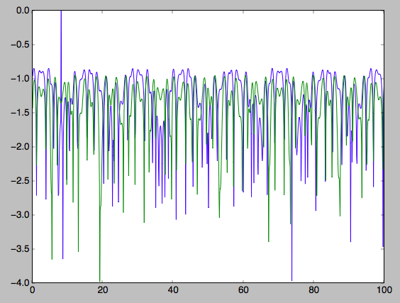

The radial action is now only conserved to about ten percent and the
vertical action to approximately five percent.

.. WARNING::
   Frequencies and angles using the adiabatic approximation are not implemented at this time.

.. _actionanglestaeckel:

Action-angle coordinates using the Staeckel approximation
-----------------------------------------------------------

A better approximation than the adiabatic one is to locally
approximate the potential as a Staeckel potential, for which actions,
frequencies, and angles can be calculated through numerical
integration. galpy contains an implementation of the algorithm of
Binney (2012; `2012MNRAS.426.1324B
<http://adsabs.harvard.edu/abs/2012MNRAS.426.1324B>`_), which
accomplishes the Staeckel approximation for disk-like (i.e., oblate)
potentials without explicitly fitting a Staeckel potential. For all
intents and purposes the adiabatic approximation is made obsolete by
this new method, which is as fast and more precise. The only advantage
of the adiabatic approximation over the Staeckel approximation is that
the Staeckel approximation requires the user to specify a *focal
length* :math:`\Delta` to be used in the Staeckel
approximation. However, this focal length can be easily estimated from
the second derivatives of the potential (see Sanders 2012;
`2012MNRAS.426..128S
<http://adsabs.harvard.edu/abs/2012MNRAS.426..128S>`_).

Starting from the second orbit example in the adiabatic section above,
we first estimate a good focal length of the ``MWPotential2014`` to
use in the Staeckel approximation. We do this by averaging (through
the median) estimates at positions around the orbit (which we
integrated in the example above)

>>> from galpy.actionAngle import estimateDeltaStaeckel
>>> estimateDeltaStaeckel(MWPotential2014,o.R(ts),o.z(ts))
# 0.40272708556203662

We will use :math:`\Delta = 0.4` in what follows. We set up the
``actionAngleStaeckel`` object

>>> from galpy.actionAngle import actionAngleStaeckel
>>> aAS= actionAngleStaeckel(pot=MWPotential2014,delta=0.4,c=False) #c=True is the default

and calculate the actions

>>> aAS(o.R(),o.vR(),o.vT(),o.z(),o.vz())
# (0.019212848866725911, 1.1000000000000001, 0.015274597971510892)

The adiabatic approximation from above gives

>>> aAA(o.R(),o.vR(),o.vT(),o.z(),o.vz())
# (array([ 0.01686478]), array([ 1.1]), array([ 0.01590001]))

The actionAngleStaeckel calculations are sped up in two ways. First,
the action integrals can be calculated using Gaussian quadrature by
specifying ``fixed_quad=True``

>>> aAS(o.R(),o.vR(),o.vT(),o.z(),o.vz(),fixed_quad=True)
# (0.01922167296633687, 1.1000000000000001, 0.015276825017286706)

which in itself leads to a ten times speed up

>>> timeit(aAS(o.R(),o.vR(),o.vT(),o.z(),o.vz(),fixed_quad=False))
# 10 loops, best of 3: 129 ms per loop
>>> timeit(aAS(o.R(),o.vR(),o.vT(),o.z(),o.vz(),fixed_quad=True))
# 100 loops, best of 3: 10.3 ms per loop

Second, the actionAngleStaeckel calculations have also been
implemented in C, which leads to even greater speed-ups, especially
for arrays

>>> aAS= actionAngleStaeckel(pot=MWPotential2014,delta=0.4,c=True)
>>> s= numpy.ones(100)
>>> timeit(aAS(1.*s,0.1*s,1.1*s,0.*s,0.05*s))
# 10 loops, best of 3: 35.1 ms per loop
>>> aAS= actionAngleStaeckel(pot=MWPotential2014,delta=0.4,c=False) #back to no C
>>> timeit(aAS(1.*s,0.1*s,1.1*s,0.*s,0.05*s,fixed_quad=True))
# 1 loops, best of 3: 496 ms per loop

or a fifteen times speed up. The speed up is not that large because
the bulge model in ``MWPotential2014`` requires expensive special
functions to be evaluated. Computations could be sped up ten times
more when using a simpler bulge model.

Similar to ``actionAngleAdiabaticGrid``, we can also tabulate the
actions on a grid of (approximate) integrals of the motion and
interpolate over this look-up table when evaluating new actions. The
details of how this look-up table is setup and used are again fully
explained in the galpy paper. To use this grid-based Staeckel
approximation, contained in ``actionAngleStaeckelGrid``, do

>>> from galpy.actionAngle import actionAngleStaeckelGrid
>>> aASG= actionAngleStaeckelGrid(pot=MWPotential2014,delta=0.4,nE=51,npsi=51,nLz=61,c=True)

where ``c=True`` makes sure that we use the C implementation of the
Staeckel method to calculate the grid. Because this is a fully
three-dimensional grid, setting up the grid takes longer than it does
for the adiabatic method (which only uses two two-dimensional
grids). We can then evaluate actions as before

>>> aAS(o.R(),o.vR(),o.vT(),o.z(),o.vz()), aASG(o.R(),o.vR(),o.vT(),o.z(),o.vz())
# ((0.019212848866725911, 1.1000000000000001, 0.015274597971510892),
#  (0.019221119033345408, 1.1000000000000001, 0.015022528662310393))

These actions agree very well. We can compare the timings of these
methods as above

>>> timeit(aAS(1.*s,0.1*s,1.1*s,0.*s,0.05*s,fixed_quad=True))
# 1 loops, best of 3: 576 ms per loop # Not using C, direct calculation
>>> aAS= actionAngleStaeckel(pot=MWPotential2014,delta=0.4,c=True)
>>> timeit(aAS(1.*s,0.1*s,1.1*s,0.*s,0.05*s))
# 100 loops, best of 3: 17.8 ms per loop # Using C, direct calculation
>>> timeit(aASG(1.*s,0.1*s,1.1*s,0.*s,0.05*s))
# 100 loops, best of 3: 3.45 ms per loop # Grid-based calculation

This demonstrates that the grid-based interpolation again leeds to a
significant speed up, even over the C implementation of the direct
calculation. This speed up becomes more significant for larger array
input, although it saturates at about 25 times (at least for
``MWPotential2014``).

We can now go back to checking that the actions are conserved along
the orbit (going back to the ``c=False`` version of
``actionAngleStaeckel``)

>>> aAS= actionAngleStaeckel(pot=MWPotential2014,delta=0.4,c=False)
>>> js= aAS(o.R(ts),o.vR(ts),o.vT(ts),o.z(ts),o.vz(ts),fixed_quad=True)
>>> plot(ts,numpy.log10(numpy.fabs((js[0]-numpy.mean(js[0]))/numpy.mean(js[0]))))
>>> plot(ts,numpy.log10(numpy.fabs((js[2]-numpy.mean(js[2]))/numpy.mean(js[2]))))

which gives

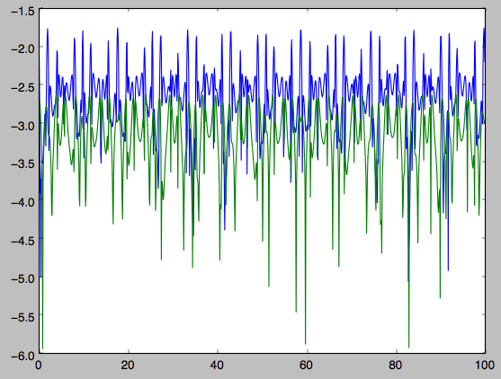

The radial action is now conserved to better than a percent and the
vertical action to only a fraction of a percent. Clearly, this is much
better than the five to ten percent errors found for the adiabatic
approximation above.

For the Staeckel approximation we can also calculate frequencies and
angles through the ``actionsFreqs`` and ``actionsFreqsAngles``
methods.

.. WARNING:: Frequencies and angles using the Staeckel approximation
   are *only* implemented in C. So use ``c=True`` in the setup of the
   actionAngleStaeckel object.

.. WARNING:: Angles using the Staeckel approximation in galpy are such
   that (a) the radial angle starts at zero at pericenter and
   increases then going toward apocenter; (b) the vertical angle
   starts at zero at *z=0* and increases toward positive zmax. The
   latter is a different convention from that in Binney (2012), but is
   consistent with that in actionAngleIsochrone and
   actionAngleSpherical.

>>> aAS= actionAngleStaeckel(pot=MWPotential2014,delta=0.4,c=True)
>>> o= Orbit([1.,0.1,1.1,0.,0.25,0.]) #need to specify phi for angles
>>> aAS.actionsFreqsAngles(o.R(),o.vR(),o.vT(),o.z(),o.vz(),o.phi())
# (array([ 0.01922167]),
#  array([ 1.1]),
#  array([ 0.01527683]),
#  array([ 1.11317796]),
#  array([ 0.82538032]),
#  array([ 1.34126138]),
#  array([ 0.37758087]),
#  array([ 6.17833493]),
#  array([ 6.13368239]))

and we can check that the angles increase linearly along the orbit

>>> o.integrate(ts,MWPotential2014)
>>> jfa= aAS.actionsFreqsAngles(o.R(ts),o.vR(ts),o.vT(ts),o.z(ts),o.vz(ts),o.phi(ts))
>>> plot(ts,jfa[6],'b.')
>>> plot(ts,jfa[7],'g.')
>>> plot(ts,jfa[8],'r.')

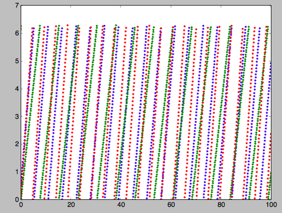

or

>>> plot(jfa[6],jfa[8],'b.')

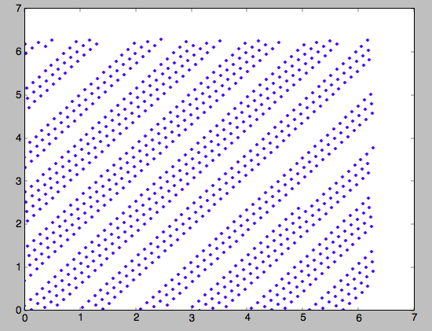

Action-angle coordinates using an orbit-integration-based approximation
-------------------------------------------------------------------------

The adiabatic and Staeckel approximations used above are good for
stars on close-to-circular orbits, but they break down for more
eccentric orbits (specifically, orbits for which the radial and/or
vertical action is of a similar magnitude as the angular
momentum). This is because the approximations made to the potential in
these methods (that it is separable in *R* and *z* for the adiabatic
approximation and that it is close to a Staeckel potential for the
Staeckel approximation) break down for such orbits. Unfortunately,
these methods cannot be refined to provide better approximations for
eccentric orbits.

galpy contains a new method for calculating actions, frequencies, and
angles that is completely general for any static potential. It can
calculate the actions to any desired precision for any orbit in such
potentials. The method works by employing an auxiliary isochrone
potential and calculates action-angle variables by arithmetic
operations on the actions and angles calculated in the auxiliary
potential along an orbit (integrated in the true potential). Full
details can be found in Appendix A of Bovy (2014).

We setup this method for a logarithmic potential as follows

>>> from galpy.actionAngle import actionAngleIsochroneApprox
>>> from galpy.potential import LogarithmicHaloPotential
>>> lp= LogarithmicHaloPotential(normalize=1.,q=0.9)
>>> aAIA= actionAngleIsochroneApprox(pot=lp,b=0.8)

``b=0.8`` here sets the scale parameter of the auxiliary isochrone
potential; this potential can also be specified as an
IsochronePotential instance through ``ip=``). We can now calculate the
actions for an orbit similar to that of the GD-1 stream

>>> obs= numpy.array([1.56148083,0.35081535,-1.15481504,0.88719443,-0.47713334,0.12019596]) #orbit similar to GD-1
>>> aAIA(*obs)
# (array([ 0.16605011]), array([-1.80322155]), array([ 0.50704439]))

An essential requirement of this method is that the angles calculated
in the auxiliary potential go through the full range
:math:`[0,2\pi]`. If this is not the case, galpy will raise a warning

>>> aAIA= actionAngleIsochroneApprox(pot=lp,b=10.8)
>>> aAIA(*obs)
# galpyWarning: Full radial angle range not covered for at least one object; actions are likely not reliable
# (array([ 0.08985167]), array([-1.80322155]), array([ 0.50849276]))

Therefore, some care should be taken to choosing a good auxiliary
potential. galpy contains a method to estimate a decent scale
parameter for the auxiliary scale parameter, which works similar to
``estimateDeltaStaeckel`` above except that it also gives a minimum
and maximum b if multiple *R* and *z* are given

>>> from galpy.actionAngle import estimateBIsochrone
>>> from galpy.orbit import Orbit
>>> o= Orbit(obs)
>>> ts= numpy.linspace(0.,100.,1001)
>>> o.integrate(ts,lp)
>>> estimateBIsochrone(lp,o.R(ts),o.z(ts))
# (0.78065062339131952, 1.2265541473461612, 1.4899326335155412) #bmin,bmedian,bmax over the orbit

Experience shows that a scale parameter somewhere in the range
returned by this function makes sure that the angles go through the
full :math:`[0,2\pi]` range. However, even if the angles go through
the full range, the closer the angles increase to linear, the better
the converenge of the algorithm is (and especially, the more accurate
the calculation of the frequencies and angles is, see below). For
example, for the scale parameter at the upper and of the range

>>> aAIA= actionAngleIsochroneApprox(pot=lp,b=1.5)
>>> aAIA(*obs)
# (array([ 0.01120145]), array([-1.80322155]), array([ 0.50788893]))

which does not agree with the previous calculation. We can inspect how
the angles increase and how the actions converge by using the
``aAIA.plot`` function. For example, we can plot the radial versus the
vertical angle in the auxiliary potential

>>> aAIA.plot(*obs,type='araz')

which gives

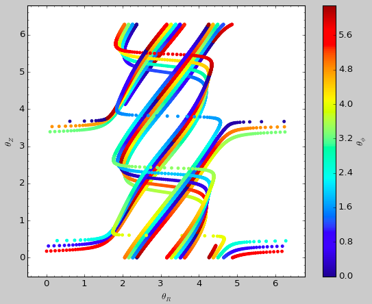

and this clearly shows that the angles increase *very* non-linearly,
because the auxiliary isochrone potential used is too far from the
real potential. This causes the actions to converge only very
slowly. For example, for the radial action we can plot the converge as a function of integration time

>>> aAIA.plot(*obs,type='jr')

which gives

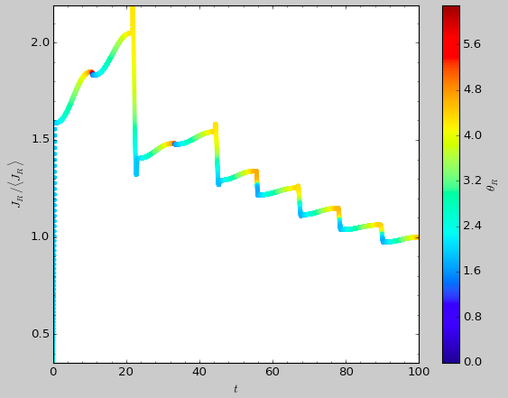

This Figure clearly shows that the radial action has not converged
yet. We need to integrate *much* longer in this auxiliary potential to
obtain convergence and because the angles increase so non-linearly, we also need to integrate the orbit much more finely:

>>> aAIA= actionAngleIsochroneApprox(pot=lp,b=1.5,tintJ=1000,ntintJ=800000)
>>> aAIA(*obs)
# (array([ 0.01711635]), array([-1.80322155]), array([ 0.51008058]))
>>> aAIA.plot(*obs,type='jr')

which shows slow convergence

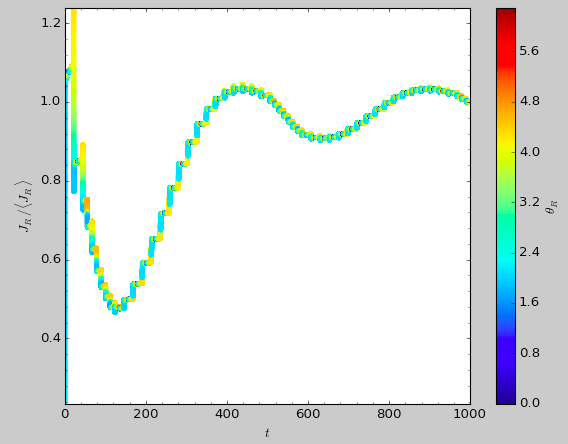

Finding a better auxiliary potential makes convergence *much* faster
and also allows the frequencies and the angles to be calculated by
removing the small wiggles in the auxiliary angles vs. time (in the
angle plot above, the wiggles are much larger, such that removing them
is hard). The auxiliary potential used above had ``b=0.8``, which
shows very quick converenge and good behavior of the angles

>>> aAIA= actionAngleIsochroneApprox(pot=lp,b=0.8)
>>> aAIA.plot(*obs,type='jr')

gives

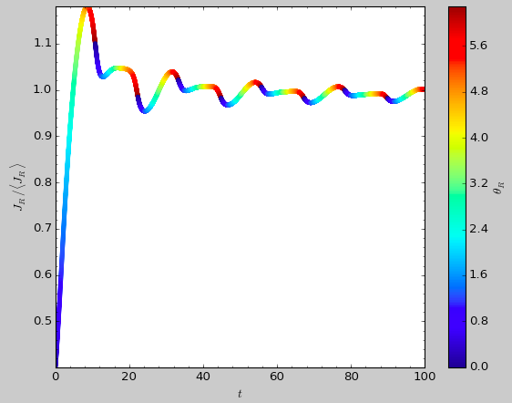

and

>>> aAIA.plot(*obs,type='araz')

gives

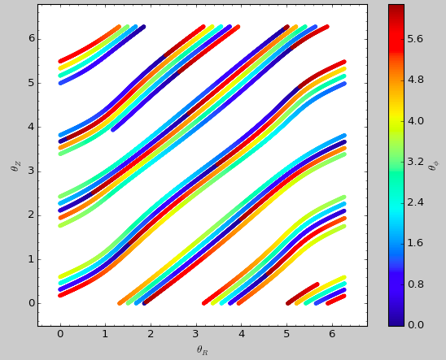

We can remove the periodic behavior from the angles, which clearly
shows that they increase close-to-linear with time

>>> aAIA.plot(*obs,type='araz',deperiod=True)

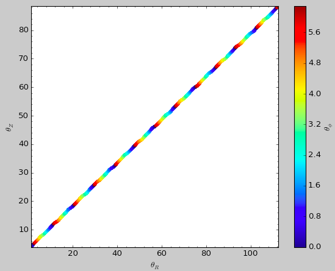

We can then calculate the frequencies and the angles for this orbit as

>>> aAIA.actionsFreqsAngles(*obs)
# (array([ 0.16392384]),
#  array([-1.80322155]),
#  array([ 0.50999882]),
#  array([ 0.55808933]),
#  array([-0.38475753]),
#  array([ 0.42199713]),
#  array([ 0.18739688]),
#  array([ 0.3131815]),
#  array([ 2.18425661]))

This function takes as an argument ``maxn=`` the maximum *n* for which
to remove sinusoidal wiggles. So we can raise this, for example to 4
from 3

>>> aAIA.actionsFreqsAngles(*obs,maxn=4)
# (array([ 0.16392384]),
#  array([-1.80322155]),
#  array([ 0.50999882]),
#  array([ 0.55808776]),
#  array([-0.38475733]),
#  array([ 0.4219968]),
#  array([ 0.18732009]),
#  array([ 0.31318534]),
#  array([ 2.18421296]))

Clearly, there is very little change, as most of the wiggles are of
low *n*.

This technique also works for triaxial potentials, but using those
requires the code to also use the azimuthal angle variable in the
auxiliary potential (this is unnecessary in axisymmetric potentials as
the *z* component of the angular momentum is conserved). We can
calculate actions for triaxial potentials by specifying that
``nonaxi=True``:

>>> aAIA(*obs,nonaxi=True)
# (array([ 0.16605011]), array([-1.80322155]), array([ 0.50704439]))

.. _aatorus:

Action-angle coordinates using the TorusMapper code
----------------------------------------------------

All of the methods described so far allow one to compute the actions,
angles, and frequencies for a given phase-space location. ``galpy``
also contains some support for computing the inverse transformation by
using an interface to the `TorusMapper
<https://github.com/PaulMcMillan-Astro/Torus>`__ code. Currently, this
is limited to axisymmetric potentials, because the TorusMapper code is
limited to such potentials.

The basic use of this part of ``galpy`` is to compute an orbit
:math:`(R,v_R,v_T,z,v_z,\phi)` for a given torus, specified by three
actions :math:`(J_R,L_Z,J_Z)` and as many angles along a torus as you
want. First we set up an ``actionAngleTorus`` object

>>> from galpy.actionAngle import actionAngleTorus
>>> from galpy.potential import MWPotential2014
>>> aAT= actionAngleTorus(pot=MWPotential2014)

To compute an orbit, we first need to compute the frequencies, which
we do as follows

>>> jr,lz,jz= 0.1,1.1,0.2
>>> Om= aAT.Freqs(jr,lz,jz)

This set consists of :math:`(\Omega_R,\Omega_\phi,\Omega_Z,\mathrm{TM
err})`, where the last entry is the exit code of the TorusMapper code
(will be printed as a warning when it is non-zero). Then we compute a
set of angles that fall along an orbit as :math:`\mathbf{\theta}(t) =
\mathbf{\theta}_0+\mathbf{\Omega}\,t` for a set of times :math:`t`

>>> times= numpy.linspace(0.,100.,10001)
>>> init_angle= numpy.array([1.,2.,3.])
>>> angles= numpy.tile(init_angle,(len(times),1))+Om[:3]*numpy.tile(times,(3,1)).T

Then we can compute the orbit by transforming the orbit in action-angle coordinates to configuration space as follows

>>> RvR,_,_,_,_= aAT.xvFreqs(jr,lz,jz,angles[:,0],angles[:,1],angles[:,2])

Note that the frequency is also always computed and returned by this
method, because it can be obtained at zero cost. The ``RvR`` array has
shape ``(ntimes,6)`` and the six phase-space coordinates are arranged
in the usual ``(R,vR,vT,z,vz,phi)`` order. The orbit in :math:`(R,Z)`
is then given by

>>> plot(RvR[:,0],RvR[:,3])

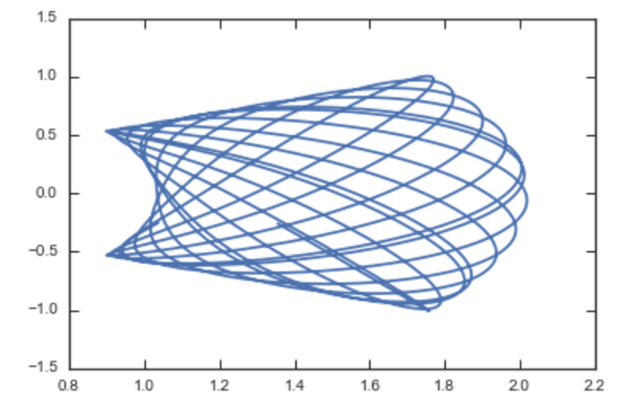

We can compare this to the direct numerical orbit integration. We
integrate the orbit, starting at the position and velocity of the
initial angle ``RvR[0]``

>>> from galpy.orbit import Orbit
>>> orb= Orbit(RvR[0])
>>> orb.integrate(times,MWPotential2014)
>>> orb.plot(overplot=True)

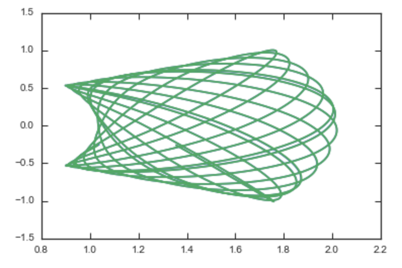

The two orbits are exactly the same.

Of course, we do not have to follow the path of an orbit to map the
entire orbital torus and thus reveal the orbital building blocks of
galaxies. To directly map a torus, we can do (don't worry, this
doesn't take very long)

>>> nangles= 200001
>>> angler= numpy.random.uniform(size=nangles)*2.*numpy.pi
>>> anglep= numpy.random.uniform(size=nangles)*2.*numpy.pi
>>> anglez= numpy.random.uniform(size=nangles)*2.*numpy.pi
>>> RvR,_,_,_,_= aAT.xvFreqs(jr,lz,jz,angler,anglep,anglez)
>>> plot(RvR[:,0],RvR[:,3],',',alpha=0.02)

which directly shows where the orbit spends most of its time:

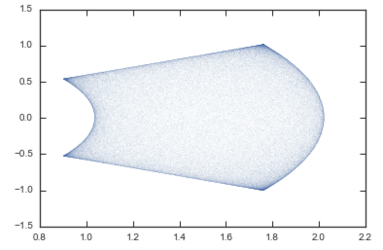

``actionAngleTorus`` has additional methods documented on the
action-angle API page for computing Hessians and Jacobians of the
transformation between action-angle and configuration space
coordinates.

.. _aaorbit:

Accessing action-angle coordinates for Orbit instances
------------------------------------------------------

While the most flexible way to access the actionAngle routines is
through the methods in the ``galpy.actionAngle`` modules, action-angle
coordinates can also be calculated for ``galpy.orbit.Orbit`` instances
and this is often more convenient. This is illustrated here
briefly. We initialize an Orbit instance

>>> from galpy.orbit import Orbit
>>> from galpy.potential import MWPotential2014
>>> o= Orbit([1.,0.1,1.1,0.,0.25,0.])

and we can then calculate the actions (default is to use the staeckel
approximation with an automatically-estimated delta parameter, but
this can be adjusted)

>>> o.jr(pot=MWPotential2014), o.jp(pot=MWPotential2014), o.jz(pot=MWPotential2014)
# (0.018194068808944613,1.1,0.01540155584446606)

``o.jp`` here gives the azimuthal action (which is the *z* component
of the angular momentum for axisymmetric potentials). We can also use
the other methods described above or adjust the parameters of the
approximation (see above):

>>> o.jr(pot=MWPotential2014,type='staeckel',delta=0.4), o.jp(pot=MWPotential2014,type='staeckel',delta=0.4), o.jz(pot=MWPotential2014,type='staeckel',delta=0.4)
# (0.019221672966336707, 1.1, 0.015276825017286827)
>>> o.jr(pot=MWPotential2014,type='adiabatic'), o.jp(pot=MWPotential2014,type='adiabatic'), o.jz(pot=MWPotential2014,type='adiabatic')
# (0.016856430059017123, 1.1, 0.015897730620467752)
>>> o.jr(pot=MWPotential2014,type='isochroneApprox',b=0.8), o.jp(pot=MWPotential2014,type='isochroneApprox',b=0.8), o.jz(pot=MWPotential2014,type='isochroneApprox',b=0.8)
# (0.019066091295488922, 1.1, 0.015280492319332751)

These two methods give very precise actions for this orbit (both are
converged to about 1%) and they agree very well

>>> (o.jr(pot=MWPotential2014,type='staeckel',delta=0.4)-o.jr(pot=MWPotential2014,type='isochroneApprox',b=0.8))/o.jr(pot=MWPotential2014,type='isochroneApprox',b=0.8)
# 0.00816012408818143
>>> (o.jz(pot=MWPotential2014,type='staeckel',delta=0.4)-o.jz(pot=MWPotential2014,type='isochroneApprox',b=0.8))/o.jz(pot=MWPotential2014,type='isochroneApprox',b=0.8)
# 0.00023999894566772273

We can also calculate the frequencies and the angles. This requires
using the Staeckel or Isochrone approximations, because frequencies
and angles are currently not supported for the adiabatic
approximation. For example, the radial frequency

>>> o.Or(pot=MWPotential2014,type='staeckel',delta=0.4)
# 1.1131779637307115
>>> o.Or(pot=MWPotential2014,type='isochroneApprox',b=0.8)
# 1.1134635974560649

and the radial angle

>>> o.wr(pot=MWPotential2014,type='staeckel',delta=0.4)
# 0.37758086786371969
>>> o.wr(pot=MWPotential2014,type='isochroneApprox',b=0.8)
# 0.38159809018175395

which again agree to 1%. We can also calculate the other frequencies,
angles, as well as periods using the functions ``o.Op``, ``o.oz``,
``o.wp``, ``o.wz``, ``o.Tr``, ``o.Tp``, ``o.Tz``.

All of the functions above also work for ``Orbit`` instances that
contain multiple objects. This is particularly convenient if you have
data in observed coordinates (e.g., RA, Dec, etc.), for example,

>>> numpy.random.seed(1)
>>> nrand= 30
>>> ras= numpy.random.uniform(size=nrand)*360.*u.deg
>>> decs= 90.*(2.*numpy.random.uniform(size=nrand)-1.)*u.deg
>>> dists= numpy.random.uniform(size=nrand)*10.*u.kpc
>>> pmras= 2.*(2.*numpy.random.uniform(size=nrand)-1.)*u.mas/u.yr
>>> pmdecs= 2.*(2.*numpy.random.uniform(size=nrand)-1.)*u.mas/u.yr
>>> vloss= 200.*(2.*numpy.random.uniform(size=nrand)-1.)*u.km/u.s
>>> co= SkyCoord(ra=ras,dec=decs,distance=dists,
                 pm_ra_cosdec=pmras,pm_dec=pmdecs,
                 radial_velocity=vloss,
                 frame='icrs')
>>> orbits= Orbit(co)
>>> orbits.jr(pot=MWPotential2014)
# [2363.7957, 360.12445, 690.32238, 1046.2924, 132.9572, 86.989812, 272.06487, 360.73566, 55.568238, 698.18447, 24.783574, 21.889352, 16.148216, 3870.4286, 743.63456, 317.66551, 325.93816, 183.86429, 56.087796, 180.42838, 1121.8019, 8700.8335, 977.8525, 7.569396, 8.2847477, 210.72127, 160.9785, 680.63864, 1093.7413, 87.629873]kmkpcs

Example: Evidence for a Lindblad resonance in the Solar neighborhood
---------------------------------------------------------------------

We can use galpy to calculate action-angle coordinates for a set of
stars in the Solar neighborhood and look for unexplained features. For
this we download the data from the Geneva-Copenhagen Survey
(`2009A&A...501..941H
<http://adsabs.harvard.edu/abs/2009A&A...501..941H>`_; data available
at `viZier
<http://vizier.cfa.harvard.edu/viz-bin/VizieR?-source=V/130/>`_). Since
the velocities in this catalog are given as U,V, and W, we use the
``radec`` and ``UVW`` keywords to initialize the orbits from the raw
data. For each object ``ii``

>>> o= Orbit(vxvv[ii,:],radec=True,uvw=True,vo=220.,ro=8.)

We then calculate the actions and angles for each object in a flat
rotation curve potential

>>> lp= LogarithmicHaloPotential(normalize=1.)
>>> myjr[ii]= o.jr(lp)

etc.

Plotting the radial action versus the angular momentum

>>> import galpy.util.plot as galpy_plot
>>> galpy_plot.plot(myjp,myjr,'k.',ms=2.,xlabel=r'$J_{\phi}$',ylabel=r'$J_R$',xrange=[0.7,1.3],yrange=[0.,0.05])

shows a feature in the distribution

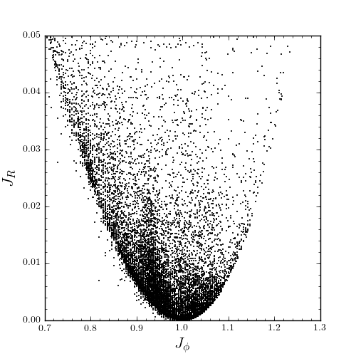

If instead we use a power-law rotation curve with power-law index 1

>>> pp= PowerSphericalPotential(normalize=1.,alpha=-2.)
>>> myjr[ii]= o.jr(pp)

We find that the distribution is stretched, but the feature remains

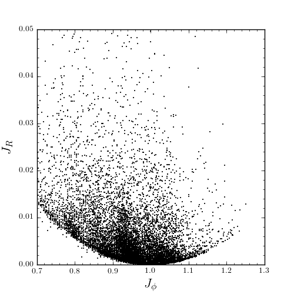

Code for this example can be found :download:`here
<examples/sellwood-jrjp.py>` (note that this code uses a particular
download of the GCS data set; if you use your own version, you will
need to modify the part of the code that reads the data). For more
information see `2010MNRAS.409..145S
<http://adsabs.harvard.edu/abs/2010MNRAS.409..145S>`_.

Example: actions in an N-body simulation
------------------------------------------

To illustrate how we can use ``galpy`` to calculate actions in a
snapshot of an N-body simulation, we again look at the ``g15784``
snapshot in the ``pynbody`` test suite, discussed in :ref:`The
potential of N-body simulations <potnbody>`. Please look at that
section for information on how to setup the potential of this snapshot
in ``galpy``. One change is that we should set ``enable_c=True`` in
the instantiation of the ``InterpSnapshotRZPotential`` object

>>> spi= InterpSnapshotRZPotential(h1,rgrid=(numpy.log(0.01),numpy.log(20.),101),logR=True,zgrid=(0.,10.,101),interpPot=True,zsym=True,enable_c=True)
>>> spi.normalize(R0=10.)

where we again normalize the potential to use galpy's *natural units*.

We first load a pristine copy of the simulation (because the normalization above leads to some inconsistent behavior in pynbody)

>>> sc = pynbody.load('Repos/pynbody-testdata/g15784.lr.01024.gz'); hc = sc.halos(); hc1= hc[1]; pynbody.analysis.halo.center(hc1,mode='hyb'); pynbody.analysis.angmom.faceon(hc1, cen=(0,0,0),mode='ssc'); sc.physical_units()

and then select particles near ``R=8`` kpc by doing

>>> sn= pynbody.filt.BandPass('rxy','7 kpc','9 kpc')
>>> R,vR,vT,z,vz = [numpy.ascontiguousarray(hc1.s[sn][x]) for x in ('rxy','vr','vt','z','vz')]

These have physical units, so we normalize them (the velocity
normalization is the circular velocity at ``R=10`` kpc, see
:ref:`here <potnbody>`).

>>> ro, vo= 10., 294.62723076942245
>>> R/= ro
>>> z/= ro
>>> vR/= vo
>>> vT/= vo
>>> vz/= vo

We will calculate actions using ``actionAngleStaeckel`` above. We can
first integrate a random orbit in this potential

>>> from galpy.orbit import Orbit
>>> numpy.random.seed(1)
>>> ii= numpy.random.permutation(len(R))[0]
>>> o= Orbit([R[ii],vR[ii],vT[ii],z[ii],vz[ii]])
>>> ts= numpy.linspace(0.,100.,1001)
>>> o.integrate(ts,spi)

This orbit looks like this

>>> o.plot()

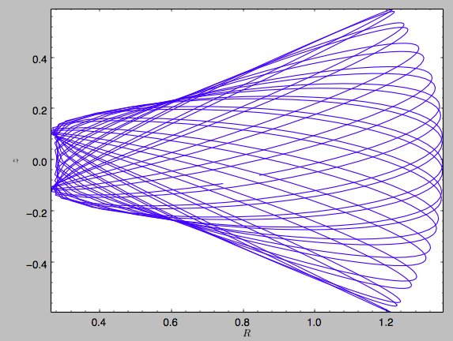

We can now calculate the actions by doing

>>> from galpy.actionAngle import actionAngleStaeckel
>>> aAS= actionAngleStaeckel(pot=spi,delta=0.45,c=True)
>>> jr,lz,jz= aAS(R,vR,vT,z,vz)

These actions are also in *natural units*; you can obtain physical
units by multiplying with ``ro*vo``. We can now plot these actions

>>> from galpy.util import plot as galpy_plot
>>> galpy_plot.scatterplot(lz,jr,'k.',xlabel=r'$J_\phi$',ylabel=r'$J_R$',xrange=[0.,1.3],yrange=[0.,.6])

which gives

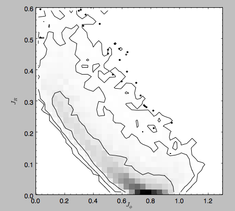

Note the similarity between this figure and the GCS figure above. The
curve shape is due to the selection (low angular momentum stars can
only enter the selected radial ring if they are very elliptical and
therefore have large radial action) and the density gradient in
angular momentum is due to the falling surface density of the disk. We
can also look at the distribution of radial and vertical actions.

>>> galpy_plot.plot(jr,jz,'k,',xlabel=r'$J_R$',ylabel=r'$J_z$',xrange=[0.,.4],yrange=[0.,0.2],onedhists=True)

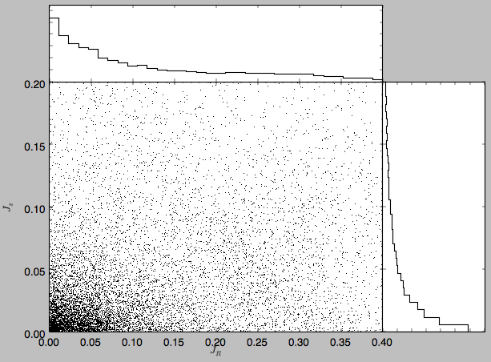

With the other methods in the actionAngle module we can also calculate
frequencies and angles.
