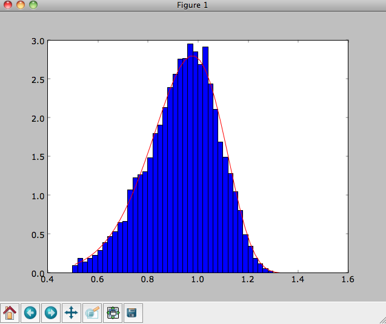

Basic usage: distribution functions
======================================

galpy contains various distribution function, both distribution
functions for disks as well as for spheroids. This section introduces
the basic procedures in ``galpy.df``.

.. _usagediskdfs:

Disk distribution functions
----------------------------

galpy contains distribution functions for razor-thin disks:
``galpy.df.dehnendf`` and ``galpy.df.shudf``. These are the
distribution functions of Dehnen (`1999AJ....118.1201D
<http://adsabs.harvard.edu/abs/1999AJ....118.1201D>`_) and Shu
(`1969ApJ...158..505S
<http://adsabs.harvard.edu/abs/1969ApJ...158..505S>`_). Everything
shown below for ``dehnendf`` can also be done for ``shudf``.

These disk distribution functions are functions of the energy and the
angular momentum alone. They can be evaluated for orbits, or for a
given energy and angular momentum. At this point, only power-law
rotation curves are supported. A ``dehnendf`` instance is initialized
as follows

>>> from galpy.df import dehnendf
>>> dfc= dehnendf(beta=0.)

This initializes a ``dehnendf`` instance based on an exponential
surface-mass profile with scale-length 1/3 and an exponential
radial-velocity-dispersion profile with scale-length 1 and a value of
0.2 at R=1. 

We can show that these distribution functions have an asymmetric drift
built-in by evaluating the DF at R=1. We first create a set of
orbit-instances and then evaluate the DF at them

>>> from galpy.orbit import Orbit
>>> os= [Orbit([1.,0.,1.+-0.9+1.8/1000*ii]) for ii in range(1001)]
>>> dfro= [dfc(o) for o in os]
>>> plot([1.+-0.9+1.8/1000*ii for ii in range(1001)],dfro)

.. image:: images/basic-df-asydrift.png

Or we can plot the two-dimensional density at R=1.

>>> dfro= [[dfc(Orbit([1.,-0.7+1.4/200*jj,1.-0.6+1.2/200*ii])) for jj in range(201)]for ii in range(201)]
>>> dfro= numpy.array(dfro)
>>> from galpy.util.bovy_plot import bovy_dens2d
>>> bovy_dens2d(dfro,origin='lower',cmap='gist_yarg',contours=True,xrange=[-0.7,0.7],yrange=[0.4,1.6],xlabel=r'$v_R$',ylabel=r'$v_T$')

.. image:: images/basic-df-2d.png

We can sample from the disk distribution functions using
``sample``. ``sample`` can return either an energy--angular-momentum
pair, or a full orbit initialization. We can sample 4000 orbits for
example as (could take two minutes)

>>> o= dfc.sample(n=4000,returnOrbit=True,nphi=1)

We can then plot the histogram of the sampled radii and compare it to the input surface-mass density profile

>>> Rs= [e.R() for e in o]
>>> hists, bins, edges= hist(Rs,range=[0,2],normed=True,bins=30)
>>> xs= numpy.array([(bins[ii+1]+bins[ii])/2. for ii in range(len(bins)-1)])
>>> plot(xs, xs*exp(-xs*3.)*9.,'r-')

E.g.,

.. image:: images/basic-df-sampleR.png

We can also plot the spatial distribution of the sampled disk

>>> xs= [e.x() for e in o]
>>> ys= [e.y() for e in o]
>>> figure()
>>> plot(xs,ys,',')

E.g.,

.. image:: images/basic-df-samplexy.png

We can also sample points in a specific radial range (might take a few
minutes)

>>> o= dfc.sample(n=1000,returnOrbit=True,nphi=1,rrange=[0.8,1.2])

and we can plot the distribution of tangential velocities

>>> vTs= [e.vxvv[2] for e in o]
>>> hists, bins, edges= hist(vTs,range=[.5,1.5],normed=True,bins=30)
>>> xs= numpy.array([(bins[ii+1]+bins[ii])/2. for ii in range(len(bins)-1)])
>>> dfro= [dfc(Orbit([1.,0.,x]))/9./numpy.exp(-3.) for x in xs]
>>> plot(xs,dfro,'r-')

.. image:: images/basic-df-samplevT.png

The agreement between the sampled distribution and the theoretical
curve is not as good because the sampled distribution has a finite
radial range. If we sample 10,000 points in ``rrange=[0.95,1.05]`` the
agreement is better (this takes a long time):

