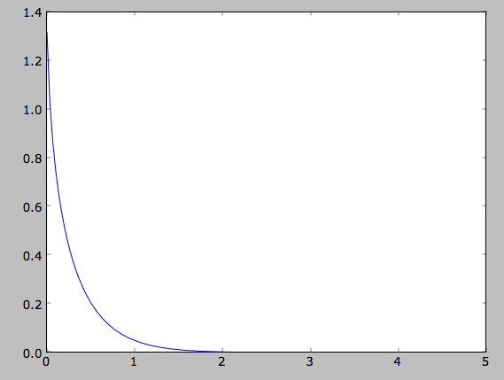
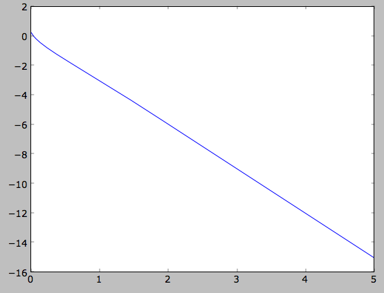
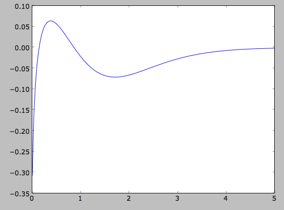
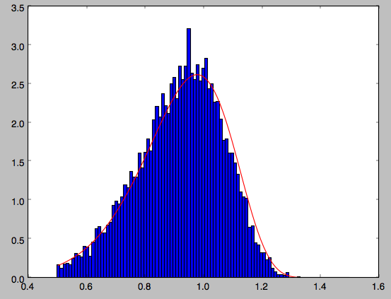
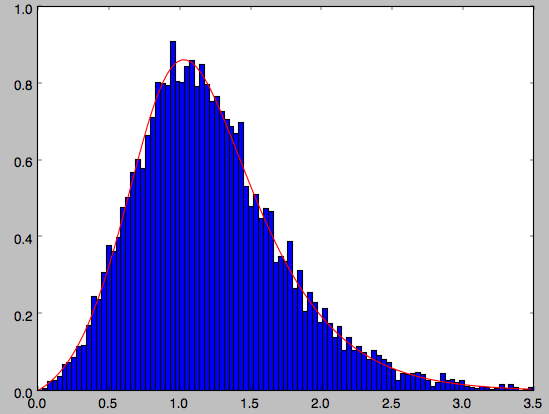
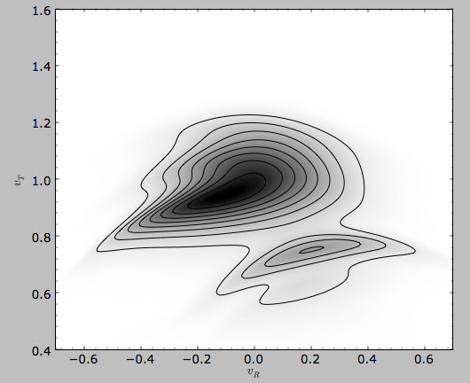

Two-dimensional disk distribution functions
=============================================

galpy contains various disk distribution functions, both in two and
three dimensions. This section introduces the two-dimensional
distribution functions, useful for studying the dynamics of stars that
stay relatively close to the mid-plane of a galaxy. The vertical
motions of these stars may be approximated as being entirely decoupled
from the motion in the plane.

.. _usagediskdfs:

Types of disk distribution functions
---------------------------------------

galpy contains the following distribution functions for razor-thin
disks: ``galpy.df.dehnendf`` and ``galpy.df.shudf``. These are the
distribution functions of Dehnen (`1999AJ....118.1201D
<http://adsabs.harvard.edu/abs/1999AJ....118.1201D>`_) and Shu
(`1969ApJ...158..505S
<http://adsabs.harvard.edu/abs/1969ApJ...158..505S>`_). Everything
shown below for ``dehnendf`` can also be done for ``shudf``.

These disk distribution functions are functions of the energy and the
angular momentum alone. They can be evaluated for orbits, or for a
given energy and angular momentum. At this point, only power-law
rotation curves are supported. A ``dehnendf`` instance is initialized
as follows

>>> from galpy.df import dehnendf
>>> dfc= dehnendf(beta=0.)

This initializes a ``dehnendf`` instance based on an exponential
surface-mass profile with scale-length 1/3 and an exponential
radial-velocity-dispersion profile with scale-length 1 and a value of
0.2 at R=1. Different parameters for these profiles can be provided as
an initialization keyword. For example,

>>> dfc= dehnendf(beta=0.,profileParams=(1./4.,1.,0.2))

initializes the distribution function with a radial scale length of
1/4 instead.

We can show that these distribution functions have an asymmetric drift
built-in by evaluating the DF at R=1. We first create a set of
orbit-instances and then evaluate the DF at them

>>> from galpy.orbit import Orbit
>>> os= [Orbit([1.,0.,1.+-0.9+1.8/1000*ii]) for ii in range(1001)]
>>> dfro= [dfc(o) for o in os]
>>> plot([1.+-0.9+1.8/1000*ii for ii in range(1001)],dfro)

.. image:: images/basic-df-asydrift.png

Or we can plot the two-dimensional density at R=1.

>>> dfro= [[dfc(Orbit([1.,-0.7+1.4/200*jj,1.-0.6+1.2/200*ii])) for jj in range(201)]for ii in range(201)]
>>> dfro= numpy.array(dfro)
>>> from galpy.util.bovy_plot import bovy_dens2d
>>> bovy_dens2d(dfro,origin='lower',cmap='gist_yarg',contours=True,xrange=[-0.7,0.7],yrange=[0.4,1.6],xlabel=r'$v_R$',ylabel=r'$v_T$')

.. image:: images/basic-df-2d.png

.. _dftwod-moments:

Evaluating moments of the DF
-----------------------------

galpy can evaluate various moments of the disk distribution
functions. For example, we can calculate the mean velocities (for the
DF with a scale length of 1/3 above)

>>> dfc.meanvT(1.)
0.91715276979447324
>>> dfc.meanvR(1.)
0.0

and the velocity dispersions

>>> numpy.sqrt(dfc.sigmaR2(1.))
0.19321086259083936
>>> numpy.sqrt(dfc.sigmaT2(1.))
0.15084122011271159

and their ratio

>>> dfc.sigmaR2(1.)/dfc.sigmaT2(1.)
1.6406766813028968

In the limit of zero velocity dispersion (the epicycle approximation)
this ratio should be equal to 2, which we can check as follows

>>> dfccold= dehnendf(beta=0.,profileParams=(1./3.,1.,0.02))
>>> dfccold.sigmaR2(1.)/dfccold.sigmaT2(1.)
1.9947493895454664

We can also calculate higher order moments

>>> dfc.skewvT(1.)
-0.48617143862047763
>>> dfc.kurtosisvT(1.)
0.13338978593181494
>>> dfc.kurtosisvR(1.)
-0.12159407676394096

We already saw above that the velocity dispersion at R=1 is not
exactly equal to the input velocity dispersion (0.19321086259083936
vs. 0.2). Similarly, the whole surface-density and velocity-dispersion
profiles are not quite equal to the exponential input profiles. We can
calculate the resulting surface-mass density profile using
``surfacemass``, ``sigmaR2``, and ``sigma2surfacemass``. The latter
calculates the product of the velocity dispersion squared and the
surface-mass density. E.g.,

>>> dfc.surfacemass(1.)
0.050820867101511534

We can plot the surface-mass density as follows

>>> Rs= numpy.linspace(0.01,5.,151)
>>> out= [dfc.surfacemass(r) for r in Rs]
>>> plot(Rs, out)

or

>>> plot(Rs,numpy.log(out))

which shows the exponential behavior expected for an exponential
disk. We can compare this to the input surface-mass density

>>> input_out= [dfc.targetSurfacemass(r) for r in Rs]
>>> plot(Rs,numpy.log(input_out)-numpy.log(out))

which shows that there are significant differences between the desired
surface-mass density and the actual surface-mass density. We can do
the same for the velocity-dispersion profile

>>> out= [dfc.sigmaR2(r) for r in Rs]
>>> input_out= [dfc.targetSigma2(r) for r in Rs]
>>> plot(Rs,numpy.log(input_out)-numpy.log(out))

.. image:: images/diskdf-sigma2diff.png

That the input surface-density and velocity-dispersion profiles are
not the same as the output profiles, means that estimates of DF
properties based on these profiles will not be quite
correct. Obviously this is the case for the surface-density and
velocity-dispersion profiles themselves, which have to be explicitly
calculated by integration over the DF rather than by evaluating the
input profiles. This also means that estimates of the asymmetric drift
based on the input profiles will be wrong. We can calculate the
asymmetric drift at R=1 using the asymmetric drift equation derived
from the Jeans equation (eq. 4.228 in Binney & Tremaine 2008), using
the input surface-density and velocity dispersion profiles

>>> dfc.asymmetricdrift(1.)
0.090000000000000024

which should be equal to the circular velocity minus the mean rotational
velocity

>>> 1.-dfc.meanvT(1.)
0.082847230205526756

These are not the same in part because of the difference between the
input and output surface-density and velocity-dispersion profiles (and
because the ``asymmetricdrift`` method assumes that the ratio of the
velocity dispersions squared is two using the epicycle approximation;
see above).

Using corrected disk distribution functions
-----------------------------------------------

As shown above, for a given surface-mass density and velocity
dispersion profile, the two-dimensional disk distribution functions
only do a poor job of reproducing the desired profiles. We can correct
this by calculating a set of *corrections* to the input profiles such
that the output profiles more closely resemble the desired profiles
(see `1999AJ....118.1201D
<http://adsabs.harvard.edu/abs/1999AJ....118.1201D>`_). galpy supports
the calculation of these corrections, and comes with some
pre-calculated corrections (these can be found `here
<http://github.com/jobovy/galpy#disk-df-corrections>`_). For example,
the following initializes a ``dehnendf`` with corrections up to 20th
order (the default)

>>> dfc= dehnendf(beta=0.,correct=True)

The following figure shows the difference between the actual
surface-mass density profile and the desired profile for 1, 2, 3, 4,
5, 10, 15, and 20 iterations

.. image:: images/testSurfacemassCorrections_sigma0_0.5.png

and the same for the velocity-dispersion profile

.. image:: images/testSigmaCorrections_sigma0_0.5.png

galpy will automatically save any new corrections that you calculate. 

All of the methods for an uncorrected disk DF can be used for the
corrected DFs as well. For example, the velocity dispersion is now 

>>> numpy.sqrt(dfc.sigmaR2(1.))
0.19999985069451526

and the mean rotation velocity is

>>> dfc.meanvT(1.)
0.90355161181498711

and (correct) asymmetric drift

>>> 1.-dfc.meanvT(1.)
0.09644838818501289

That this still does not agree with the simple ``dfc.asymmetricdrift``
estimate is because of the latter's using the epicycle approximation
for the ratio of the velocity dispersions.

Oort constants and functions
------------------------------

galpy also contains methods to calculate the Oort functions for
two-dimensional disk distribution functions. These are known as the
*Oort constants* when measured in the solar neighborhood. They are
combinations of the mean velocities and derivatives thereof. galpy
calculates these by direct integration over the DF and derivatives of
the DF. Thus, we can calculate

>>> dfc= dehnendf(beta=0.)
>>> dfc.oortA(1.)
0.43190780889218749
>>> dfc.oortB(1.)
-0.48524496090228575

The *K* and *C* Oort constants are zero for axisymmetric DFs

>>> dfc.oortC(1.)
0.0
>>> dfc.oortK(1.)
0.0

In the epicycle approximation, for a flat rotation curve *A* =- *B* =
0.5. The explicit calculates of *A* and *B* for warm DFs quantify how
good (or bad) this approximation is

>>> dfc.oortA(1.)+dfc.oortB(1.)
-0.053337152010098254

For the cold DF from above the approximation is much better

>>> dfccold= dehnendf(beta=0.,profileParams=(1./3.,1.,0.02))
>>> dfccold.oortA(1.), dfccold.oortB(1.)
(0.49917556666144003, -0.49992824742490816)

Sampling data from the DF
--------------------------

We can sample from the disk distribution functions using
``sample``. ``sample`` can return either an energy--angular-momentum
pair, or a full orbit initialization. We can sample 4000 orbits for
example as (could take two minutes)

>>> o= dfc.sample(n=4000,returnOrbit=True,nphi=1)

We can then plot the histogram of the sampled radii and compare it to the input surface-mass density profile

>>> Rs= [e.R() for e in o]
>>> hists, bins, edges= hist(Rs,range=[0,2],normed=True,bins=30)
>>> xs= numpy.array([(bins[ii+1]+bins[ii])/2. for ii in range(len(bins)-1)])
>>> plot(xs, xs*exp(-xs*3.)*9.,'r-')

E.g.,

.. image:: images/basic-df-sampleR.png

We can also plot the spatial distribution of the sampled disk

>>> xs= [e.x() for e in o]
>>> ys= [e.y() for e in o]
>>> figure()
>>> plot(xs,ys,',')

E.g.,

.. image:: images/basic-df-samplexy.png

We can also sample points in a specific radial range (might take a few
minutes)

>>> o= dfc.sample(n=1000,returnOrbit=True,nphi=1,rrange=[0.8,1.2])

and we can plot the distribution of tangential velocities

>>> vTs= [e.vxvv[2] for e in o]
>>> hists, bins, edges= hist(vTs,range=[.5,1.5],normed=True,bins=30)
>>> xs= numpy.array([(bins[ii+1]+bins[ii])/2. for ii in range(len(bins)-1)])
>>> dfro= [dfc(Orbit([1.,0.,x]))/9./numpy.exp(-3.) for x in xs]
>>> plot(xs,dfro,'r-')

.. image:: images/basic-df-samplevT.png

The agreement between the sampled distribution and the theoretical
curve is not as good because the sampled distribution has a finite
radial range. If we sample 10,000 points in ``rrange=[0.95,1.05]`` the
agreement is better (this takes a long time):

.. image:: images/basic-df-samplevTmore.png

We can also directly sample velocities at a given radius rather than
in a range of radii. Doing this for a correct DF gives

>>> dfc= dehnendf(beta=0.,correct=True)
>>> vrvt= dfc.sampleVRVT(1.)
>>> hists, bins, edges= hist(vrvt[:,1],range=[.5,1.5],normed=True,bins=101)
>>> xs= numpy.array([(bins[ii+1]+bins[ii])/2. for ii in range(len(bins)-1)])
>>> dfro= [dfc(Orbit([1.,0.,x])) for x in xs]
>>> plot(xs,dfro/numpy.sum(dfro)/(xs[1]-xs[0]),'r-')

galpy further has support for sampling along a given line of sight in
the disk, which is useful for interpreting surveys consisting of a
finite number of pointings. For example, we can sampled distances
along a given line of sight

>>> ds= dfc.sampledSurfacemassLOS(30./180.*numpy.pi,n=10000)

which is very fast. We can histogram these

>>> hists, bins, edges= hist(ds,range=[0.,3.5],normed=True,bins=101)

and compare it to the predicted distribution, which we can calculate as

>>> xs= numpy.array([(bins[ii+1]+bins[ii])/2. for ii in range(len(bins)-1)])
>>> fd= numpy.array([dfc.surfacemassLOS(d,30.) for d in xs])
>>> plot(xs,fd/numpy.sum(fd)/(xs[1]-xs[0]),'r-')

which shows very good agreement with the sampled distances

galpy can further sample full 4D phase--space coordinates along a
given line of sight through ``dfc.sampleLOS``.

Example: The Hercules stream in the Solar neighborhood as a result of the Galactic bar 
---------------------------------------------------------------------------------------
.. _hercules:

We can combine the orbit integration capabilities of galpy with the
provided distribution functions and see the effect of the Galactic bar
on stellar velocities. By backward integrating orbits starting at the
Solar position in a potential that includes the Galactic bar we can
evaluate what the velocity distribution is that we should see today if
the Galactic bar stirred up a steady-state disk. For this we
initialize a flat rotation curve potential and Dehnen's bar potential

>>> from galpy.potential import LogarithmicHaloPotential, DehnenBarPotential
>>> lp= LogarithmicHaloPotential(normalize=1.)
>>> dp= DehnenBarPotential()

The Dehnen bar potential is initialized to start bar formation four bar
periods before the present day and to have completely formed the bar two
bar periods ago. We can integrate back to the time before
bar-formation:

>>> ts= numpy.linspace(0,dp.tform(),1000)

where ``dp.tform()`` is the time of bar-formation (in the usual
time-coordinates).

We initialize orbits on a grid in velocity space and integrate them

>>> ins=[[Orbit([1.,-0.7+1.4/100*jj,1.-0.6+1.2/100*ii,0.]) for jj in range(101)] for ii in range(101)]
>>> int=[[o.integrate(ts,[lp,dp]) for o in j] for j in ins]

We can then evaluate the weight of these orbits by assuming that the
disk was in a steady-state before bar-formation with a Dehnen
distribution function. We evaluate the Dehnen distribution function at
``dp.tform()`` for each of the orbits

>>> dfc= dehnendf(beta=0.,correct=True)
>>> out= [[dfc(o(dp.tform())) for o in j] for j in ins]
>>> out= numpy.array(out)

This gives

>>> from galpy.util.bovy_plot import bovy_dens2d
>>> bovy_dens2d(out,origin='lower',cmap='gist_yarg',contours=True,xrange=[-0.7,0.7],yrange=[0.4,1.6],xlabel=r'$v_R$',ylabel=r'$v_T$')

For more information see `2000AJ....119..800D
<http://adsabs.harvard.edu/abs/2000AJ....119..800D>`_ and
`2010ApJ...725.1676B
<http://adsabs.harvard.edu/abs/2010ApJ...725.1676B>`_. Note that the
x-axis in the Figure above is defined as minus the x-axis in these
papers.
