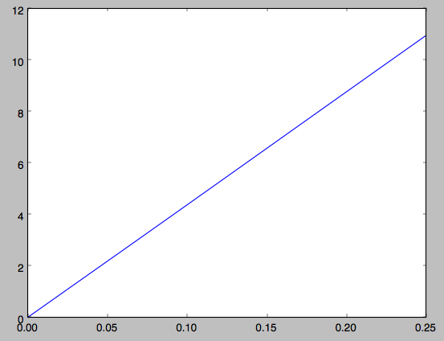
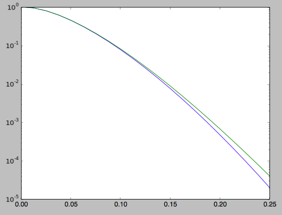
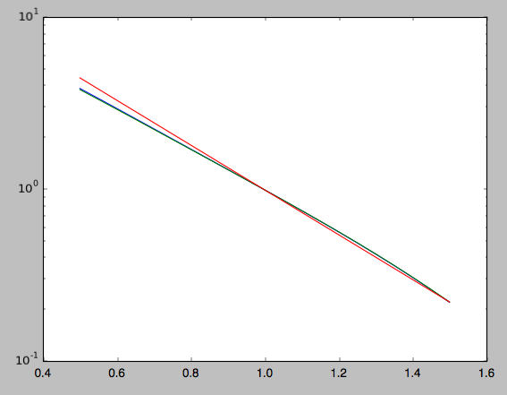
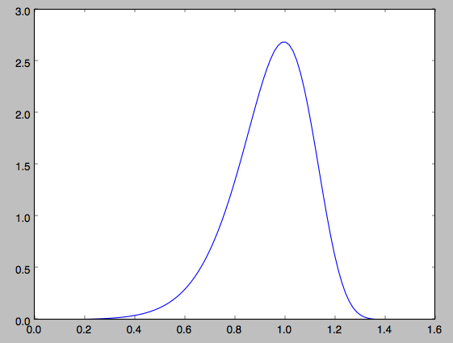
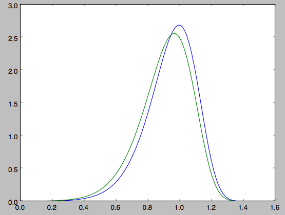
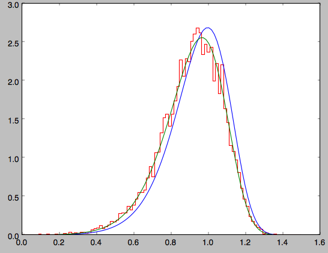

Three-dimensional disk distribution functions
================================================

galpy contains a fully three-dimensional disk distribution:
``galpy.df.quasiisothermaldf``, which is an approximately isothermal
distribution function expressed in terms of action--angle variables
(see `2010MNRAS.401.2318B
<http://adsabs.harvard.edu/abs/2010MNRAS.401.2318B>`_ and
`2011MNRAS.413.1889B
<http://adsabs.harvard.edu/abs/2011MNRAS.413.1889B>`_). Recent
research shows that this distribution function provides a good model
for the DF of mono-abundance sub-populations (MAPs) of the Milky Way
disk (see `2013MNRAS.434..652T
<http://adsabs.harvard.edu/abs/2013MNRAS.434..652T>`_ and
`2013ApJ...779..115B
<http://adsabs.harvard.edu/abs/2013ApJ...779..115B>`_). This
distribution function family requires action-angle coordinates to
evaluate the DF, so ``galpy.df.quasiisothermaldf`` makes heavy use of
the routines in ``galpy.actionAngle`` (in particular those in
``galpy.actionAngleAdiabatic`` and
``galpy.actionAngle.actionAngleStaeckel``).

Setting up the DF and basic properties
---------------------------------------

The quasi-isothermal DF is defined by a gravitational potential and a
set of parameters describing the radial surface-density profile and
the radial and vertical velocity dispersion as a function of
radius. In addition, we have to provide an instance of a
``galpy.actionAngle`` class to calculate the actions for a given
position and velocity. For example, for a
``galpy.potential.MWPotential2014`` potential using the adiabatic
approximation for the actions, we import and define the following

>>> from galpy.potential import MWPotential2014
>>> from galpy.actionAngle import actionAngleAdiabatic
>>> from galpy.df import quasiisothermaldf
>>> aA= actionAngleAdiabatic(pot=MWPotential2014,c=True)

and then setup the ``quasiisothermaldf`` instance

>>> qdf= quasiisothermaldf(1./3.,0.2,0.1,1.,1.,pot=MWPotential2014,aA=aA,cutcounter=True)

which sets up a DF instance with a radial scale length of
:math:`R_0/3`, a local radial and vertical velocity dispersion of
:math:`0.2\,V_c(R_0)` and :math:`0.1\,V_c(R_0)`, respectively, and a
radial scale lengths of the velocity dispersions of
:math:`R_0`. ``cutcounter=True`` specifies that counter-rotating stars
are explicitly excluded (normally these are just exponentially
suppressed). As for the two-dimensional disk DFs, these parameters are
merely input (or target) parameters; the true density and velocity
dispersion profiles calculated by evaluating the relevant moments of
the DF (see below) are not exactly exponential and have scale lengths
and local normalizations that deviate slightly from these input
parameters. We can estimate the DF's actual radial scale length near
:math:`R_0` as

>>> qdf.estimate_hr(1.)
# 0.32908034635647182

which is quite close to the input value of 1/3. Similarly, we can
estimate the scale lengths of the dispersions

>>> qdf.estimate_hsr(1.)
# 1.1913935820372923
>>> qdf.estimate_hsz(1.)
# 1.0506918075359255

The vertical profile is fully specified by the velocity dispersions
and radial density / dispersion profiles under the assumption of
dynamical equilibrium. We can estimate the scale height of this DF at
a given radius and height as follows

>>> qdf.estimate_hz(1.,0.125)
# 0.021389597757156088

Near the mid-plane this vertical scale height becomes very large
because the vertical profile flattens, e.g., 

>>> qdf.estimate_hz(1.,0.125/100.)
# 1.006386030587223

or even

>>> qdf.estimate_hz(1.,0.)
# 187649.98447377066

which is basically infinity.

Evaluating moments
-------------------

We can evaluate various moments of the DF giving the density, mean
velocities, and velocity dispersions. For example, the mean radial
velocity is again everywhere zero because the potential and the DF are
axisymmetric

>>> qdf.meanvR(1.,0.)
# 0.0

Likewise, the mean vertical velocity is everywhere zero

>>> qdf.meanvz(1.,0.)
# 0.0

The mean rotational velocity has a more interesting dependence on
position. Near the plane, this is the same as that calculated for a similar two-dimensional disk DF (see :ref:`dftwod-moments`)

>>> qdf.meanvT(1.,0.)
# 0.91988346380781227

However, this value decreases as one moves further from the plane. The
``quasiisothermaldf`` allows us to calculate the average rotational
velocity as a function of height above the plane. For example, 

>>> zs= numpy.linspace(0.,0.25,21)
>>> mvts= numpy.array([qdf.meanvT(1.,z) for z in zs])

which gives

>>> plot(zs,mvts)

.. image:: images/qdf-meanvtz.png

We can also calculate the second moments of the DF. We can check
whether the radial and velocity dispersions at :math:`R_0` are close
to their input values

>>> numpy.sqrt(qdf.sigmaR2(1.,0.))
# 0.20807112565801389
>>> numpy.sqrt(qdf.sigmaz2(1.,0.))
# 0.090453510526130904

and they are pretty close. We can also calculate the mixed *R* and *z*
moment, for example,

>>> qdf.sigmaRz(1.,0.125)
# 0.0

or expressed as an angle (the *tilt of the velocity ellipsoid*)

>>> qdf.tilt(1.,0.125)
# 0.0

This tilt is zero because we are using the adiabatic approximation. As
this approximation assumes that the motions in the plane are decoupled
from the vertical motions of stars, the mixed moment is zero. However,
this approximation is invalid for stars that go far above the
plane. By using the Staeckel approximation to calculate the actions,
we can model this coupling better. Setting up a ``quasiisothermaldf``
instance with the Staeckel approximation

>>> from galpy.actionAngle import actionAngleStaeckel
>>> aAS= actionAngleStaeckel(pot=MWPotential2014,delta=0.45,c=True)
>>> qdfS= quasiisothermaldf(1./3.,0.2,0.1,1.,1.,pot=MWPotential2014,aA=aAS,cutcounter=True)

we can similarly calculate the tilt

>>> qdfS.tilt(1.,0.125)
# 0.10314272868452541

or about 5 degrees (the returned value has units of rad). As a
function of height, we find

>>> tilts= numpy.array([qdfS.tilt(1.,z) for z in zs])
>>> plot(zs,tilts*180./numpy.pi)

which gives

We can also calculate the density and surface density (the zero-th
velocity moments). For example, the vertical density

>>> densz= numpy.array([qdf.density(1.,z) for z in zs])

and

>>> denszS= numpy.array([qdfS.density(1.,z) for z in zs])

We can compare the vertical profiles calculated using the adiabatic
and Staeckel action-angle approximations

>>> semilogy(zs,densz/densz[0])
>>> semilogy(zs,denszS/denszS[0])

which gives

Similarly, we can calculate the radial profile of the surface density

>>> rs= numpy.linspace(0.5,1.5,21)
>>> surfr= numpy.array([qdf.surfacemass_z(r) for r in rs])
>>> surfrS= numpy.array([qdfS.surfacemass_z(r) for r in rs])

and compare them with each other and an exponential with scale length
1/3

>>> semilogy(rs,surfr/surfr[10])
>>> semilogy(rs,surfrS/surfrS[10])
>>> semilogy(rs,numpy.exp(-(rs-1.)/(1./3.)))

which gives

The two radial profiles are almost indistinguishable and are very
close, if somewhat shallower, than the pure exponential profile.

General velocity moments, including all higher order moments, are
implemented in ``quasiisothermaldf.vmomentdensity``.

Evaluating and sampling the full probability distribution function
--------------------------------------------------------------------

We can evaluate the distribution itself by calling the object, e.g.,

>>> qdf(1.,0.1,1.1,0.1,0.) #input: R,vR,vT,z,vz
# array([ 16.86790643])

or as a function of rotational velocity, for example in the mid-plane

>>> vts= numpy.linspace(0.,1.5,101)
>>> pvt= numpy.array([qdfS(1.,0.,vt,0.,0.) for vt in vts])
>>> plot(vts,pvt/numpy.sum(pvt)/(vts[1]-vts[0]))

which gives

This is, however, not the true distribution of rotational velocities
at *R* =0 and *z* =0, because it is conditioned on zero radial and
vertical velocities. We can calculate the distribution of rotational
velocities marginalized over the radial and vertical velocities as

>>> qdfS.pvT(1.,1.,0.) #input vT,R,z
# 14.677231196899195

or as a function of rotational velocity

>>> pvt= numpy.array([qdfS.pvT(vt,1.,0.) for vt in vts])

overplotting this over the previous distribution gives

>>> plot(vts,pvt/numpy.sum(pvt)/(vts[1]-vts[0]))

which is slightly different from the conditioned
distribution. Similarly, we can calculate marginalized velocity
probabilities ``pvR``, ``pvz``, ``pvRvT``, ``pvRvz``, and
``pvTvz``. These are all multiplied with the density, such that
marginalizing these over the remaining velocity component results in
the density.

We can sample velocities at a given location using
``quasiisothermaldf.sampleV`` (there is currently no support for
sampling locations from the density profile, although that is rather
trivial):

>>> vs= qdfS.sampleV(1.,0.,n=10000)
>>> hist(vs[:,1],normed=True,histtype='step',bins=101,range=[0.,1.5])

gives

which shows very good agreement with the green (marginalized over *vR*
and *vz*) curve (as it should).