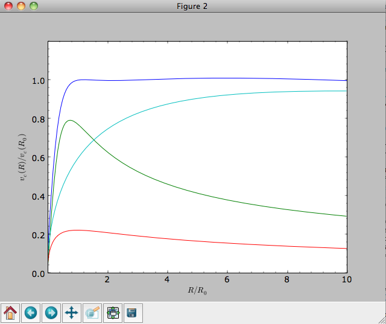
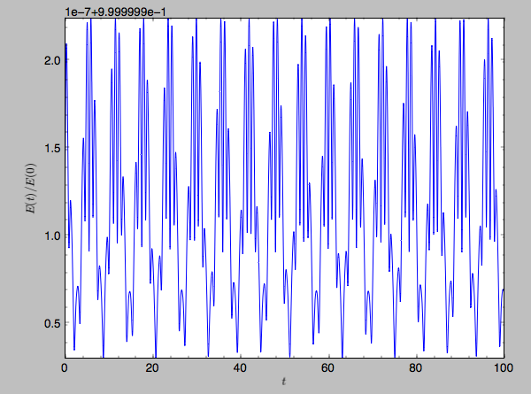
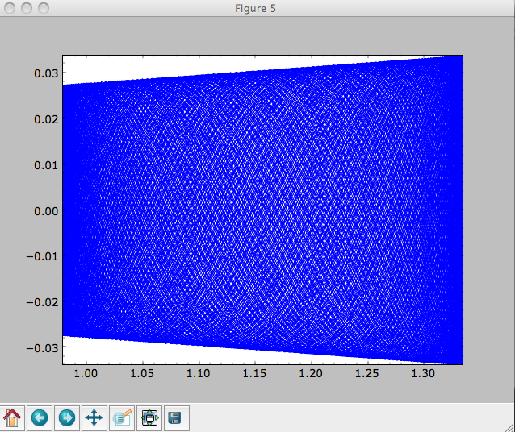
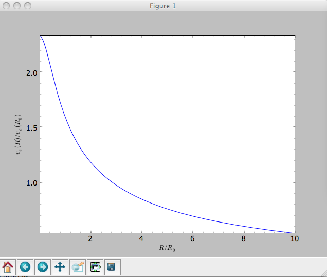
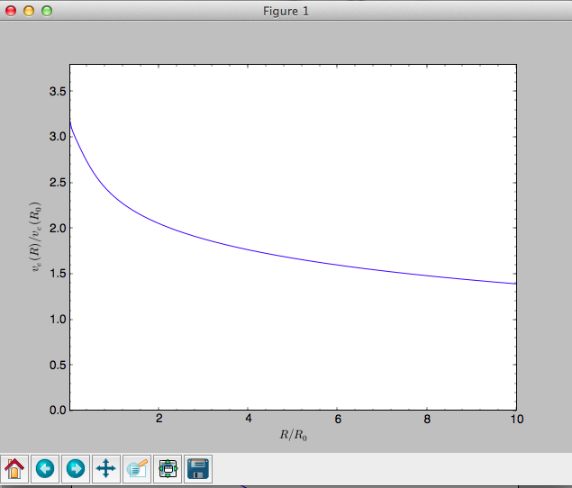

Introduction
=============

The most basic features of galpy are its ability to display rotation
curves and perform orbit integration for arbitrary combinations of
potentials. This section introduce the most basic features of
``galpy.potential`` and ``galpy.orbit``.

.. _rotcurves:

Rotation curves
---------------

The following code example shows how to initialize a Miyamoto-Nagai disk potential and plot its rotation curve

>>> from galpy.potential import MiyamotoNagaiPotential
>>> mp= MiyamotoNagaiPotential(a=0.5,b=0.0375,normalize=1.)
>>> mp.plotRotcurve(Rrange=[0.01,10.],grid=1001)

The ``normalize=1.`` option normalizes the potential such that the
radial force is a fraction ``normalize=1.`` of the radial force
necessary to make the circular velocity 1 at R=1. Starting in v1.2 you
can also initialize potentials with amplitudes and other parameters in
physical units; see below and other parts of this documentation.

.. |clippy| image:: _static/clippy.svg
   :height: 20px
   :width: 20px

.. TIP::
   You can copy all of the code examples in this documentation to your clipboard by clicking the |clippy| button in the top, right corner of each example. This can be directly pasted into a Python interpreter (including the >>>).

Similarly we can initialize other potentials and plot the combined
rotation curve

>>> from galpy.potential import NFWPotential, HernquistPotential
>>> mp= MiyamotoNagaiPotential(a=0.5,b=0.0375,normalize=.6)
>>> np= NFWPotential(a=4.5,normalize=.35)
>>> hp= HernquistPotential(a=0.6/8,normalize=0.05)
>>> (hp+mp+np).plotRotcurve(Rrange=[0.01,10.],grid=1001,yrange=[0.,1.2])

Note that the ``normalize`` values add up to 1. such that the circular
velocity will be 1 at R=1. Potentials can be combined into a composite
potential by adding them up ``hp+mp+np``.
The resulting rotation curve is approximately flat.
To show the rotation curves of the three components do

>>> mp.plotRotcurve(Rrange=[0.01,10.],grid=1001,overplot=True)
>>> hp.plotRotcurve(Rrange=[0.01,10.],grid=1001,overplot=True)
>>> np.plotRotcurve(Rrange=[0.01,10.],grid=1001,overplot=True)

You'll see the following

As a shortcut the ``hp+mp+np`` Milky-Way-like potential is defined as

>>> from galpy.potential import MWPotential

This is *not* the recommended Milky-Way-like potential in
``galpy``. The (currently) recommended Milky-Way-like potential is
``MWPotential2014``:

>>> from galpy.potential import MWPotential2014

``MWPotential2014`` has a more realistic bulge model and is actually
fit to various dynamical constraints on the Milky Way (see
:ref:`here <potential-mw>` and the ``galpy`` paper).

.. _units:

Units in galpy
---------------

Internal (natural) units
+++++++++++++++++++++++++

Above we normalized the potentials such that they give a circular
velocity of 1 at R=1. These are the standard galpy units (sometimes
referred to as *natural units* in the documentation). galpy will work
most robustly when using these natural units. When using galpy to
model a real galaxy with, say, a circular velocity of 220 km/s at R=8
kpc, all of the velocities should be scaled as v= V/[220 km/s] and all
of the positions should be scaled as x = X/[8 kpc] when using galpy's
natural units.

For convenience, a utility module ``conversion`` is included in
galpy that helps in converting between physical units and natural
units for various quantities. Alternatively, you can use the
``astropy`` `units <http://docs.astropy.org/en/stable/units/>`__
module to specify inputs in physical units and get outputs with units
(see the :ref:`next subsection <physunits>` below).  For example, in
natural units the orbital time of a circular orbit at R=1 is
:math:`2\pi`; in physical units this corresponds to

>>> from galpy.util import conversion
>>> print(2.*numpy.pi*conversion.time_in_Gyr(220.,8.))
# 0.223405444283

or about 223 Myr. We can also express forces in various physical
units. For example, for the Milky-Way-like potential defined in galpy,
we have that the vertical force at 1.1 kpc is

>>> from galpy.potential import MWPotential2014
>>> -MWPotential2014.zforce(1.,1.1/8.)*conversion.force_in_pcMyr2(220.,8.)
# 2.0259181908629933

which we can also express as an equivalent surface-density by dividing
by :math:`2\pi G`

>>> -MWPotential2014.zforce(1.,1.1/8.)*conversion.force_in_2piGmsolpc2(220.,8.)
# 71.658016957792356

Because the vertical force at the solar circle in the Milky Way at 1.1
kpc above the plane is approximately :math:`70\,(2\pi G\,
M_\odot\,\mathrm{pc}^{-2})` (e.g., `2013arXiv1309.0809B
<http://adsabs.harvard.edu/abs/2013arXiv1309.0809B>`_), this shows
that our Milky-Way-like potential has a realistic disk (at least in
this respect).

``conversion`` further has functions to convert densities,
masses, surface densities, and frequencies to physical units (actions
are considered to be too obvious to be included); see :ref:`here
<bovyconversion>` for a full list. As a final example, the local dark
matter density in the Milky-Way-like potential is given by

>>> MWPotential2014[2].dens(1.,0.)*conversion.dens_in_msolpc3(220.,8.)
# 0.0075419566970079373

or

>>> MWPotential2014[2].dens(1.,0.)*conversion.dens_in_gevcc(220.,8.)
# 0.28643101789044584

or about :math:`0.0075\,M_\odot\,\mathrm{pc}^{-3} \approx
0.3\,\mathrm{GeV\,cm}^{-3}`, in line with current measurements (e.g.,
`2012ApJ...756...89B
<http://adsabs.harvard.edu/abs/2012ApJ...756...89B>`_).

When ``galpy`` Potentials, Orbits, actionAngles, or DFs are
initialized using a distance scale ``ro=`` and a velocity scale
``vo=`` output quantities returned and plotted in physical
coordinates. Specifically, positions are returned in the units in the
table below. If ``astropy-units = True`` in the :ref:`configuration
file <configfile>`, then an `astropy Quantity
<http://docs.astropy.org/en/stable/api/astropy.units.Quantity.html>`__
which includes the units is returned instead (see below).

.. _unitstable:

=================== =================
Quantity            Default unit
=================== =================
position            kpc
velocity            km/s
angular velocity    km/s/kpc
energy              (km/s)^2
Jacobi integral     (km/s)^2
angular momentum    km/s x kpc
actions             km/s x kpc
frequencies         rad/Gyr
time                Gyr
period              Gyr
potential           (km/s)^2
force               km/s/Myr
force derivative    1/Gyr^2
density             Msun/pc^3
number density      1/pc^3
surface density     Msun/pc^2
mass                Msun
angle               rad
proper motion       mas/yr
phase-space density 1/(kpc x km/s)^3
=================== =================

.. WARNING::
   When returned as a ``Quantity``, frequencies get units of 1/Gyr, although in detail this means rad/Gyr (not cycles/Gyr).

.. _physunits:

Physical units
+++++++++++++++

.. TIP::
   With ``astropy-units = True`` in the configuration file and specifying all inputs using astropy Quantity with units, ``galpy`` will return outputs in convenient, unambiguous units.

Full support for unitful quantities using `astropy Quantity
<http://docs.astropy.org/en/stable/api/astropy.units.Quantity.html>`__
was added in v1.2. Thus, *any* input to a galpy Potential, Orbit,
actionAngle, or DF instantiation, method, or function can now be
specified in physical units as a Quantity. For example, we can set up
a Miyamoto-Nagai disk potential with a mass of
:math:`5\times10^{10}\,M_\odot`, a scale length of 3 kpc, and a scale
height of 300 pc as follows

       >>> from galpy.potential import MiyamotoNagaiPotential
       >>> from astropy import units
       >>> mp= MiyamotoNagaiPotential(amp=5*10**10*units.Msun,a=3.*units.kpc,b=300.*units.pc)

Internally, galpy uses a set of normalized units, where positions are
divided by a scale ``ro`` and velocities are divided by a scale
``vo``. If these are not specified, the default set from the
:ref:`configuration file <configfile>` is used. However, they can also
be specified on an instance-by-instance manner for all Potential,
Orbit, actionAngle, and DF instances. For example

       >>> mp= MiyamotoNagaiPotential(amp=5*10**10*units.Msun,a=3.*units.kpc,b=300.*units.pc,ro=9*units.kpc,vo=230.*units.km/units.s)

uses differently normalized internal units. When you specify the
parameters of a Potential, Orbit, etc. in physical units (e.g., the
Miyamoto-Nagai setup above), the internal set of units is unimportant
as long as you receive output in physical units (see below) and it is
unnecessary to change the values of ``ro`` and ``vo``, unless you are
modeling a system with very different distance and velocity scales
from the default set (for example, if you are looking at internal
globular cluster dynamics rather than galaxy dynamics). If you find an
input to any galpy function that does not take a Quantity as an input
(or that does it wrong), please report an `Issue
<https://github.com/jobovy/galpy/issues>`__.

.. WARNING::
   If you combine potentials by adding them (``comb_pot= pot1+pot2``), galpy uses the ``ro`` and ``vo`` scales from the first potential in the combination for physical <-> internal unit conversion. If you add potentials using the '+' operator, galpy will check that the units are compatible. galpy does **not** always check whether the unit systems of various objects are consistent when they are combined (but does check this for many common cases, e.g., integrating an Orbit in a Potential, setting up an actionAngle object for a given potential, setting up a DF object for a given potential, etc.).

galpy can also return values with units as an astropy
Quantity. Whether or not this is done is specified by the
``astropy-units`` option in the :ref:`configuration file <configfile>`. If
you want to get return values as a Quantity, set ``astropy-units = True``
in the configuration file. Then you can do for the Miyamoto-Nagai
potential above

	  >>> mp.vcirc(10.*units.kpc)
	  # <Quantity 135.72399857308042 km / s>

Note that if you do not specify the argument as a Quantity with units,
galpy will assume that it is given in natural units, viz.

      >>> mp.vcirc(10.)
      # <Quantity 51.78776595740726 km / s>

because this input is considered equal to 10 times the distance scale
(this is for the case using the default ``ro`` and ``vo``, the first
Miyamoto-Nagai instantiation of this subsection)

	>>> mp.vcirc(10.*8.*units.kpc)
	# <Quantity 51.78776595740726 km / s>

.. WARNING::
   If you do not specify arguments of methods and functions using a Quantity with units, galpy assumes that the argument has internal (natural) units.

If you do not use astropy Quantities (``astropy-units = False`` in the
configuration file), you can still get output in physical units when
you have specified ``ro=`` and ``vo=`` during instantiation of the
Potential, Orbit, etc. For example, for the Miyamoto-Nagai potential
above in a session with ``astropy-units = False``

      >>> mp= MiyamotoNagaiPotential(amp=5*10**10*units.Msun,a=3.*units.kpc,b=300.*units.pc)
      >>> mp.vcirc(10.*units.kpc)
      # 135.72399857308042

This return value is in km/s (see the :ref:`table <unitstable>` at the
end of the previous section for default units for different
quantities). Note that as long as astropy is installed, we can still
provide arguments as a Quantity, but the return value will not be a
Quantity when ``astropy-units = False``. If you setup a Potential, Orbit,
actionAngle, or DF object with parameters specified as a Quantity, the
default is to return any output in physical units. This is why
``mp.vcirc`` returns the velocity in km/s above. Potential and Orbit
instances (or combinations of Potentials) also support the functions
``turn_physical_off`` and ``turn_physical_on`` to turn physical output
off or on. For example, if we do

   >>> mp.turn_physical_off()

outputs will be in internal units

	>>> mp.vcirc(10.*units.kpc)
	# 0.61692726624127459

If you setup a Potential, Orbit, etc. object without specifying the
parameters as a Quantity, the default is to return output in natural
units, except when ``ro=`` and ``vo=`` scales are specified
(exception: when you wrap a potential that has physical outputs on,
the wrapped potential will also have them on). ``ro=`` and ``vo=`` can
always be given as a Quantity themselves. ``ro=`` and ``vo=`` can
always also be specified on a method-by-method basis, overwriting an
object's default. For example

	    >>> mp.vcirc(10.*units.kpc,ro=12.*units.kpc)
	    # 0.69273212489609337

Physical output can also be turned off on a method-by-method or function-by-function basis, for example

	 >>> mp.turn_physical_on() # turn overall physical output on
	 >>> mp.vcirc(10.*units.kpc)
	 135.72399857308042 # km/s
	 >>> mp.vcirc(10.*units.kpc,use_physical=False)
	 # 0.61692726624127459 # in natural units

Further examples of specifying inputs with units will be given
throughout the documentation.

Orbit integration
-----------------

.. WARNING::
   ``galpy`` uses a left-handed Galactocentric coordinate frame, as is common in studies of the kinematics of the Milky Way. This means that in particular cross-products, like the angular momentum :math:`\vec{L} = \vec{r}\times\vec{p}`, behave differently than in a right-handed coordinate frame.

We can also integrate orbits in all galpy potentials. Going back to a
simple Miyamoto-Nagai potential, we initialize an orbit as follows

>>> from galpy.orbit import Orbit
>>> mp= MiyamotoNagaiPotential(a=0.5,b=0.0375,amp=1.,normalize=1.)
>>> o= Orbit([1.,0.1,1.1,0.,0.1])

Since we gave ``Orbit()`` a five-dimensional initial condition
``[R,vR,vT,z,vz]``, we assume we are dealing with a three-dimensional
axisymmetric potential in which we do not wish to track the
azimuth. We then integrate the orbit for a set of times ``ts``

>>> import numpy
>>> ts= numpy.linspace(0,100,10000)
>>> o.integrate(ts,mp)

.. TIP::
   Like for the Miyamoto-Nagai example in the section above, the Orbit and integration times can also be specified in physical units, e.g., ``o= Orbit([8.*units.kpc,22.*units.km/units.s,242.*units.km/units.s.0.*units.pc,20.*units.km/s])`` and ``ts= numpy.linspace(0.,10.,10000)*units.Gyr``

Now we plot the resulting orbit as

>>> o.plot()

Which gives

.. image:: images/mp-orbit-integration.png

The integrator used is not symplectic, so the energy error grows with time, but is small nonetheless

>>> o.plotE(normed=True)

.. image:: images/mp-orbit-E.png

When we use a symplectic leapfrog integrator, we see that the energy
error remains constant

>>> o.integrate(ts,mp,method='leapfrog')
>>> o.plotE(xlabel=r'$t$',ylabel=r'$E(t)/E(0)$')

Because stars have typically only orbited the center of their galaxy
tens of times, using symplectic integrators is mostly unnecessary
(compared to planetary systems which orbits millions or billions of
times). galpy contains :ref:`fast integrators <fastorbit>` written in
C, which can be accessed through the ``method=`` keyword (e.g.,
``integrate(...,method='dopr54_c')`` is a fast high-order
Dormand-Prince method).

When we integrate for much longer we see how the orbit fills up a
torus (this could take a minute)

>>> ts= numpy.linspace(0,1000,10000)
>>> o.integrate(ts,mp)
>>> o.plot()

As before, we can also integrate orbits in combinations of potentials. Assuming ``mp, np,`` and ``hp`` were defined as above, we can

>>> ts= numpy.linspace(0,100,10000)
>>> o.integrate(ts,mp+hp+np)
>>> o.plot()

.. image:: images/mphpnp-orbit-integration.png

Energy is again approximately conserved

>>> o.plotE(xlabel=r'$t$',ylabel=r'$E(t)/E(0)$')

.. image:: images/mphpnp-orbit-E.png

Escape velocity curves
----------------------

Just like we can plot the rotation curve for a potential or a
combination of potentials, we can plot the escape velocity curve. For
example, the escape velocity curve for the Miyamoto-Nagai disk defined
above

>>> mp.plotEscapecurve(Rrange=[0.01,10.],grid=1001)

or of the combination of potentials defined above

>>> (mp+hp+np).plotEscapecurve(Rrange=[0.01,10.],grid=1001)

.. image:: images/esc-comb.png

For the Milky-Way-like potential ``MWPotential2014``, the
escape-velocity curve is

>>> MWPotential2014.plotEscapecurve(Rrange=[0.01,10.],grid=1001)

At the solar radius, the escape velocity is

>>> MWPotential2014.vesc(1.)
2.3316389848832784

Or, for a local circular velocity of 220 km/s

>>> MWPotential2014.vesc(1.)*220.
# 512.96057667432126

similar to direct measurements of this (e.g., `2007MNRAS.379..755S
<http://adsabs.harvard.edu/abs/2007MNRAS.379..755S>`_ and
`2014A%26A...562A..91P
<http://adsabs.harvard.edu/abs/2014A%26A...562A..91P>`_).
