A closer look at orbit integration
======================================

.. _orbinit:

**UPDATED in v1.5**: Orbit initialization
-----------------------------------------

Standard initialization
***********************

`Orbits <reference/orbitinit.html>`__ can be initialized in various
coordinate frames. The simplest initialization gives the initial
conditions directly in the Galactocentric cylindrical coordinate frame
(or in the rectangular coordinate frame in one dimension). ``Orbit()``
automatically figures out the dimensionality of the space from the
initial conditions in this case. In three dimensions initial
conditions are given either as ``[R,vR,vT,z,vz,phi]`` or one can
choose not to specify the azimuth of the orbit and initialize with
``[R,vR,vT,z,vz]``. Since potentials in galpy are easily initialized
to have a circular velocity of one at a radius equal to one, initial
coordinates are best given as a fraction of the radius at which one
specifies the circular velocity, and initial velocities are best
expressed as fractions of this circular velocity. For example,

>>> from galpy.orbit import Orbit
>>> o= Orbit([1.,0.1,1.1,0.,0.1,0.])

initializes a fully three-dimensional orbit, while

>>> o= Orbit([1.,0.1,1.1,0.,0.1])

initializes an orbit in which the azimuth is not tracked, as might be
useful for axisymmetric potentials.

In two dimensions, we can similarly specify fully two-dimensional
orbits ``o=Orbit([R,vR,vT,phi])`` or choose not to track the azimuth
and initialize with ``o= Orbit([R,vR,vT])``.

In one dimension we simply initialize with ``o= Orbit([x,vx])``.

Initialization with physical units
************************************

Orbits are normally used in galpy's *natural coordinates*. When Orbits
are initialized using a distance scale ``ro=`` and a velocity scale
``vo=``, then many Orbit methods return quantities in physical
coordinates. Specifically, physical distance and velocity scales are
specified as

>>> op= Orbit([1.,0.1,1.1,0.,0.1,0.],ro=8.,vo=220.)

All output quantities will then be automatically be specified in
physical units: kpc for positions, km/s for velocities, (km/s)^2 for
energies and the Jacobi integral, km/s kpc for the angular momentum
o.L() and actions, 1/Gyr for frequencies, and Gyr for times and
periods. See below for examples of this.

The actual initial condition can also be specified in physical
units. For example, the Orbit above can be initialized as

>>> from astropy import units
>>> op= Orbit([8.*units.kpc,22.*units.km/units.s,242*units.km/units.s,0.*units.kpc,22.*units.km/units.s,0.*units.deg])

In this case, it is unnecessary to specify the ``ro=`` and ``vo=``
scales; when they are not specified, ``ro`` and ``vo`` are set to the
default values from the :ref:`configuration file
<configfile>`. However, if they are specified, then those values
rather than the ones from the configuration file are used.

.. TIP::
   If you do input and output in physical units, the internal unit conversion specified by ``ro=`` and ``vo=`` does not matter!

Inputs to any Orbit method can also be specified with units as an
astropy Quantity. galpy's natural units are still used under the hood,
as explained in the section on :ref:`physical units in galpy
<physunits>`. For example, integration times can be specified in Gyr
if you want to integrate for a specific time period.

If for any output you do *not* want the output in physical units, you
can specify this by supplying the keyword argument
``use_physical=False``.

Initialization from observed coordinates or astropy ``SkyCoord``
****************************************************************

For orbit integration and characterization of observed stars or
clusters, initial conditions can also be specified directly as
observed quantities when ``radec=True`` is set (see further down in
this section on how to use an ``astropy`` `SkyCoord
<http://docs.astropy.org/en/stable/api/astropy.coordinates.SkyCoord.html#astropy.coordinates.SkyCoord>`__
instead). In this case a full three-dimensional orbit is initialized
as ``o= Orbit([RA,Dec,distance,pmRA,pmDec,Vlos],radec=True)``
where RA and Dec are expressed in degrees, the distance is expressed
in kpc, proper motions are expressed in mas/yr (pmra = pmra' *
cos[Dec] ), and ``Vlos`` is the heliocentric line-of-sight velocity
given in km/s. The observed epoch is currently assumed to be
J2000.00. These observed coordinates are translated to the
Galactocentric cylindrical coordinate frame by assuming a Solar motion
that can be specified as either ``solarmotion='hogg'`` (`2005ApJ...629..268H
<http://adsabs.harvard.edu/abs/2005ApJ...629..268H>`_),
``solarmotion='dehnen'`` (`1998MNRAS.298..387D
<http://adsabs.harvard.edu/abs/1998MNRAS.298..387D>`_) or
``solarmotion='schoenrich'`` (default; `2010MNRAS.403.1829S
<http://adsabs.harvard.edu/abs/2010MNRAS.403.1829S>`_). A circular
velocity can be specified as ``vo=220`` in km/s and a value for the
distance between the Galactic center and the Sun can be given as
``ro=8.0`` in kpc (e.g., `2012ApJ...759..131B
<http://adsabs.harvard.edu/abs/2012ApJ...759..131B>`_). While the
inputs are given in physical units, the orbit is initialized assuming
a circular velocity of one at the distance of the Sun (that is, the
orbit's position and velocity is scaled to galpy's *natural* units
after converting to the Galactocentric coordinate frame, using the
specified ``ro=`` and ``vo=``). The parameters of the coordinate
transformations are stored internally, such that they are
automatically used for relevant outputs (for example, when the RA of
an orbit is requested). An example of all of this is:

>>> o= Orbit([20.,30.,2.,-10.,20.,50.],radec=True,ro=8.,vo=220.)

However, the internally stored position/velocity vector is

>>> print(o.vxvv)
# [1.1480792664061401, 0.1994859759019009, 1.8306295160508093, -0.13064400474040533, 0.58167185623715167, 0.14066246212987227]

and is therefore in *natural* units.

.. TIP::
   Initialization using observed coordinates can also use units. So, for example, proper motions can be specified as ``2*units.mas/units.yr``.

Similarly, one can also initialize orbits from Galactic coordinates
using ``o= Orbit([glon,glat,distance,pmll,pmbb,Vlos],lb=True)``, where
glon and glat are Galactic longitude and latitude expressed in
degrees, and the proper motions are again given in mas/yr ((pmll =
pmll' * cos[glat] ):

>>> o= Orbit([20.,30.,2.,-10.,20.,50.],lb=True,ro=8.,vo=220.)
>>> print(o.vxvv)
# [0.79959714332811838, 0.073287283885367677, 0.5286278286083651, 0.12748861331872263, 0.89074407199364924, 0.0927414387396788]

When ``radec=True`` or ``lb=True`` is set, velocities can also be
specified in Galactic coordinates if ``UVW=True`` is set. The input is
then ``[RA,Dec,distance,U,V,W]``, where the velocities are expressed
in km/s. U is, as usual, defined as -vR (minus vR).

Finally, orbits can also be initialized using an
``astropy.coordinates.SkyCoord`` object. For example, the (ra,dec)
example from above can also be initialized as:

>>> from astropy.coordinates import SkyCoord
>>> import astropy.units as u
>>> c= SkyCoord(ra=20.*u.deg,dec=30.*u.deg,distance=2.*u.kpc,
	        pm_ra_cosdec=-10.*u.mas/u.yr,pm_dec=20.*u.mas/u.yr,
                radial_velocity=50.*u.km/u.s)
>>> o= Orbit(c)

In this case, you can still specify the properties of the
transformation to Galactocentric coordinates using the standard
``ro``, ``vo``, ``zo``, and ``solarmotion`` keywords, or you can use
the ``SkyCoord`` `Galactocentric frame specification
<http://docs.astropy.org/en/stable/api/astropy.coordinates.Galactocentric.html#astropy.coordinates.Galactocentric>`__
and these are propagated to the ``Orbit`` instance. For example,

>>> from astropy.coordinates import CartesianDifferential
>>> c= SkyCoord(ra=20.*u.deg,dec=30.*u.deg,distance=2.*u.kpc,
	        pm_ra_cosdec=-10.*u.mas/u.yr,pm_dec=20.*u.mas/u.yr,
                radial_velocity=50.*u.km/u.s,
                galcen_distance=8.*u.kpc,z_sun=15.*u.pc,
                galcen_v_sun=CartesianDifferential([10.0,235.,7.]*u.km/u.s))
>>> o= Orbit(c)

A subtlety here is that the ``galcen_distance`` and ``ro`` keywords
are not interchangeable, because the former is the distance between
the Sun and the Galactic center and ``ro`` is the projection of this
distance onto the Galactic midplane. Another subtlety is that the
``astropy`` Galactocentric frame is a right-handed frame, while galpy
normally uses a left-handed frame, so the sign of the x component of
``galcen_v_sun`` is the opposite of what it would be in
``solarmotion``. Because the Galactocentric frame in ``astropy`` does
not specify the circular velocity, but only the Sun's velocity, you
still need to specify ``vo`` to use a non-default circular velocity.

When orbits are initialized using ``radec=True``, ``lb=True``, or
using a ``SkyCoord`` physical scales ``ro=`` and ``vo=`` are
automatically specified (because they have defaults of ``ro=8`` and
``vo=220``). Therefore, all output quantities will be specified in
physical units (see above). If you do want to get outputs in galpy's
natural coordinates, you can turn this behavior off by doing

>>> o.turn_physical_off()

All outputs will then be specified in galpy's natural coordinates.

**NEW in v1.5**: Initializing multiple objects at once
*******************************************************

In all of the examples above, the ``Orbit`` instance corresponds to a
single object, but ``Orbit`` instances can also contain and analyze
multiple objects at once. This makes handling ``Orbit`` instances
highly convenient and also allows for efficient handling of multiple
objects. Many of the most computationally-intense methods have been
parallelized (orbit integration; analytic eccentricity, zmax,
etc. calculation; action-angle calculations) and some other methods
switch to more efficient algorithms for larger numbers of objects
(e.g., ``rguiding``). 

All of the methods for initializing ``Orbit`` instances above work for
multiple objects. Specifically, the initial conditions can be:

* Array of arbitrary shape (shape,phasedim); needs to be in internal units (for Quantity input; see 'list' option below or use a SkyCoord):
    * in Galactocentric cylindrical coordinates with phase-space coordinates arranged as [R,vR,vT(,z,vz,phi)];
    * [ra,dec,d,mu_ra, mu_dec,vlos] or [l,b,d,mu_l, mu_b, vlos] in [deg,deg,kpc,mas/yr,mas/yr,km/s], or [ra,dec,d,U,V,W] or [l,b,d,U,V,W] in [deg,deg,kpc,km/s,km/s,kms] (ICRS where relevant; mu_ra = mu_ra * cos dec and mu_l = mu_l * cos ); use the ``radec=``, ``lb=``, and ``UVW=`` keywords as before
* astropy (>v3.0) SkyCoord with arbitrary shape, including velocities;
* lists of initial conditions, entries can be
   * individual Orbit instances (of single objects)
   * Quantity arrays arranged as in the first bullet above (so things like [R,vR,vT,z,vz,phi], where R, vR, ... can be arbitrary shape Quantity arrays)
   * list of Quantities (so things like [R1,vR1,..,], where R1, vR1, ... are scalar Quantities
   * None: assumed to be the Sun; if None occurs in a list it is assumed to be the Sun *and all other items in the list are assumed to be [ra,dec,...]*; cannot be combined with Quantity lists
   * lists of scalar phase-space coordinates arranged as in the first bullet above (so things like [R,vR,...] where R,vR are scalars in internal units  

.. TIP::
   For multiple object initialization using an array or SkyCoord, arbitrary input shapes are supported.

An example initialization with an array is:

>>> vxvvs= numpy.array([[1.,0.1,1.,0.1,-0.2,1.5],[0.1,0.3,1.1,-0.3,0.4,2.]])
>>> orbits= Orbit(vxvvs)
>>> print(orbits.R())
# [ 1.   0.1]

and with a SkyCoord:

>>> numpy.random.seed(1)
>>> nrand= 30
>>> ras= numpy.random.uniform(size=nrand)*360.*u.deg
>>> decs= 90.*(2.*numpy.random.uniform(size=nrand)-1.)*u.deg
>>> dists= numpy.random.uniform(size=nrand)*10.*u.kpc
>>> pmras= 20.*(2.*numpy.random.uniform(size=nrand)-1.)*20.*u.mas/u.yr
>>> pmdecs= 20.*(2.*numpy.random.uniform(size=nrand)-1.)*20.*u.mas/u.yr
>>> vloss= 200.*(2.*numpy.random.uniform(size=nrand)-1.)*u.km/u.s
# Without any custom coordinate-transformation parameters
>>> co= SkyCoord(ra=ras,dec=decs,distance=dists, 
                 pm_ra_cosdec=pmras,pm_dec=pmdecs,
                 radial_velocity=vloss,
                 frame='icrs')
>>> orbits= Orbit(co)
>>> print(orbits.ra()[:3],ras[:3])
# [  1.50127922e+02   2.59316818e+02   4.11749371e-02] deg [  1.50127922e+02   2.59316818e+02   4.11749342e-02] deg

As before, you can use the ``SkyCoord`` Galactocentric frame
specification here.

``Orbit`` instances containing multiple objects act like numpy arrays
in many ways, but have some subtly different behaviors for some
functions. For example, one can do:

>>> print(len(orbits))
# 30
>>> print(orbits.shape)
# (30,)
>>> print(orbits.size)
# 30
>>> orbits.reshape((6,5)) # reshape is done inplace
>>> print(len(orbits))
# 6
>>> print(orbits.shape)
# (6,5)
>>> print(orbits.size)
# 30
>>> sliced_orbits= orbits[:3,1:5] # Extract a subset using numpy's slicing rules
>>> print(sliced_orbits.shape)
# (3,4)
>>> single_orbit= orbits[1,3] # Extract a single object
>>> print(single_orbit.shape)
# ()

Slicing creates a new ``Orbit`` instance. When slicing an ``Orbit``
instance that has been integrated, the integrated orbit will be
transferred to the new instance.

The shape of the ``Orbit`` instances is retained for all relevant
outputs. Continuing on from the previous example (where ``orbits`` has
shape ``(6,5)`` after we reshaped it), we have:

>>> print(orbits.R().shape)
# (6,5)
>>> print(orbits.L().shape)
# (6,5,3)

After orbit integration, evaluating ``orbits.R(times)`` would return
an array with shape ``(6,5,ntimes)`` here.

.. _orbfromname:

Initialization from an object's name
****************************************

A convenience method, ``Orbit.from_name``, is also available to initialize
orbits from the name of an object. For example, for the star `Lacaille 8760 <https://en.wikipedia.org/wiki/Lacaille_8760>`__:

>>> o= Orbit.from_name('Lacaille 8760', ro=8., vo=220.)
>>> [o.ra(), o.dec(), o.dist(), o.pmra(), o.pmdec(), o.vlos()]
# [319.31362023999276, -38.86736390000036, 0.003970940656277758, -3258.5529999996584, -1145.3959999996205, 20.560000000006063]

but this also works for some globular clusters, e.g., to obtain `Omega Cen <https://en.wikipedia.org/wiki/Omega_Centauri>`__'s orbit and current location in the Milky Way do:

>>> o= Orbit.from_name('Omega Cen')
>>> from galpy.potential import MWPotential2014
>>> ts= numpy.linspace(0.,100.,2001)
>>> o.integrate(ts,MWPotential2014)
>>> o.plot()
>>> plot([o.R()],[o.z()],'ro')

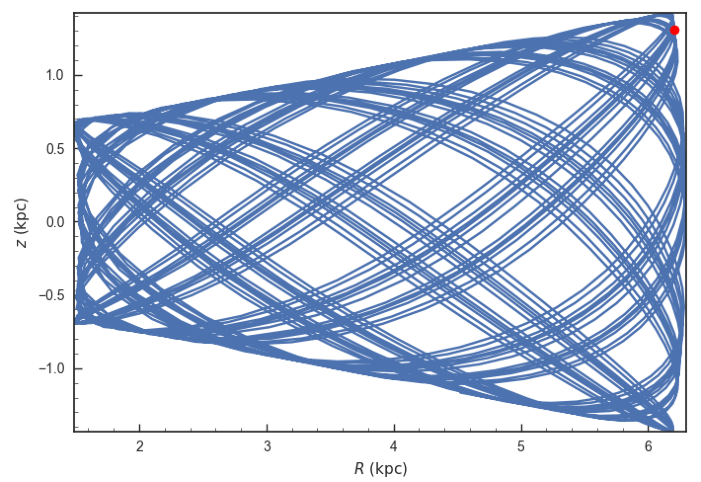

We see that Omega Cen is currently close to its maximum distance from both the Galactic center and from the Galactic midplane.

Similarly, you can do:

>>> o= Orbit.from_name('LMC')
>>> [o.ra(), o.dec(), o.dist(), o.pmra(), o.pmdec(), o.vlos()]
# [80.894200000000055, -69.756099999999847, 49.999999999999993, 1.909999999999999, 0.2290000000000037, 262.19999999999993]

It is also possible to initialize using multiple names, for example:

>>> o= Orbit.from_name(['LMC','SMC'])
>>> print(o.ra(),o.dec(),o.dist())
# [ 80.8942  13.1583] deg [-69.7561 -72.8003] deg [ 50.  60.] kpc

The names are stored in the ``name`` attribute:

>>> print(o.name)
# ['LMC', 'SMC']

The ``Orbit.from_name`` method attempts to resolve the name of the
object in SIMBAD, and then use the observed coordinates found there to
generate an ``Orbit`` instance. In order to query SIMBAD,
``Orbit.from_name`` requires the `astroquery
<https://astroquery.readthedocs.io/>`_ package to be installed. A
small number of objects, mainly Milky Way globular clusters and dwarf
satellite galaxies, have their phase-space coordinates stored in a
file that is part of galpy and for these objects the values from this
file are used rather than querying SIMBAD. ``Orbit.from_name``
supports tab completion in IPython/Jupyter for this list of objects

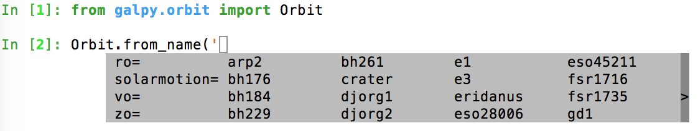

.. TIP::
   Setting up an ``Orbit`` instance *without* arguments will return an Orbit instance representing the Sun: ``o= Orbit()``. This instance has physical units *turned on by default*, so methods will return outputs in physical units unless you ``o.turn_physical_off()``.

.. WARNING::
   Orbits initialized using ``Orbit.from_name`` have physical output *turned on by default*, so methods will return outputs in physical units unless you ``o.turn_physical_off()``.

Orbit integration
------------------

After an orbit is initialized, we can integrate it for a set of times
``ts``, given as a numpy array. For example, in a simple logarithmic
potential we can do the following

>>> from galpy.potential import LogarithmicHaloPotential
>>> lp= LogarithmicHaloPotential(normalize=1.)
>>> o= Orbit([1.,0.1,1.1,0.,0.1,0.])
>>> import numpy
>>> ts= numpy.linspace(0,100,10000)
>>> o.integrate(ts,lp)

to integrate the orbit from ``t=0`` to ``t=100``, saving the orbit at
10000 instances. In physical units, we can integrate for 10 Gyr as follows

>>> from astropy import units
>>> ts= numpy.linspace(0,10.,10000)*units.Gyr
>>> o.integrate(ts,lp)

.. WARNING::
   When the integration times are not specified using a Quantity, they are assumed to be in natural units.

If we initialize the Orbit using a distance scale ``ro=`` and a
velocity scale ``vo=``, then Orbit plots and outputs will use physical
coordinates (currently, times, positions, and velocities)

>>> op= Orbit([1.,0.1,1.1,0.,0.1,0.],ro=8.,vo=220.) #Use Vc=220 km/s at R= 8 kpc as the normalization
>>> op.integrate(ts,lp) 

An ``Orbit`` instance containing multiple objects can be integrated in
the same way and the orbit integration will be performed in parallel
on machines with multiple cores. For the fast C integrators (:ref:`see
below <fastorbit>`), this parallelization is done using OpenMP in C
and requires one to set the ``OMP_NUM_THREADS`` environment variable
to control the number of cores used. The Python integrators are
parallelized in Python and by default also use the ``OMP_NUM_THREADS``
variable to set the number of cores (but for the Python integrators
this can be overwritten). A simple example is

>>> vxvvs= numpy.array([[1.,0.1,1.,0.1,-0.2,1.5],[0.1,0.3,1.1,-0.3,0.4,2.]])
>>> orbits= Orbit(vxvvs)
>>> orbits.integrate(ts,lp)
>>> print(orbits.R(ts).shape)
# (2,10000)
>>> print(orbits.R(ts))
# [[ 1.          1.00281576  1.00563403 ...,  1.05694767  1.05608923
#   1.0551804 ]
# [ 0.1         0.18647825  0.27361065 ...,  3.39447863  3.34992543
#   3.30527001]]

Displaying the orbit
---------------------

After integrating the orbit, it can be displayed by using the
``plot()`` function. The quantities that are plotted when ``plot()``
is called depend on the dimensionality of the orbit: in 3D the (R,z)
projection of the orbit is shown; in 2D either (X,Y) is plotted if the
azimuth is tracked and (R,vR) is shown otherwise; in 1D (x,vx) is
shown. E.g., for the example given above,

>>> o.plot()

gives

.. image:: images/lp-orbit-integration.png

If we do the same for the Orbit that has physical distance and
velocity scales associated with it, we get the following

>>> op.plot()

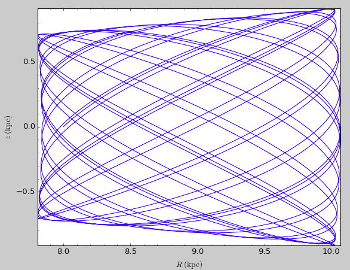

If we call ``op.plot(use_physical=False)``, the quantities will be
displayed in natural galpy coordinates. 

Plotting an ``Orbit`` instance that consists of multiple objects plots
all objects at once, e.g.,

>>> orbits.plot()

gives

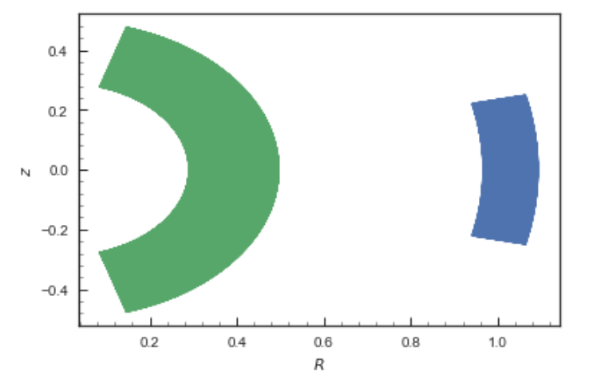

Other projections of the orbit can be displayed by specifying the
quantities to plot. E.g., 

>>> o.plot(d1='x',d2='y')

gives the projection onto the plane of the orbit:

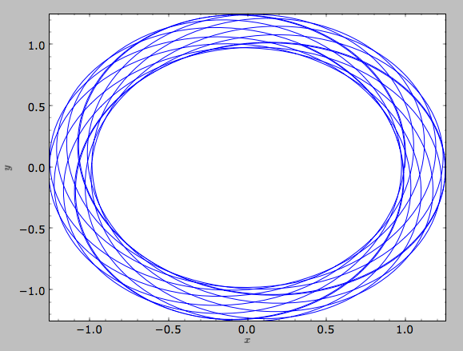

while

>>> o.plot(d1='R',d2='vR')

gives the projection onto (R,vR):

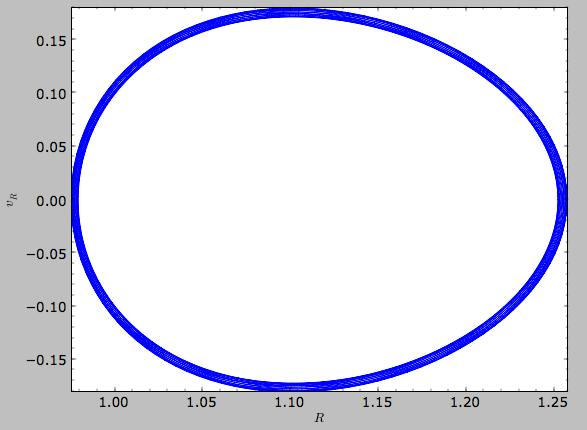

We can also plot the orbit in other coordinate systems such as
Galactic longitude and latitude

>>> o.plot('k.',d1='ll',d2='bb')

which shows

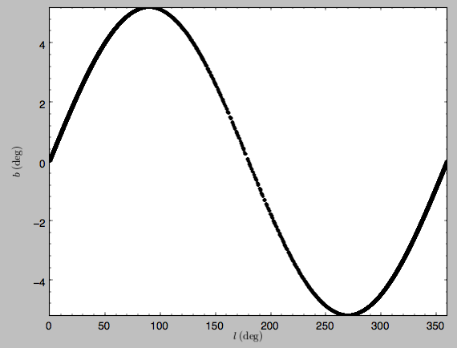

or RA and Dec

>>> o.plot('k.',d1='ra',d2='dec')

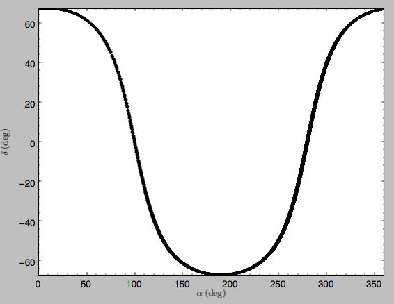

See the documentation of the o.plot function and the o.ra(), o.ll(),
etc. functions on how to provide the necessary parameters for the
coordinate transformations.

It is also possible to plot quantities computed from the basic Orbit
outputs like ``o.x()``, ``o.r()``, etc. For this to work, the `numexpr
<https://github.com/pydata/numexpr>`__ module needs to be installed;
this can be done using ``pip`` or ``conda``. Then you can ask for
plots like

>>> o.plot(d1='r',d2='vR*R/r+vz*z/r')

where ``d2=`` converts the velocity to spherical coordinates (this is
currently not a pre-defined option). This gives the following orbit
(which is closed in this projection, because we are using a spherical
potential):

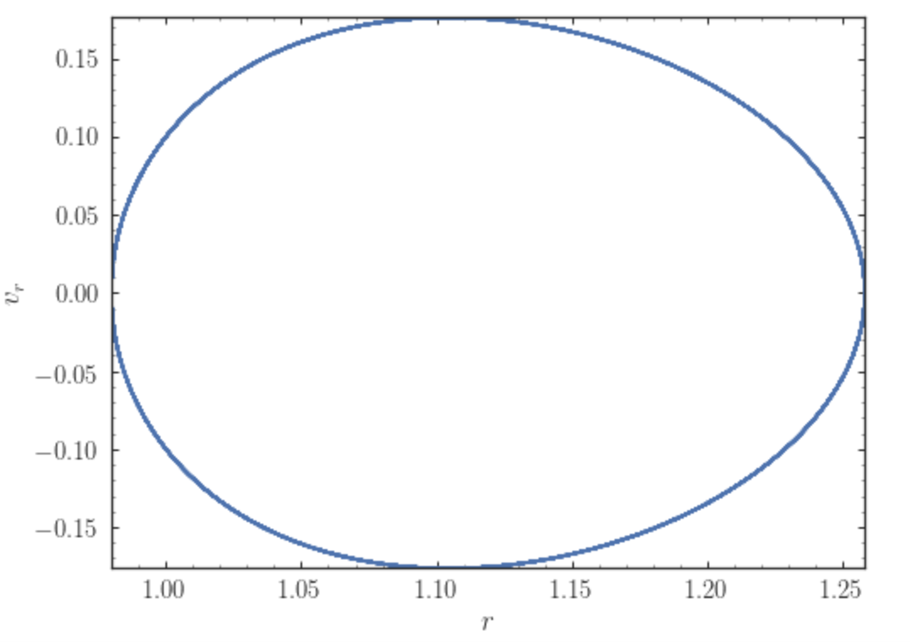

You can also do  more complex things like

>>> o.plot(d1='x',d2='y')
>>> o.plot(d1='R*cos(phi-{:f}*t)'.format(o.Op(quantity=False)),
           d2='R*sin(phi-{:f}*t)'.format(o.Op(quantity=False)),
          overplot=True)

which shows the orbit in the regular ``(x,y)`` frame as well as in a
``(x,y)`` frame that is rotating at the angular frequency of the
orbit. When doing more complex calculations like this, you need to
make sure that you are getting the units right: parameters ``param``
in the expression you provide are directly evaluated as ``o.param()``,
which depending on how you setup the object may or may not return
output in physical units. The expression above is safe, because
``o.Op`` evaluated like this will be in a consistent unit system with
the rest of the expression. Expressions cannot contain astropy
Quantities (these cannot be parsed by the parser), which is why
``quantity=False`` is specified; this is also used internally.

Finally, it is also possible to plot arbitrary functions of time with
``Orbit.plot``, by specifying ``d1=`` or ``d2=`` as a function. For
example, to display the orbital velocity in the spherical radial
direction, which we also did with the expression above, you can do the
following

>>> o.plot(d1='r',
	   d2=lambda t: o.vR(t)*o.R(t)/o.r(t)+o.vz(t)*o.z(t)/o.r(t),
	   ylabel='v_r')

For a function like this, just specifying it as the expression
``d2='vR*R/r+vz*z/r'`` is much more convenient, but expressions that
cannot be parsed automatically could be directly given as a function.

.. _orbanim:

Animating the orbit
-------------------

.. WARNING::
   Animating orbits is a new, experimental feature at this time that may be changed in later versions. It has only been tested in a limited fashion. If you are having problems with it, please open an `Issue <https://github.com/jobovy/galpy/issues>`__ and list all relevant details about your setup (python version, jupyter version, browser, any error message in full). It may also be helpful to check the javascript console for any errors.

In a `jupyter notebook <http://jupyter.org>`__ or in `jupyterlab <http://jupyterlab.readthedocs.io/en/stable/>`__ (jupyterlab versions >= 0.33) you can also create an animation of an orbit *after* you have integrated it. For example, to do this for the ``op`` orbit from above (but only integrated for 2 Gyr to create a shorter animation as an example here), do

>>> op.animate()

This will create the following animation

.. raw:: html
   :file: orbitanim.html

.. TIP::
   There is currently no option to save the animation within ``galpy``, but you could use screen capture software (for example, QuickTime's `Screen Recording <https://support.apple.com/kb/ph5882?locale=en_CA>`__ feature) to record your screen while the animation is running and save it as a video.

``animate`` has options to specify the width and height of the resulting animation, and it can also animate up to three projections of an orbit at the same time. For example, we can look at the orbit in both (x,y) and (R,z) at the same time with

>>> op.animate(d1=['x','R'],d2=['y','z'],width=800)

which gives

.. raw:: html
   :file: orbitanim2proj.html

If you want to embed the animation in a webpage, you can obtain the necessary HTML using the ``_repr_html_()`` function of the IPython.core.display.HTML object returned by ``animate``. By default, the HTML includes the entire orbit's data, but ``animate`` also has an option to store the orbit in a separate ``JSON`` file that will then be loaded by the output HTML code.

``animate`` also works in principle for ``Orbit`` instances containing multiple objects, but in practice the resulting animation is very slow once more than a few orbits/projections are used.
   
Orbit characterization
----------------------

The properties of the orbit can also be found using galpy. For
example, we can calculate the peri- and apocenter radii of an orbit,
its eccentricity, and the maximal height above the plane of the orbit

>>> o.rap(), o.rperi(), o.e(), o.zmax()
# (1.2581455175173673,0.97981663263371377,0.12436710999105324,0.11388132751079502)

or for multiple objects at once

>>> orbits.rap(), orbits.rperi(), orbits.e(), orbits.zmax()
# (array([ 1.0918143 ,  0.49557137]),
# array([ 0.96779816,  0.29150873]),
# array([ 0.06021334,  0.2592654 ]),
# array([ 0.24734084,  0.47327396]))

These four quantities can also be computed using analytical means (exact or approximations depending on the potential) by specifying ``analytic=True``

>>> o.rap(analytic=True), o.rperi(analytic=True), o.e(analytic=True), o.zmax(analytic=True)
# (1.2581448917376636,0.97981640959995842,0.12436697719989584,0.11390708640305315)

or for multiple objects at once (this calculation is done in parallel on systems that support it)

>>> orbits.rap(analytic=True), orbits.rperi(analytic=True), orbits.e(analytic=True), orbits.zmax(analytic=True)
# (array([ 1.09181433,  0.49557137]),
# array([ 0.96779816,  0.29150873]),
# array([ 0.06021335,  0.2592654 ]),
# array([ 0.24734693,  0.4733304 ]))

We can also calculate the energy of the orbit, either in the potential
that the orbit was integrated in, or in another potential:

>>> o.E(), o.E(pot=mp)
# (0.6150000000000001, -0.67390625000000015)

where ``mp`` is the Miyamoto-Nagai potential of :ref:`Introduction:
Rotation curves <rotcurves>`.

For the Orbit ``op`` that was initialized above with a distance scale
``ro=`` and a velocity scale ``vo=``, these outputs are all in
physical units

>>> op.rap(), op.rperi(), op.e(), op.zmax()
# (10.065158988860341,7.8385312810643057,0.12436696983841462,0.91105035688072711) #kpc
>>> op.E(), op.E(pot=mp)
# (29766.000000000004, -32617.062500000007) #(km/s)^2

We can also show the energy as a function of time (to check energy
conservation)

>>> o.plotE(normed=True)

gives

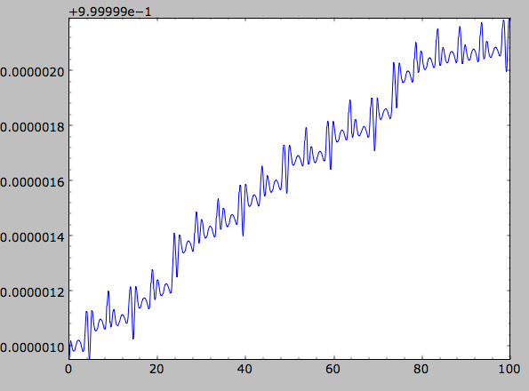

We can specify another quantity to plot the energy against by
specifying ``d1=``. We can also show the vertical energy, for example,
as a function of R

>>> o.plotEz(d1='R',normed=True)

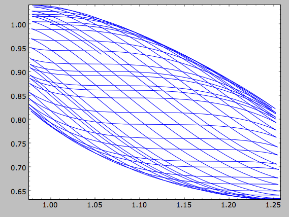

.. _fastchar:

Fast orbit characterization
---------------------------

It is also possible to use galpy for the fast estimation of orbit
parameters as demonstrated in `Mackereth & Bovy (2018)
<http://adsabs.harvard.edu/abs/2018PASP..130k4501M>`__ via the
Staeckel approximation (originally used by `Binney (2012)
<http://adsabs.harvard.edu/abs/2012MNRAS.426.1324B>`_ for the
appoximation of actions in axisymmetric potentials), without
performing any orbit integration.  The method uses the geometry of the
orbit tori to estimate the orbit parameters. After initialising an
``Orbit`` instance, the method is applied by specifying
``analytic=True`` and selecting ``type='staeckel'``.

>>> o.e(analytic=True, type='staeckel')

if running the above without integrating the orbit, the potential
should also be specified in the usual way

>>> o.e(analytic=True, type='staeckel', pot=mp)

This interface automatically estimates the necessary delta parameter
based on the initial condition of the ``Orbit`` object. (delta is the
focal-length parameter of the prolate spheroidal coordinate system
used in the approximation, see :ref:`the documentation of the
actionAngleStaeckel class <actionanglestaeckel>`).

While this is useful and fast for individual ``Orbit`` objects, it is
likely that users will want to rapidly evaluate the orbit parameters
of large numbers of objects. The easiest way to do this is by setting
up an ``Orbit`` instance that contains all objects and call the same
functions as above (in this case, the necessary delta parameter will
be automatically determined for each object in the instance based on
its initial condition)

>>> os= Orbit([R, vR, vT, z, vz, phi])
>>> os.e(analytic=True,type='staeckel',pot=mp)

In this case, the returned array has the same shape as the input
``R,vR,...`` arrays.

Rather than automatically estimating delta, you can specify an array
for ``delta`` when calling ``os.e`` (or ``zmax``, ``rperi``, and
``rap``), for example by first estimating good ``delta`` parameters as
follows:

>>> from galpy.actionAngle import estimateDeltaStaeckel
>>> delta= estimateDeltaStaeckel(mp, R, z, no_median=True)

where ``no_median=True`` specifies that the function return the delta
parameter at each given point rather than the median of the calculated
deltas (which is the default option). Then one can compute the
eccentricity etc. using individual delta values as:

>>> os.e(analytic=True,type='staeckel',pot=mp,delta=delta)

We can test the speed of this method in iPython by finding the
parameters at 100000 steps along an orbit in MWPotential2014, like
this

>>> o= Orbit([1.,0.1,1.1,0.,0.1,0.])
>>> ts = numpy.linspace(0,100,10000)
>>> o.integrate(ts,MWPotential2014)
>>> os= o(ts) # returns an Orbit instance with nt objects, each initialized at the position at one of the ts
>>> delta= estimateDeltaStaeckel(MWPotential2014,o.R(ts),o.z(ts),no_median=True)
>>> %timeit -n 10 os.e(analytic=True,pot=MWPotential2014,delta=delta)
# 584 ms ± 8.63 ms per loop (mean ± std. dev. of 7 runs, 1 loop each)

you can see that in this potential, each phase space point is
calculated in roughly 60µs.  further speed-ups can be gained by using
the ``galpy.actionAngle.actionAngleStaeckelGrid`` module, which first
calculates the parameters using a grid-based interpolation

>>> from galpy.actionAngle import actionAngleStaeckelGrid
>>> R, vR, vT, z, vz, phi = o.getOrbit().T
>>> aASG= actionAngleStaeckelGrid(pot=MWPotential2014,delta=0.4,nE=51,npsi=51,nLz=61,c=True,interpecc=True)
>>> %timeit -n 10 es, zms, rps, ras = aASG.EccZmaxRperiRap(R,vR,vT,z,vz,phi)
# 47.4 ms ± 5.11 ms per loop (mean ± std. dev. of 7 runs, 10 loops each)

where ``interpecc=True`` is required to perform the interpolation of
the orbit parameter grid.  Looking at how the eccentricity estimation
varies along the orbit, and comparing to the calculation using the
orbit integration, we see that the estimation good job

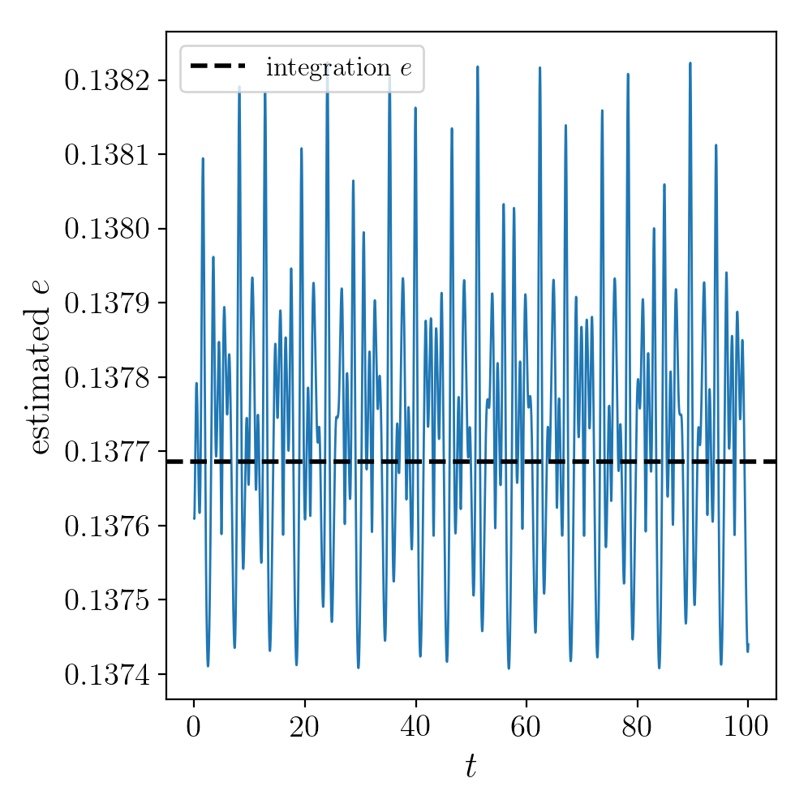

Accessing the raw orbit
-----------------------

The value of ``R``, ``vR``, ``vT``, ``z``, ``vz``, ``x``, ``vx``,
``y``, ``vy``, ``phi``, and ``vphi`` at any time can be obtained by
calling the corresponding function with as argument the time (the same
holds for other coordinates ``ra``, ``dec``, ``pmra``, ``pmdec``,
``vra``, ``vdec``, ``ll``, ``bb``, ``pmll``, ``pmbb``, ``vll``,
``vbb``, ``vlos``, ``dist``, ``helioX``, ``helioY``, ``helioZ``,
``U``, ``V``, and ``W``). If no time is given the initial condition is
returned, and if a time is requested at which the orbit was not saved
spline interpolation is used to return the value. Examples include

>>> o.R(1.)
# 1.1545076874679474
>>> o.phi(99.)
# 88.105603035901169
>>> o.ra(2.,obs=[8.,0.,0.],ro=8.)
# array([ 285.76403985])
>>> o.helioX(5.)
# array([ 1.24888927])
>>> o.pmll(10.,obs=[8.,0.,0.,0.,245.,0.],ro=8.,vo=230.)
# array([-6.45263888])

For the Orbit ``op`` that was initialized above with a distance scale
``ro=`` and a velocity scale ``vo=``, the first of these would be

>>> op.R(1.)
# 9.2360614837829225 #kpc

which we can also access in natural coordinates as

>>> op.R(1.,use_physical=False)
# 1.1545076854728653

We can also specify a different distance or velocity scale on the fly,
e.g.,

>>> op.R(1.,ro=4.) #different velocity scale would be vo=
# 4.6180307418914612

For ``Orbit`` instances that contain multiple objects, the functions
above return arrays with the shape of the Orbit.

We can also initialize an ``Orbit`` instance using the phase-space
position of another ``Orbit`` instance evaulated at time t. For
example,

>>> newOrbit= o(10.)

will initialize a new ``Orbit`` instance with as initial condition the
phase-space position of orbit ``o`` at ``time=10.``. If multiple times
are given, an ``Orbit`` instance with one object for each time will be
instantiated (this works even if the original ``Orbit`` instance
contained multiple objects already).

The whole orbit can also be obtained using the function ``getOrbit``

>>> o.getOrbit()

which returns a matrix of phase-space points with dimensions [ntimes,nphasedim] or [shape,ntimes,nphasedim] for ``Orbit`` instances with multiple objects.

.. _fastorbit:

**UPDATED IN v1.5** Fast orbit integration and available integrators
---------------------------------------------------------------------

The standard orbit integration is done purely in python using standard
scipy integrators. When fast orbit integration is needed for batch
integration of a large number of orbits, a set of orbit integration
routines are written in C that can be accessed for most potentials, as
long as they have C implementations, which can be checked by using the
attribute ``hasC``

>>> mp= MiyamotoNagaiPotential(a=0.5,b=0.0375,amp=1.,normalize=1.)
>>> mp.hasC
# True

Fast C integrators can be accessed through the ``method=`` keyword of
the ``orbit.integrate`` method. Currently available integrators are

* rk4_c
* rk6_c
* dopr54_c
* dop853_c

which are Runge-Kutta and Dormand-Prince methods. There are also a
number of symplectic integrators available

* leapfrog_c
* symplec4_c
* symplec6_c

The higher order symplectic integrators are described in `Yoshida
(1993) <http://adsabs.harvard.edu/abs/1993CeMDA..56...27Y>`_. In pure
Python, the available integrators are

* leapfrog
* odeint
* dop853

For most applications I recommend ``symplec4_c`` or ``dop853_c``,
which are speedy and reliable. For example, compare

>>> o= Orbit([1.,0.1,1.1,0.,0.1])
>>> timeit(o.integrate(ts,mp,method='leapfrog'))
# 1.34 s ± 41.8 ms per loop (mean ± std. dev. of 7 runs, 1 loop each)
>>> timeit(o.integrate(ts,mp,method='leapfrog_c'))
# galpyWarning: Using C implementation to integrate orbits
# 91 ms ± 2.42 ms per loop (mean ± std. dev. of 7 runs, 10 loops each)
>>> timeit(o.integrate(ts,mp,method='symplec4_c'))
# galpyWarning: Using C implementation to integrate orbits
# 9.67 ms ± 48.3 µs per loop (mean ± std. dev. of 7 runs, 100 loops each)
>>> timeit(o.integrate(ts,mp,method='dop853_c'))
# 4.65 ms ± 86.8 µs per loop (mean ± std. dev. of 7 runs, 100 loops each)

If the C extensions are unavailable for some reason, I recommend using
the ``odeint`` pure-Python integrator, as it is the fastest. Using the
same example as above

>>> o= Orbit([1.,0.1,1.1,0.,0.1])
>>> timeit(o.integrate(ts,mp,method='leapfrog'))
# 2.62 s ± 128 ms per loop (mean ± std. dev. of 7 runs, 1 loop each)
>>> timeit(o.integrate(ts,mp,method='odeint'))
# 153 ms ± 2.59 ms per loop (mean ± std. dev. of 7 runs, 10 loops each)
>>> timeit(o.integrate(ts,mp,method='dop853'))
# 1.61 s ± 218 ms per loop (mean ± std. dev. of 7 runs, 1 loop each)

Integration of the phase-space volume
--------------------------------------

``galpy`` further supports the integration of the phase-space volume
through the method ``integrate_dxdv``, although this is currently only
implemented for two-dimensional orbits (``planarOrbit``). As an
example, we can check Liouville's theorem explicitly. We initialize
the orbit

>>> o= Orbit([1.,0.1,1.1,0.])

and then integrate small deviations in each of the four
phase-space directions

>>> ts= numpy.linspace(0.,28.,1001) #~1 Gyr at the Solar circle
>>> o.integrate_dxdv([1.,0.,0.,0.],ts,mp,method='dopr54_c',rectIn=True,rectOut=True)
>>> dx= o.getOrbit_dxdv()[-1,:] # evolution of dxdv[0] along the orbit
>>> o.integrate_dxdv([0.,1.,0.,0.],ts,mp,method='dopr54_c',rectIn=True,rectOut=True)
>>> dy= o.getOrbit_dxdv()[-1,:]
>>> o.integrate_dxdv([0.,0.,1.,0.],ts,mp,method='dopr54_c',rectIn=True,rectOut=True)
>>> dvx= o.getOrbit_dxdv()[-1,:]
>>> o.integrate_dxdv([0.,0.,0.,1.],ts,mp,method='dopr54_c',rectIn=True,rectOut=True)
>>> dvy= o.getOrbit_dxdv()[-1,:]

We can then compute the determinant of the Jacobian of the mapping
defined by the orbit integration from time zero to the final time

>>> tjac= numpy.linalg.det(numpy.array([dx,dy,dvx,dvy]))

This determinant should be equal to one 

>>> print(tjac)
# 0.999999991189
>>> numpy.fabs(tjac-1.) < 10.**-8.
# True

The calls to ``integrate_dxdv`` above set the keywords ``rectIn=`` and
``rectOut=`` to True, as the default input and output uses phase-space
volumes defined as (dR,dvR,dvT,dphi) in cylindrical coordinates. When
``rectIn`` or ``rectOut`` is set, the in- or output is in rectangular
coordinates ([x,y,vx,vy] in two dimensions).

Implementing the phase-space integration for three-dimensional
``FullOrbit`` instances is straightforward and is part of the longer
term development plan for ``galpy``. Let the main developer know if
you would like this functionality, or better yet, implement it
yourself in a fork of the code and send a pull request!

Example: The eccentricity distribution of the Milky Way's thick disk
---------------------------------------------------------------------

A straightforward application of galpy's orbit initialization and
integration capabilities is to derive the eccentricity distribution of
a set of thick disk stars. We start by downloading the sample of SDSS
SEGUE (`2009AJ....137.4377Y
<http://adsabs.harvard.edu/abs/2009AJ....137.4377Y>`_) thick disk
stars compiled by Dierickx et al. (`2010arXiv1009.1616D
<http://adsabs.harvard.edu/abs/2010arXiv1009.1616D>`_) from CDS at
`this link
<http://vizier.cfa.harvard.edu/viz-bin/Cat?cat=J%2FApJ%2F725%2FL186&target=http&>`_.
Downloading the table and the ReadMe will allow you to read in the
data using ``astropy.io.ascii`` like so
 
>>> from astropy.io import ascii
>>> dierickx = ascii.read('table2.dat', readme='ReadMe')
>>> vxvv = numpy.dstack([dierickx['RAdeg'], dierickx['DEdeg'], dierickx['Dist']/1e3, dierickx['pmRA'], dierickx['pmDE'], dierickx['HRV']])[0]

After reading in the data (RA,Dec,distance,pmRA,pmDec,vlos; see above)
as a vector ``vxvv`` with dimensions [6,ndata] we (a) define the
potential in which we want to integrate the orbits, and (b) integrate
all orbits and compute their eccentricity numerically from the orbit
integration and analytically following the :ref:`Staeckel
approximation method <fastchar>` (the following takes lots of memory;
you might want to slice the ``orbits`` object to a smaller number to
run this code faster)

>>> ts= np.linspace(0.,20.,10000)
>>> lp= LogarithmicHaloPotential(normalize=1.)
>>> orbits= Orbit(vxvv,radec=True,ro=8.,vo=220.,solarmotion='hogg')
>>> e_ana= orbits.e(analytic=True,pot=lp,delta=1e-6)
>>> orbits.integrate(ts,lp)
>>> e_int= orbits.e()

We then find the following eccentricity distribution (from the numerical eccentricities)

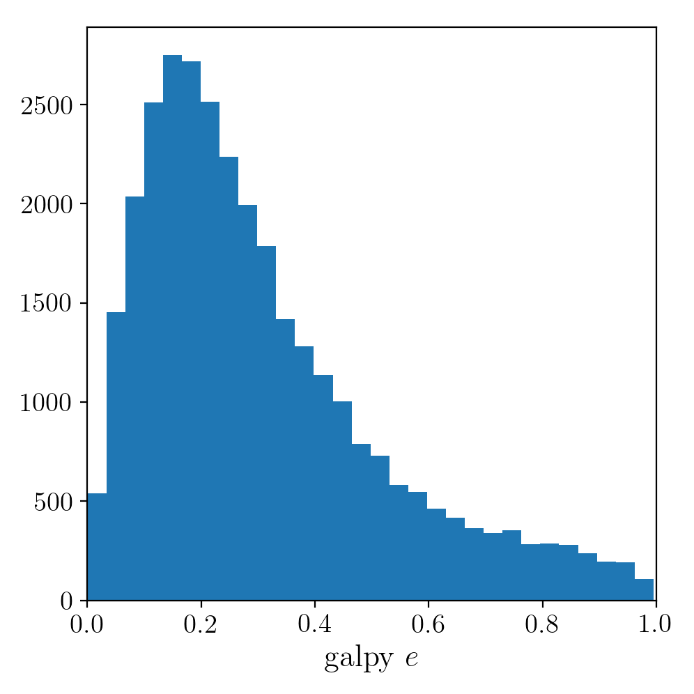

The eccentricity calculated by integration in galpy compare well with those
calculated by Dierickx et al., except for a few objects

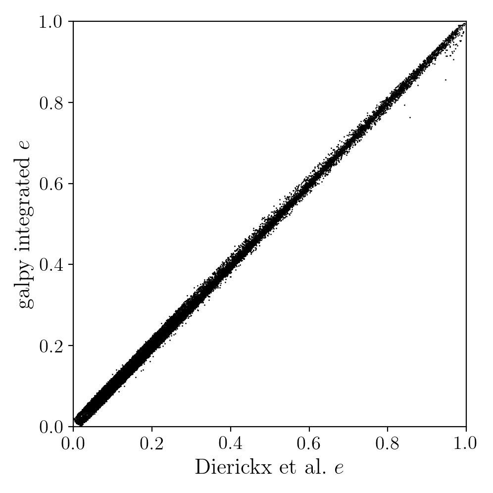

and the analytical estimates are equally as good:

In comparing the analytic and integrated eccentricity estimates - one can see that in this case
the estimation is almost exact, due to the spherical symmetry of the chosen potential:

.. image:: images/dierickx-integratedeanalytice.png
	:scale: 40 %

A script that calculates and plots everything can be downloaded
:download:`here <examples/dierickx_eccentricities.py>`. To generate the plots just run::

    python dierickx_eccentricities.py ../path/to/folder

specifiying the location you want to put the plots and data.

Alternatively - one can transform the observed coordinates into spherical coordinates and perform 
the estimations in one batch using the ``actionAngle`` interface, which takes considerably less time:

>>> from galpy import actionAngle
>>> deltas = actionAngle.estimateDeltaStaeckel(lp, Rphiz[:,0], Rphiz[:,2], no_median=True)
>>> aAS = actionAngleStaeckel(pot=lp, delta=0.)
>>> par = aAS.EccZmaxRperiRap(Rphiz[:,0], vRvTvz[:,0], vRvTvz[:,1], Rphiz[:,2], vRvTvz[:,2], Rphiz[:,1], delta=deltas)

The above code calculates the parameters in roughly 100ms on a single core.

Example: The orbit of the Large Magellanic Cloud in the presence of dynamical friction
--------------------------------------------------------------------------------------------------------

As a further example of what you can do with galpy, we investigate the
Large Magellanic Cloud's (LMC) past and future orbit. Because the LMC
is a massive satellite of the Milky Way, its orbit is affected by
dynamical friction, a frictional force of gravitational origin that
occurs when a massive object travels through a sea of low-mass objects
(halo stars and dark matter in this case). First we import all the
necessary packages:

>>> from astropy import units
>>> from galpy.potential import MWPotential2014, ChandrasekharDynamicalFrictionForce
>>> from galpy.orbit import Orbit

(also do ``%pylab inline`` if running this in a jupyter notebook or
turn on the ``pylab`` option in ipython for plotting). We can load the
current phase-space coordinates for the LMC using the
``Orbit.from_name`` function described :ref:`above <orbfromname>`:

>>> o= Orbit.from_name('LMC')

We will use ``MWPotential2014`` as our Milky-Way potential
model. Because the LMC is in fact unbound in ``MWPotential2014``, we
increase the halo mass by 50% to make it bound (this corresponds to a
Milky-Way halo mass of :math:`\approx 1.2\,\times 10^{12}\,M_\odot`, a
not unreasonable value). We can adjust a galpy Potential's amplitude simply by multiplying the potential by a number, so to increase the mass by 50% we do

>>> MWPotential2014[2]*= 1.5

Let us now integrate the orbit backwards in time for 10 Gyr and plot
it:

>>> ts= numpy.linspace(0.,-10.,1001)*units.Gyr
>>> o.integrate(ts,MWPotential2014)
>>> o.plot(d1='t',d2='r')

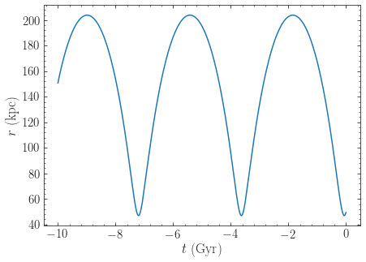

We see that the LMC is indeed bound, with an apocenter just over 250
kpc. Now let's add dynamical friction for the LMC, assuming that its
mass is :math:`5\times 10^{10}\,M_\odot`. We setup the
dynamical-friction object:

>>> cdf= ChandrasekharDynamicalFrictionForce(GMs=5.*10.**10.*units.Msun,rhm=5.*units.kpc,
					     dens=MWPotential2014)

Dynamical friction depends on the velocity distribution of the halo,
which is assumed to be an isotropic Gaussian distribution with a
radially-dependent velocity dispersion. If the velocity dispersion is
not given (like in the example above), it is computed from the
spherical Jeans equation. We have set the half-mass radius to 5 kpc
for definiteness. We now make a copy of the orbit instance above and
integrate it in the potential that includes dynamical friction:

>>> odf= o()
>>> odf.integrate(ts,MWPotential2014+cdf)

Overlaying the orbits, we can see the difference in the evolution:

>>> o.plot(d1='t',d2='r',label=r'$\mathrm{No\ DF}$')
>>> odf.plot(d1='t',d2='r',overplot=True,label=r'$\mathrm{DF}, M=5\times10^{10}\,M_\odot$')
>>> ylim(0.,400.)
>>> legend()

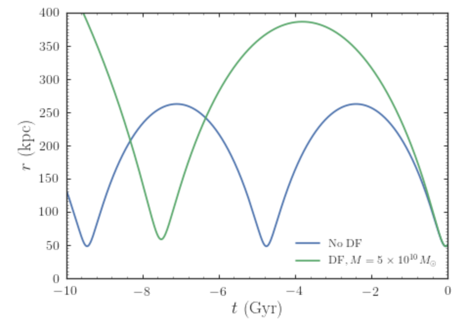

We see that dynamical friction removes energy from the LMC's orbit,
such that its past apocenter is now around 400 kpc rather than 250
kpc! The period of the orbit is therefore also much longer. Clearly,
dynamical friction has a big impact on the orbit of the LMC.

Recent observations have suggested that the LMC may be even more
massive than what we have assumed so far, with masses over
:math:`10^{11}\,M_\odot` seeming in good agreement with various
observations. Let's see how a mass of :math:`10^{11}\,M_\odot` changes
the past orbit of the LMC. We can change the mass of the LMC used in
the dynamical-friction calculation as

>>> cdf.GMs= 10.**11.*units.Msun

This way of changing the mass is preferred over re-initializing the
``ChandrasekharDynamicalFrictionForce`` object, because it avoids
having to solve the Jeans equation again to obtain the velocity
dispersion. Then we integrate the orbit and overplot it on the
previous results:

>>> odf2= o()
>>> odf2.integrate(ts,MWPotential2014+cdf)

and

>>> o.plot(d1='t',d2='r',label=r'$\mathrm{No\ DF}$')
>>> odf.plot(d1='t',d2='r',overplot=True,label=r'$\mathrm{DF}, M=5\times10^{10}\,M_\odot$')
>>> odf2.plot(d1='t',d2='r',overplot=True,label=r'$\mathrm{DF}, M=1\times10^{11}\,M_\odot$')
>>> ylim(0.,740.)
>>> legend()

which gives

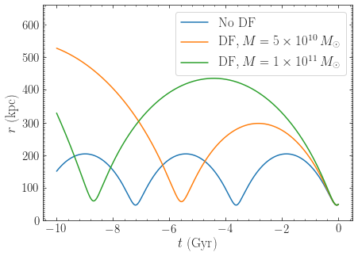

Now the apocenter increases to about 600 kpc and the LMC doesn't
perform a full orbit over the last 10 Gyr.

Finally, let's see what will happen in the future if the LMC is as
massive as :math:`10^{11}\,M_\odot`. We simply flip the sign of the
integration times to get the future trajectory:

>>> odf2.integrate(-ts[-ts < 9*units.Gyr],MWPotential2014+cdf)
>>> odf2.plot(d1='t',d2='r')

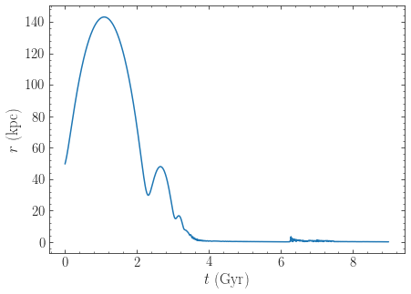

Because of the large effect of dynamical friction, the LMC will merge
with the Milky-Way in about 4 Gyr after a few more pericenter
passages. Note that we have not taken any mass-loss into
account. Because mass-loss would lead to a smaller dynamical-friction
force, this would somewhat increase the merging timescale, but
dynamical friction will inevitably lead to the merger of the LMC with
the Milky Way.

.. WARNING::
   When using dynamical friction, if the radius gets very small, the integration sometimes becomes very erroneous, which can lead to a big, unphysical kick (even though we turn off friction at very small radii); this is the reason why we have limited the future integration to 9 Gyr in the example above. When using dynamical friction, inspect the full orbit to make sure to catch whether a merger has happened. 
