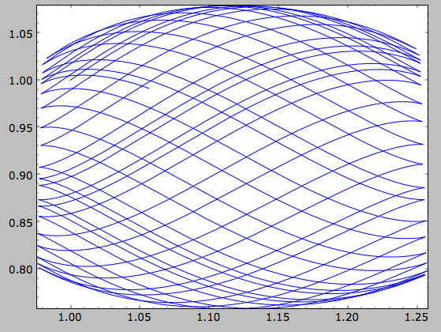

A closer look at orbit integration
======================================

.. _orbinit:

Orbit initialization
--------------------

Standard initialization
***********************

Orbits can be initialized in various coordinate frames. The simplest
initialization gives the initial conditions directly in the
Galactocentric cylindrical coordinate frame (or in the rectangular
coordinate frame in one dimension). ``Orbit()`` automatically figures
out the dimensionality of the space from the initial conditions in
this case. In three dimensions initial conditions are given either as
``vxvv=[R,vR,vT,z,vz,phi]`` or one can choose not to specify the
azimuth of the orbit and initialize with
``vxvv=[R,vR,vT,z,vz]``. Since potentials in galpy are easily
initialized to have a circular velocity of one at a radius equal to
one, initial coordinates are best given as a fraction of the radius at
which one specifies the circular velocity, and initial velocities are
best expressed as fractions of this circular velocity. For example,

>>> from galpy.orbit import Orbit
>>> o= Orbit(vxvv=[1.,0.1,1.1,0.,0.1,0.])

initializes a fully three-dimensional orbit, while

>>> o= Orbit(vxvv=[1.,0.1,1.1,0.,0.1])

initializes an orbit in which the azimuth is not tracked, as might be
useful for axisymmetric potentials.

In two dimensions, we can similarly specify fully two-dimensional
orbits ``o=Orbit(vxvv=[R,vR,vT,phi])`` or choose not to track the
azimuth and initialize with ``o= Orbit(vxvv=[R,vR,vT])``.

In one dimension we simply initialize with ``o= Orbit(vxvv=[x,vx])``.

Initialization with physical units
************************************

Orbits are normally used in galpy's *natural coordinates*. When Orbits
are initialized using a distance scale ``ro=`` and a velocity scale
``vo=``, then many Orbit methods return quantities in physical
coordinates. Specifically, physical distance and velocity scales are
specified as

>>> op= Orbit(vxvv=[1.,0.1,1.1,0.,0.1,0.],ro=8.,vo=220.)

All output quantities will then be automatically be specified in
physical units: kpc for positions, km/s for velocities, (km/s)^2 for
energies and the Jacobi integral, km/s kpc for the angular momentum
o.L() and actions, 1/Gyr for frequencies, and Gyr for times and
periods. See below for examples of this.

The actual initial condition can also be specified in physical
units. For example, the Orbit above can be initialized as

>>> from astropy import units
>>> op= Orbit(vxvv=[8.*units.kpc,22.*units.km/units.s,242*units.km/units.s,0.*units.kpc,22.*units.km/units.s,0.*units.deg])

In this case, it is unnecessary to specify the ``ro=`` and ``vo=``
scales; when they are not specified, ``ro`` and ``vo`` are set to the
default values from the :ref:`configuration file
<configfile>`. However, if they are specified, then those values
rather than the ones from the configuration file are used.

.. TIP::
   If you do input and output in physical units, the internal unit conversion specified by ``ro=`` and ``vo=`` does not matter!

Inputs to any Orbit method can also be specified with units as an
astropy Quantity. galpy's natural units are still used under the hood,
as explained in the section on :ref:`physical units in galpy
<physunits>`. For example, integration times can be specified in Gyr
if you want to integrate for a specific time period.

If for any output you do *not* want the output in physical units, you
can specify this by supplying the keyword argument
``use_physical=False``.

Initialization from observed coordinates
****************************************

For orbit integration and characterization of observed stars or
clusters, initial conditions can also be specified directly as
observed quantities when ``radec=True`` is set (see further down in
this section on how to use an ``astropy`` `SkyCoord
<http://docs.astropy.org/en/stable/api/astropy.coordinates.SkyCoord.html#astropy.coordinates.SkyCoord>`__
instead). In this case a full three-dimensional orbit is initialized
as ``o= Orbit(vxvv=[RA,Dec,distance,pmRA,pmDec,Vlos],radec=True)``
where RA and Dec are expressed in degrees, the distance is expressed
in kpc, proper motions are expressed in mas/yr (pmra = pmra' *
cos[Dec] ), and ``Vlos`` is the heliocentric line-of-sight velocity
given in km/s. The observed epoch is currently assumed to be
J2000.00. These observed coordinates are translated to the
Galactocentric cylindrical coordinate frame by assuming a Solar motion
that can be specified as either ``solarmotion=hogg`` (`2005ApJ...629..268H
<http://adsabs.harvard.edu/abs/2005ApJ...629..268H>`_),
``solarmotion=dehnen`` (`1998MNRAS.298..387D
<http://adsabs.harvard.edu/abs/1998MNRAS.298..387D>`_) or
``solarmotion=schoenrich`` (default; `2010MNRAS.403.1829S
<http://adsabs.harvard.edu/abs/2010MNRAS.403.1829S>`_). A circular
velocity can be specified as ``vo=220`` in km/s and a value for the
distance between the Galactic center and the Sun can be given as
``ro=8.0`` in kpc (e.g., `2012ApJ...759..131B
<http://adsabs.harvard.edu/abs/2012ApJ...759..131B>`_). While the
inputs are given in physical units, the orbit is initialized assuming
a circular velocity of one at the distance of the Sun (that is, the
orbit's position and velocity is scaled to galpy's *natural* units
after converting to the Galactocentric coordinate frame, using the
specified ``ro=`` and ``vo=``). The parameters of the coordinate
transformations are stored internally, such that they are
automatically used for relevant outputs (for example, when the RA of
an orbit is requested). An example of all of this is:

>>> o= Orbit(vxvv=[20.,30.,2.,-10.,20.,50.],radec=True,ro=8.,vo=220.)

However, the internally stored position/velocity vector is

>>> print(o._orb.vxvv)
# [1.1480792664061401, 0.1994859759019009, 1.8306295160508093, -0.13064400474040533, 0.58167185623715167, 0.14066246212987227]

and is therefore in *natural* units.

.. TIP::
   Initialization using observed coordinates can also use units. So, for example, proper motions can be specified as ``2*units.mas/units.yr``.

Similarly, one can also initialize orbits from Galactic coordinates
using ``o= Orbit(vxvv=[glon,glat,distance,pmll,pmbb,Vlos],lb=True)``,
where glon and glat are Galactic longitude and latitude expressed in
degrees, and the proper motions are again given in mas/yr ((pmll =
pmll' * cos[glat] ):

>>> o= Orbit(vxvv=[20.,30.,2.,-10.,20.,50.],lb=True,ro=8.,vo=220.)
>>> print(o._orb.vxvv)
# [0.79959714332811838, 0.073287283885367677, 0.5286278286083651, 0.12748861331872263, 0.89074407199364924, 0.0927414387396788]

When ``radec=True`` or ``lb=True`` is set, velocities can also be specified in
Galactic coordinates if ``UVW=True`` is set. The input is then
``vxvv=[RA,Dec,distance,U,V,W]``, where the velocities are expressed
in km/s. U is, as usual, defined as -vR (minus vR).

Finally, orbits can also be initialized using an
``astropy.coordinates.SkyCoord`` object. For example, the (ra,dec)
example from above can also be initialized as:

>>> from astropy.coordinates import SkyCoord
>>> import astropy.units as u
>>> c= SkyCoord(ra=20.*u.deg,dec=30.*u.deg,distance=2.*u.kpc,
	        pm_ra_cosdec=-10.*u.mas/u.yr,pm_dec=20.*u.mas/u.yr,
                radial_velocity=50.*u.km/u.s)
>>> o= Orbit(c)

In this case, you can still specify the properties of the
transformation to Galactocentric coordinates using the standard
``ro``, ``vo``, ``zo``, and ``solarmotion`` keywords, or you can use
the ``SkyCoord`` `Galactocentric frame specification
<http://docs.astropy.org/en/stable/api/astropy.coordinates.Galactocentric.html#astropy.coordinates.Galactocentric>`__
and these are propagated to the ``Orbit`` instance. For example,

>>> from astropy.coordinates import CartesianDifferential
>>> c= SkyCoord(ra=20.*u.deg,dec=30.*u.deg,distance=2.*u.kpc,
	        pm_ra_cosdec=-10.*u.mas/u.yr,pm_dec=20.*u.mas/u.yr,
                radial_velocity=50.*u.km/u.s,
                galcen_distance=8.*u.kpc,z_sun=15.*u.pc,
                galcen_v_sun=CartesianDifferential([10.0,235.,7.]*u.km/u.s))
>>> o= Orbit(c)

A subtlety here is that the ``galcen_distance`` and ``ro`` keywords
are not interchangeable, because the former is the distance between
the Sun and the Galactic center and ``ro`` is the projection of this
distance onto the Galactic midplane. Another subtlety is that the
``astropy`` Galactocentric frame is a right-handed frame, while galpy
normally uses a left-handed frame, so the sign of the x component of
``galcen_v_sun`` is the opposite of what it would be in
``solarmotion``. Because the Galactocentric frame in ``astropy`` does
not specify the circular velocity, but only the Sun's velocity, you
still need to specify ``vo`` to use a non-default circular velocity.

When orbits are initialized using ``radec=True``, ``lb=True``, or
using a ``SkyCoord`` physical scales ``ro=`` and ``vo=`` are
automatically specified (because they have defaults of ``ro=8`` and
``vo=220``). Therefore, all output quantities will be specified in
physical units (see above). If you do want to get outputs in galpy's
natural coordinates, you can turn this behavior off by doing

>>> o.turn_physical_off()

All outputs will then be specified in galpy's natural coordinates.

Orbit integration
------------------

After an orbit is initialized, we can integrate it for a set of times
``ts``, given as a numpy array. For example, in a simple logarithmic
potential we can do the following

>>> from galpy.potential import LogarithmicHaloPotential
>>> lp= LogarithmicHaloPotential(normalize=1.)
>>> o= Orbit(vxvv=[1.,0.1,1.1,0.,0.1,0.])
>>> import numpy
>>> ts= numpy.linspace(0,100,10000)
>>> o.integrate(ts,lp)

to integrate the orbit from ``t=0`` to ``t=100``, saving the orbit at
10000 instances. In physical units, we can integrate for 10 Gyr as follows

>>> from astropy import units
>>> ts= numpy.linspace(0,10.,10000)*units.Gyr
>>> o.integrate(ts,lp)

If we initialize the Orbit using a distance scale ``ro=`` and a
velocity scale ``vo=``, then Orbit plots and outputs will use physical
coordinates (currently, times, positions, and velocities)

>>> op= Orbit(vxvv=[1.,0.1,1.1,0.,0.1,0.],ro=8.,vo=220.) #Use Vc=220 km/s at R= 8 kpc as the normalization
>>> op.integrate(ts,lp) 

Displaying the orbit
---------------------

After integrating the orbit, it can be displayed by using the
``plot()`` function. The quantities that are plotted when ``plot()``
is called depend on the dimensionality of the orbit: in 3D the (R,z)
projection of the orbit is shown; in 2D either (X,Y) is plotted if the
azimuth is tracked and (R,vR) is shown otherwise; in 1D (x,vx) is
shown. E.g., for the example given above,

>>> o.plot()

gives

.. image:: images/lp-orbit-integration.png

If we do the same for the Orbit that has physical distance and
velocity scales associated with it, we get the following

>>> op.plot()

.. image:: images/lp-orbit-integration-physical.png

If we call ``op.plot(use_physical=False)``, the quantities will be
displayed in natural galpy coordinates. 

Other projections of the orbit can be displayed by specifying the
quantities to plot. E.g., 

>>> o.plot(d1='x',d2='y')

gives the projection onto the plane of the orbit:

.. image:: images/lp-orbit-integration-xy.png

while

>>> o.plot(d1='R',d2='vR')

gives the projection onto (R,vR):

.. image:: images/lp-orbit-integration-RvR.png

We can also plot the orbit in other coordinate systems such as
Galactic longitude and latitude

>>> o.plot('k.',d1='ll',d2='bb')

which shows

.. image:: images/lp-orbit-integration-lb.png

or RA and Dec

>>> o.plot('k.',d1='ra',d2='dec')

.. image:: images/lp-orbit-integration-radec.png

See the documentation of the o.plot function and the o.ra(), o.ll(),
etc. functions on how to provide the necessary parameters for the
coordinate transformations.

Finally, it is also possible to plot arbitrary functions of time with
``Orbit.plot``, by specifying ``d1=`` or ``d2=`` as a function. This
is for example useful if you want to display the orbit in a different
coordinate system. For example, to display the orbital velocity in the
spherical radial direction (which is currently not a pre-defined
option), you can do the following

>>> o.plot(d1='r',
	   d2=lambda t: o.vR(t)*o.R(t)/o.r(t)+o.vz(t)*o.z(t)/o.r(t),
	   ylabel='v_r')

where ``d2=`` converts the velocity to spherical coordinates. This
gives the following orbit (which is closed in this projection, because
we are using a spherical potential):

.. image:: images/lp-orbit-integration-spherrvr.png

.. _orbanim:

**NEW in v1.3**: Animating the orbit
-------------------------------------

.. WARNING::
   Animating orbits is a new, experimental feature at this time that may be changed in later versions. It has only been tested in a limited fashion. If you are having problems with it, please open an `Issue <https://github.com/jobovy/galpy/issues>`__ and list all relevant details about your setup (python version, jupyter version, browser, any error message in full). It may also be helpful to check the javascript console for any errors.

In a `jupyter notebook <http://jupyter.org>`__ you can also create an animation of an orbit *after* you have integrated it. For example, to do this for the ``op`` orbit from above (but only integrated for 2 Gyr to create a shorter animation as an example here), do

>>> op.animate()

This will create the following animation

.. raw:: html
   :file: orbitanim.html

.. TIP::
   There is currently no option to save the animation within ``galpy``, but you could use screen capture software (for example, QuickTime's `Screen Recording <https://support.apple.com/kb/ph5882?locale=en_CA>`__ feature) to record your screen while the animation is running and save it as a video.

``animate`` has options to specify the width and height of the resulting animation, and it can also animate up to three projections of an orbit at the same time. For example, we can look at the orbit in both (x,y) and (R,z) at the same time with

>>> op.animate(d1=['x','R'],d2=['y','z'],width=800)

which gives

.. raw:: html
   :file: orbitanim2proj.html

   
Orbit characterization
------------------------

The properties of the orbit can also be found using galpy. For
example, we can calculate the peri- and apocenter radii of an orbit,
its eccentricity, and the maximal height above the plane of the orbit

>>> o.rap(), o.rperi(), o.e(), o.zmax()
# (1.2581455175173673,0.97981663263371377,0.12436710999105324,0.11388132751079502)

These four quantities can also be computed using analytical means (exact or approximations depending on the potential) by specifying ``analytic=True``

>>> o.rap(analytic=True), o.rperi(analytic=True), o.e(analytic=True), o.zmax(analytic=True)
# (1.2581448917376636,0.97981640959995842,0.12436697719989584,0.11390708640305315)

We can also calculate the energy of the orbit, either in the potential
that the orbit was integrated in, or in another potential:

>>> o.E(), o.E(pot=mp)
# (0.6150000000000001, -0.67390625000000015)

where ``mp`` is the Miyamoto-Nagai potential of :ref:`Introduction:
Rotation curves <rotcurves>`.

For the Orbit ``op`` that was initialized above with a distance scale
``ro=`` and a velocity scale ``vo=``, these outputs are all in
physical units

>>> op.rap(), op.rperi(), op.e(), op.zmax()
# (10.065158988860341,7.8385312810643057,0.12436696983841462,0.91105035688072711) #kpc
>>> op.E(), op.E(pot=mp)
# (29766.000000000004, -32617.062500000007) #(km/s)^2

We can also show the energy as a function of time (to check energy
conservation)

>>> o.plotE(normed=True)

gives

.. image:: images/lp-orbit-integration-E.png

We can specify another quantity to plot the energy against by
specifying ``d1=``. We can also show the vertical energy, for example,
as a function of R

>>> o.plotEz(d1='R',normed=True)

.. image:: images/lp-orbit-integration-Ez.png

Often, a better approximation to an integral of the motion is given by
Ez/sqrt(density[R]). We refer to this quantity as ``EzJz`` and we can plot its
behavior

>>> o.plotEzJz(d1='R',normed=True)

.. _fastchar:

**NEW in v1.3** Fast orbit characterization
--------------------------------------------

It is also possible to use galpy for the fast estimation of orbit parameters as demonstrated
in Mackereth & Bovy (2018, in prep.) via the Staeckel approximation (originally used by `Binney (2012) <http://adsabs.harvard.edu/abs/2012MNRAS.426.1324B>`_
for the appoximation of actions in axisymmetric potentials), without performing any orbit integration. 
The method uses the geometry of the orbit tori to estimate the orbit parameters. After initialising 
an ``Orbit`` instance, the method is applied by specifying ``analytic=True`` and 
selecting ``type='staeckel'``.

>>> o.e(analytic=True, type='staeckel')

if running the above without integrating the orbit, the potential should also be specified
in the usual way

>>> o.e(analytic=True, type='staeckel', pot=mp)

This interface automatically estimates the necessary delta parameter based on the initial 
condition of the ``Orbit`` object.

While this is useful and fast for individual ``Orbit`` objects, it is likely that users will
want to rapidly evaluate the orbit parameters of large numbers of objects. It is possible
to perform the orbital parameter estimation above through the :ref:`actionAngle <actionangle>` 
interface. To do this, we need arrays of the phase-space points ``R``, ``vR``, ``vT``, ``z``, ``vz``, and 
``phi`` for the objects.  The orbit parameters are then calculated by first 
specifying an ``actionAngleStaeckel`` instance (this requires a single ``delta`` focal-length parameter, see :ref:`the documentation of the actionAngleStaeckel class <actionanglestaeckel>`), then using the 
``EccZmaxRperiRap`` method with the data points:

>>> aAS = actionAngleStaeckel(pot=mp, delta=0.4)
>>> e, Zmax, rperi, rap = aAS.EccZmaxRperiRap(R, vR, vT, z, vz, phi)

Alternatively, you can specify an array for ``delta`` when calling ``aAS.EccZmaxRperiRap``, for example by first estimating good ``delta`` parameters as follows:

>>> from galpy.actionAngle import estimateDeltaStaeckel
>>> delta = estimateDeltaStaeckel(mp, R, z, no_median=True)

where ``no_median=True`` specifies that the function return the delta parameter at each given point
rather than the median of the calculated deltas (which is the default option). Then one can compute the eccetrncity etc. using individual delta values as:

>>> e, Zmax, rperi, rap = aAS.EccZmaxRperiRap(R, vR, vT, z, vz, phi, delta=delta)

Th ``EccZmaxRperiRap`` method also exists for the ``actionAngleIsochrone``, 
``actionAngleSpherical``, and ``actionAngleAdiabatic`` modules. 

We can test the speed of this method in iPython by finding the parameters at 100000 steps 
along an orbit in MWPotential2014, like this

>>> o= Orbit(vxvv=[1.,0.1,1.1,0.,0.1,0.])
>>> ts = numpy.linspace(0,100,100000)
>>> o.integrate(ts,MWPotential2014)
>>> aAS = actionAngleStaeckel(pot=MWPotential2014,delta=0.3) 
>>> R, vR, vT, z, vz, phi = o.getOrbit().T
>>> delta = estimateDeltaStaeckel(MWPotential2014, R, z, no_median=True)
>>> %timeit -n 10 es, zms, rps, ras = aAS.EccZmaxRperiRap(R,vR,vT,z,vz,phi,delta=delta)
#10 loops, best of 3: 899 ms per loop

you can see that in this potential, each phase space point is calculated in roughly 9µs.
further speed-ups can be gained by using the ``actionAngleStaeckelGrid`` module, which first
calculates the parameters using a grid-based interpolation

>>> from galpy.actionAngle import actionAngleStaeckelGrid
>>> aASG= actionAngleStaeckelGrid(pot=mp,delta=0.4,nE=51,npsi=51,nLz=61,c=True,interpecc=True)
>>> %timeit -n 10 es, zms, rps, ras = aASG.EccZmaxRperiRap(R,vR,vT,z,vz,phi)
#10 loops, best of 3: 587 ms per loop

where ``interpecc=True`` is required to perform the interpolation of the orbit parameter grid.
Looking at how the eccentricity estimation varies along the orbit, and comparing to the calculation
using the orbit integration, we see that the estimation good job

.. image:: images/lp-orbit-integration-et.png
	:scale: 40 % 

Accessing the raw orbit
-----------------------

The value of ``R``, ``vR``, ``vT``, ``z``, ``vz``, ``x``, ``vx``,
``y``, ``vy``, ``phi``, and ``vphi`` at any time can be obtained by
calling the corresponding function with as argument the time (the same
holds for other coordinates ``ra``, ``dec``, ``pmra``, ``pmdec``,
``vra``, ``vdec``, ``ll``, ``bb``, ``pmll``, ``pmbb``, ``vll``,
``vbb``, ``vlos``, ``dist``, ``helioX``, ``helioY``, ``helioZ``,
``U``, ``V``, and ``W``). If no time is given the initial condition is
returned, and if a time is requested at which the orbit was not saved
spline interpolation is used to return the value. Examples include

>>> o.R(1.)
# 1.1545076874679474
>>> o.phi(99.)
# 88.105603035901169
>>> o.ra(2.,obs=[8.,0.,0.],ro=8.)
# array([ 285.76403985])
>>> o.helioX(5.)
# array([ 1.24888927])
>>> o.pmll(10.,obs=[8.,0.,0.,0.,245.,0.],ro=8.,vo=230.)
# array([-6.45263888])

For the Orbit ``op`` that was initialized above with a distance scale
``ro=`` and a velocity scale ``vo=``, the first of these would be

>>> op.R(1.)
# 9.2360614837829225 #kpc

which we can also access in natural coordinates as

>>> op.R(1.,use_physical=False)
# 1.1545076854728653

We can also specify a different distance or velocity scale on the fly,
e.g.,

>>> op.R(1.,ro=4.) #different velocity scale would be vo=
# 4.6180307418914612

We can also initialize an ``Orbit`` instance using the phase-space
position of another ``Orbit`` instance evaulated at time t. For
example,

>>> newOrbit= o(10.)

will initialize a new Orbit instance with as initial condition the phase-space position of orbit ``o`` at ``time=10.``.

The whole orbit can also be obtained using the function ``getOrbit``

>>> o.getOrbit()

which returns a matrix of phase-space points with dimensions [ntimes,ndim].

Fast orbit integration
------------------------

The standard orbit integration is done purely in python using standard
scipy integrators. When fast orbit integration is needed for batch
integration of a large number of orbits, a set of orbit integration
routines are written in C that can be accessed for most potentials, as
long as they have C implementations, which can be checked by using the
attribute ``hasC``

>>> mp= MiyamotoNagaiPotential(a=0.5,b=0.0375,amp=1.,normalize=1.)
>>> mp.hasC
# True

Fast C integrators can be accessed through the ``method=`` keyword of
the ``orbit.integrate`` method. Currently available integrators are

* rk4_c
* rk6_c
* dopr54_c

which are Runge-Kutta and Dormand-Prince methods. There are also a
number of symplectic integrators available

* leapfrog_c
* symplec4_c
* symplec6_c

The higher order symplectic integrators are described in `Yoshida
(1993) <http://adsabs.harvard.edu/abs/1993CeMDA..56...27Y>`_.

For most applications I recommend ``symplec4_c``, which is speedy and
reliable. For example, compare

>>> o= Orbit(vxvv=[1.,0.1,1.1,0.,0.1])
>>> timeit(o.integrate(ts,mp,method='leapfrog'))
# 1.34 s ± 41.8 ms per loop (mean ± std. dev. of 7 runs, 1 loop each)
>>> timeit(o.integrate(ts,mp,method='leapfrog_c'))
# galpyWarning: Using C implementation to integrate orbits
# 91 ms ± 2.42 ms per loop (mean ± std. dev. of 7 runs, 10 loops each)
>>> timeit(o.integrate(ts,mp,method='symplec4_c'))
# galpyWarning: Using C implementation to integrate orbits
# 9.67 ms ± 48.3 µs per loop (mean ± std. dev. of 7 runs, 100 loops each)

As this example shows, galpy will issue a warning that C is being
used.

Integration of the phase-space volume
--------------------------------------

``galpy`` further supports the integration of the phase-space volume
through the method ``integrate_dxdv``, although this is currently only
implemented for two-dimensional orbits (``planarOrbit``). As an
example, we can check Liouville's theorem explicitly. We initialize
the orbit

>>> o= Orbit(vxvv=[1.,0.1,1.1,0.])

and then integrate small deviations in each of the four
phase-space directions

>>> ts= numpy.linspace(0.,28.,1001) #~1 Gyr at the Solar circle
>>> o.integrate_dxdv([1.,0.,0.,0.],ts,mp,method='dopr54_c',rectIn=True,rectOut=True)
>>> dx= o.getOrbit_dxdv()[-1,:] # evolution of dxdv[0] along the orbit
>>> o.integrate_dxdv([0.,1.,0.,0.],ts,mp,method='dopr54_c',rectIn=True,rectOut=True)
>>> dy= o.getOrbit_dxdv()[-1,:]
>>> o.integrate_dxdv([0.,0.,1.,0.],ts,mp,method='dopr54_c',rectIn=True,rectOut=True)
>>> dvx= o.getOrbit_dxdv()[-1,:]
>>> o.integrate_dxdv([0.,0.,0.,1.],ts,mp,method='dopr54_c',rectIn=True,rectOut=True)
>>> dvy= o.getOrbit_dxdv()[-1,:]

We can then compute the determinant of the Jacobian of the mapping
defined by the orbit integration from time zero to the final time

>>> tjac= numpy.linalg.det(numpy.array([dx,dy,dvx,dvy]))

This determinant should be equal to one 

>>> print(tjac)
# 0.999999991189
>>> numpy.fabs(tjac-1.) < 10.**-8.
# True

The calls to ``integrate_dxdv`` above set the keywords ``rectIn=`` and
``rectOut=`` to True, as the default input and output uses phase-space
volumes defined as (dR,dvR,dvT,dphi) in cylindrical coordinates. When
``rectIn`` or ``rectOut`` is set, the in- or output is in rectangular
coordinates ([x,y,vx,vy] in two dimensions).

Implementing the phase-space integration for three-dimensional
``FullOrbit`` instances is straightforward and is part of the longer
term development plan for ``galpy``. Let the main developer know if
you would like this functionality, or better yet, implement it
yourself in a fork of the code and send a pull request!

Example: The eccentricity distribution of the Milky Way's thick disk
---------------------------------------------------------------------

A straightforward application of galpy's orbit initialization and
integration capabilities is to derive the eccentricity distribution of
a set of thick disk stars. We start by downloading the sample of SDSS
SEGUE (`2009AJ....137.4377Y
<http://adsabs.harvard.edu/abs/2009AJ....137.4377Y>`_) thick disk
stars compiled by Dierickx et al. (`2010arXiv1009.1616D
<http://adsabs.harvard.edu/abs/2010arXiv1009.1616D>`_) from CDS at `this 
link <http://vizier.cfa.harvard.edu/viz-bin/Cat?cat=J%2FApJ%2F725%2FL186&target=http&>`_.
Downloading the table and the ReadMe will allow you to read in the data using ``astropy.io.ascii``
like so
 
>>> from astropy.io import ascii
>>> dierickx = ascii.read('table2.dat', readme='ReadMe')
>>> vxvv = numpy.dstack([dierickx['RAdeg'], dierickx['DEdeg'], dierickx['Dist']/1e3, dierickx['pmRA'], dierickx['pmDE'], dierickx['HRV']])[0]

After reading in the data (RA,Dec,distance,pmRA,pmDec,vlos; see above)
as a vector ``vxvv`` with dimensions [6,ndata] we (a) define the
potential in which we want to integrate the orbits, and (b) integrate
each orbit and save its eccentricity as calculated analytically following the :ref:`Staeckel 
approximation method <fastchar>` and by orbit integration (running this for all 30,000-ish
stars will take about half an hour)

>>> from galpy.actionAngle import UnboundError
>>> ts= np.linspace(0.,20.,10000)
>>> lp= LogarithmicHaloPotential(normalize=1.)
>>> e_ana = numpy.zeros(len(vxvv))
>>> e_int = numpy.zeros(len(vxvv))
>>> for i in range(len(vxvv)):
...	#calculate analytic e estimate, catch any 'unbound' orbits
...     try:
...         orbit = Orbit(vxvv[i], radec=True, vo=220., ro=8.)
...         e_ana[i] = orbit.e(analytic=True, pot=lp, c=True)
...     except UnboundError:
...         #parameters cannot be estimated analytically
...         e_ana[i] = np.nan
...     #integrate the orbit and return the numerical e value
...     orbit.integrate(ts, lp)
...     e_int[i] = orbit.e(analytic=False)

We then find the following eccentricity distribution (from the numerical eccentricities)

.. image:: images/dierickx-integratedehist.png
	:scale: 40 %

The eccentricity calculated by integration in galpy compare well with those
calculated by Dierickx et al., except for a few objects

.. image:: images/dierickx-integratedee.png
	:scale: 40 %

and the analytical estimates are equally as good:

.. image:: images/dierickx-analyticee.png
	:scale: 40 %

In comparing the analytic and integrated eccentricity estimates - one can see that in this case
the estimation is almost exact, due to the spherical symmetry of the chosen potential:

.. image:: images/dierickx-integratedeanalytice.png
	:scale: 40 %

A script that calculates and plots everything can be downloaded
:download:`here <examples/dierickx_eccentricities.py>`. To generate the plots just run::

    python dierickx_eccentricities.py ../path/to/folder

specifiying the location you want to put the plots and data.

Alternatively - one can transform the observed coordinates into spherical coordinates and perform 
the estimations in one batch using the ``actionAngle`` interface, which takes considerably less time:

>>> from galpy import actionAngle
>>> deltas = actionAngle.estimateDeltaStaeckel(lp, Rphiz[:,0], Rphiz[:,2], no_median=True)
>>> aAS = actionAngleStaeckel(pot=lp, delta=0.)
>>> par = aAS.EccZmaxRperiRap(Rphiz[:,0], vRvTvz[:,0], vRvTvz[:,1], Rphiz[:,2], vRvTvz[:,2], Rphiz[:,1], delta=deltas)

The above code calculates the parameters in roughly 100ms on a single core.
