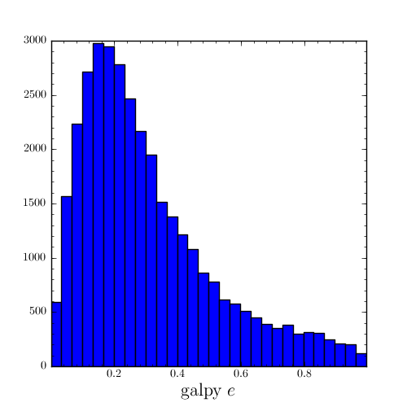

A closer look at orbit integration
======================================

Orbit initialization
---------------------

Orbits can be initialized in various coordinate frames. The simplest
initialization gives the initial conditions directly in the
Galactocentric cylindrical coordinate frame (or in the rectangular
coordinate frame in one dimension). ``Orbit()`` automatically figures
out the dimensionality of the space from the initial conditions in
this case. In three dimensions initial conditions are given either as
``vxvv=[R,vR,vT,z,vz,phi]`` or one can choose not to specify the
azimuth of the orbit and initialize with
``vxvv=[R,vR,vT,z,vz]``. Since potentials in galpy are easily
initialized to have a circular velocity of one at a radius equal to
one, initial coordinates are best given as a fraction of the radius at
which one specifies the circular velocity, and initial velocities are
best expressed as fractions of this circular velocity. For example,

>>> o= Orbit(vxvv=[1.,0.1,1.1,0.,0.1,0.])

initializes a fully three-dimensional orbit, while

>>> o= Orbit(vxvv=[1.,0.1,1.1,0.,0.1])

initializes an orbit in which the azimuth is not tracked, as might be
useful for axisymmetric potentials.

In two dimensions, we can similarly specify fully two-dimensional
orbits ``vxvv=[R,vR,vT,phi]`` or choose not to track the azimuth and
initialize as ``vxvv=[R,vR,vT]``. 

In one dimension we simply initialize as ``vxvv=[x,vx]``.

For orbit integration and characterization of observed stars or
clusters, initial conditions can also be specified directly as
observed quantities when ``radec=True`` is set. In this case a full
three-dimensional orbit is initialized as
``vxvv=[RA,Dec,distance,pmRA,pmDec,Vlos]`` where RA and Dec are
expressed in degrees, the distance is expressed in kpc, proper motions
are expressed in mas/yr (pmra = pmra' * cos[Dec] ), and the
line-of-sight velocity is given in km/s. These observed coordinates
are translated to the Galactocentric cylindrical coordinate frame by
assuming a Solar motion that can be specified as either
``solarmotion=hogg`` (default; `2005ApJ...629..268H
<http://adsabs.harvard.edu/abs/2005ApJ...629..268H>`_),
``solarmotion=dehnen`` (`1998MNRAS.298..387D
<http://adsabs.harvard.edu/abs/1998MNRAS.298..387D>`_) or
``solarmotion=shoenrich`` (`2010MNRAS.403.1829S
<http://adsabs.harvard.edu/abs/2010MNRAS.403.1829S>`_). A circular
velocity can be specified as ``vo=235`` in km/s and a value for the
distance between the Galactic center and the Sun can be given as
``ro=8.5`` in kpc. While the inputs are given in physical units, the
orbit is initialized assuming a circular velocity of one at the
distance of the Sun.

When ``radec=True`` is set, velocities can also be specified in
Galactic coordinates if ``UVW=True`` is set. The input is then
``vxvv=[RA,Dec,distance,U,V,W]``, where the velocities are expressed
in km/s. U is, as usual, defined as -vR (minus vR).

Orbit integration
---------------------

After an orbit is initialized, we can integrate it for a set of times
``ts``, given as a numpy array. For example, in a simple logarithmic
potential we can do the following

>>> from galpy.potential import LogarithmicHaloPotential
>>> lp= LogarithmicHaloPotential(normalize=1.)
>>> o= Orbit(vxvv=[1.,0.1,1.1,0.,0.1,0.])
>>> import numpy
>>> ts= numpy.linspace(0,100,10000)
>>> o.integrate(ts,lp)

to integrate the orbit from ``t=0`` to ``t=100``, saving the orbit at
10000 instances.

Displaying the orbit
---------------------

After integrating the orbit, it can be displayed by using the
``plot()`` function. The quantities that are plotted when ``plot()``
is called depend on the dimensionality of the orbit: in 3D the (R,z)
projection of the orbit is shown; in 2D either (X,Y) is plotted if the
azimuth is tracked and (R,vR) is shown otherwise; in 1D (x,vx) is
shown. E.g., for the example given above,

>>> o.plot()

gives

.. image:: images/lp-orbit-integration.png

Other projections of the orbit can be displayed by specifying the
quantities to plot. E.g., 

>>> o.plot(d1='x',d2='y')

gives the projection onto the plane of the orbit:

.. image:: images/lp-orbit-integration-xy.png

while

>>> o.plot(d1='R',d2='vR')

gives the projection onto (R,vR):

.. image:: images/lp-orbit-integration-RvR.png

We can also plot the orbit in other coordinate systems such as
Galactic longitude and latitude

>>> o.plot('k.',d1='ll',d2='bb')

which shows

.. image:: images/lp-orbit-integration-lb.png

or RA and Dec

>>> o.plot('k.',d1='ra',d2='dec')

.. image:: images/lp-orbit-integration-radec.png

See the documentation of the o.plot function and the o.ra(), o.ll(),
etc. functions on how to provide the necessary parameters for the
coordinate transformations.

Orbit characterization
------------------------

The properties of the orbit can also be found using galpy. For
example, we can calculate the peri- and apocenter radii of an orbit,
its eccentricity, and the maximal height above the plane of the orbit

>>> o.rap(), o.rperi(), o.e(), o.zmax()
(1.2581455175173673,0.97981663263371377,0.12436710999105324,0.11388132751079502)

We can also calculate the energy of the orbit, either in the potential
that the orbit was integrated in, or in another potential:

>>> o.E(), o.E(pot=mp)
(0.6150000000000001, -0.67390625000000015)

where ``mp`` is the Miyamoto-Nagai potential of :ref:`Introduction:
Rotation curves <rotcurves>`.

We can also show the energy as a function of time (to check energy
conservation)

>>> o.plotE()

gives

.. image:: images/lp-orbit-integration-E.png

We can specify another quantity to plot the energy against by
specifying ``d1=``. We can also show the vertical energy, for example,
as a function of R

>>> o.plotEz(d1='R')

.. image:: images/lp-orbit-integration-Ez.png

Often, a better approximation to an integral of the motion is given by
Ez/sqrt(density[R]). We refer to this quantity as ``EzJz`` and we can plot its
behavior

>>> o.plotEzJz(d1='R')

.. image:: images/lp-orbit-integration-EzJz.png

Accessing the raw orbit
-----------------------

The value of ``R``, ``vR``, ``vT``, ``z``, ``vz``, ``x``, ``vx``,
``y``, ``vy``, ``phi``, and ``vphi`` at any time can be obtained by
calling the corresponding function with as argument the time (the same
holds for other coordinates ``ra``, ``dec``, ``pmra``, ``pmdec``,
``vra``, ``vdec``, ``ll``, ``bb``, ``pmll``, ``pmbb``, ``vll``,
``vbb``, ``vlos``, ``dist``, ``helioX``, ``helioY``, ``helioZ``,
``U``, ``V``, and ``W``). If no time is given the initial condition is
returned, and if a time is requested at which the orbit was not saved
spline interpolation is used to return the value. Examples include

>>> o.R(1.)
1.1545076874679474
>>> o.phi(99.)
88.105603035901169
>>> o.ra(2.,obs=[8.,0.,0.],ro=8.)
array([ 285.76403985])
>>> o.helioX(5.)
array([ 1.24888927])
>>> o.pmll(10.,obs=[8.,0.,0.,0.,245.,0.],ro=8.,vo=230.)
array([-6.45263888])

We can also initialize an ``Orbit`` instance using the phase-space
position of another ``Orbit`` instance evaulated at time t. For
example,

>>> newOrbit= o(10.)

will initialize a new Orbit instance with as initial condition the phase-space position of orbit ``o`` at ``time=10.``.

The whole orbit can also be obtained using the function ``getOrbit``

>>> o.getOrbit()

which returns a matrix of phase-space points with dimensions [ntimes,ndim].

Fast orbit integration
------------------------

The standard orbit integration is done purely in python using standard
scipy integrators. When fast orbit integration is needed for batch
integration of a large number of orbits, a set of orbit integration
routines are written in C that can be accessed for most potentials, as
long as they have C implementations, which can be checked by using the
attribute ``hasC``

>>> mp= MiyamotoNagaiPotential(a=0.5,b=0.0375,amp=1.,normalize=1.)
>>> mp.hasC
True

Fast C integrators can be accessed through the ``method=`` keyword of
the ``orbit.integrate`` method. Currently available integrators are

* rk4_c
* rk6_c
* dopr54_c

which are Runge-Kutta and Dormand-Prince methods. There are also a
number of symplectic integrators available

* leapfrog_c
* symplec4_c
* symplec6_c

The higher order symplectic integrators are described in `Yoshida
(1993) <http://adsabs.harvard.edu/abs/1993CeMDA..56...27Y>`_.

For most applications I recommend ``dopr54_c``. For example, compare

>>> o= Orbit(vxvv=[1.,0.1,1.1,0.,0.1])
>>> timeit(o.integrate(ts,mp))
1 loops, best of 3: 553 ms per loop
>>> timeit(o.integrate(ts,mp,method='dopr54_c'))
galpyWarning: Using C implementation to integrate orbits
10 loops, best of 3: 25.6 ms per loop

As this example shows, galpy will issue a warning that C is being
used. Speed-ups by a factor of 20 are typical.

Example: The eccentricity distribution of the Milky Way's thick disk
---------------------------------------------------------------------

A straightforward application of galpy's orbit initialization and
integration capabilities is to derive the eccentricity distribution of
a set of thick disk stars. We start by downloading the sample of SDSS
SEGUE (`2009AJ....137.4377Y
<http://adsabs.harvard.edu/abs/2009AJ....137.4377Y>`_) thick disk
stars compiled by Dierickx et al. (`2010arXiv1009.1616D
<http://adsabs.harvard.edu/abs/2010arXiv1009.1616D>`_) at

http://www.mpia-hd.mpg.de/homes/rix/Data/Dierickx-etal-tab2.txt

After reading in the data (RA,Dec,distance,pmRA,pmDec,vlos; see above)
as a vector ``vxvv`` with dimensions [6,ndata] we (a) define the
potential in which we want to integrate the orbits, and (b) integrate
each orbit and save its eccentricity (running this for all 30,000-ish
stars will take about half an hour)

>>> lp= LogarithmicHaloPotential(normalize=1.)
>>> ts= nu.linspace(0.,20.,10000)
>>> mye= nu.zeros(ndata)
>>> for ii in range(len(e)):
...         o= Orbit(vxvv[ii,:],radec=True,vo=220.,ro=8.) #Initialize
...         o.integrate(ts,lp) #Integrate
...         mye[ii]= o.e() #Calculate eccentricity

We then find the following eccentricity distribution

The eccentricity calculated by galpy compare well with those
calculated by Dierickx et al., except for a few objects

.. image:: images/dierickx-myee.png

The script that calculates and plots everything can be downloaded
:download:`here <examples/dierickx-edist.py>`.