Potentials in galpy
====================

galpy contains a large variety of potentials in ``galpy.potential``
that can be used for orbit integration, the calculation of
action-angle coordinates, as part of steady-state distribution
functions, and to study the properties of gravitational
potentials. This section introduces some of these features.

Potentials and forces
----------------------

Various 3D and 2D potentials are contained in galpy, list in the
:ref:`API page <potential-api>`. Another way to list the latest overview
of potentials included with galpy is to run

>>> import galpy.potential
>>> print([p for p in dir(galpy.potential) if 'Potential' in p])
# ['CosmphiDiskPotential',
#  'DehnenBarPotential',
#  'DoubleExponentialDiskPotential',
#  'EllipticalDiskPotential',
#  'FlattenedPowerPotential',
#  'HernquistPotential',
# ....]

(list cut here for brevity). Section :ref:`Rotation curves
<rotcurves>` explains how to initialize potentials and how to display
the rotation curve of single Potential instances or of combinations of
such instances. Similarly, we can evaluate a Potential instance

>>> from galpy.potential import MiyamotoNagaiPotential
>>> mp= MiyamotoNagaiPotential(a=0.5,b=0.0375,normalize=1.)
>>> mp(1.,0.)
# -1.2889062500000001

Most member functions of Potential instances have corresponding
functions in the galpy.potential module that allow them to be
evaluated for lists of multiple Potential instances (and in versions
>=1.4 even for nested lists of Potential
instances). ``galpy.potential.MWPotential2014`` is such a list of
three Potential instances

>>> from galpy.potential import MWPotential2014
>>> print(MWPotential2014)
# [<galpy.potential.PowerSphericalPotentialwCutoff.PowerSphericalPotentialwCutoff instance at 0x1089b23b0>, <galpy.potential.MiyamotoNagaiPotential.MiyamotoNagaiPotential instance at 0x1089b2320>, <galpy.potential.TwoPowerSphericalPotential.NFWPotential instance at 0x1089b2248>]

and we can evaluate the potential by using the ``evaluatePotentials``
function

>>> from galpy.potential import evaluatePotentials
>>> evaluatePotentials(MWPotential2014,1.,0.)
# -1.3733506513947895

.. TIP::
   Lists of Potential instances can be nested, allowing you to easily add components to existing gravitational-potential models. For example, to add a ``DehnenBarPotential`` to ``MWPotential2014``, you can do: ``pot= [MWPotential2014,DehnenBarPotential()]`` and then use this ``pot`` everywhere where you can use a list of Potential instances. You can also add potential simply as ``pot= MWPotential2014+DehnenBarPotential()``.

.. WARNING::
   ``galpy`` potentials do *not* necessarily approach zero at infinity. To compute, for example, the escape velocity or whether or not an orbit is unbound, you need to take into account the value of the potential at infinity. E.g., :math:`v_{\mathrm{esc}}(r) = \sqrt{2[\Phi(\infty)-\Phi(r)]}`.

.. TIP::
   As discussed in the section on :ref:`physical units <physunits>`, potentials can be initialized and evaluated with arguments specified as a astropy Quantity with units. Use the configuration parameter ``apy-units = True`` to get output values as a Quantity. See also the subsection on :ref:`Initializing potentials with parameters with units <physunits_pot>` below.

We can plot the potential of axisymmetric potentials (or of
non-axisymmetric potentials at phi=0) using the ``plot`` member
function

>>> mp.plot()

which produces the following plot

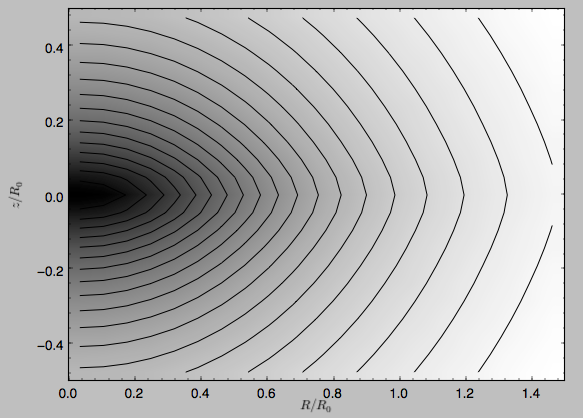

Similarly, we can plot combinations of Potentials using
``plotPotentials``, e.g., 

>>> from galpy.potential import plotPotentials
>>> plotPotentials(MWPotential2014,rmin=0.01)

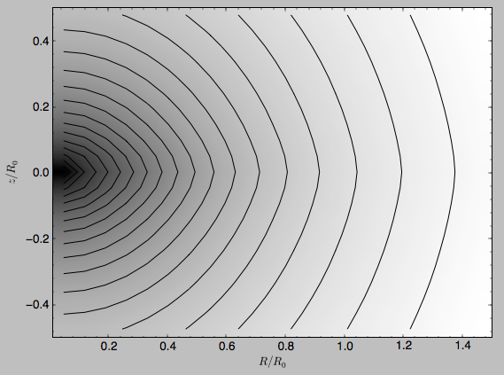

These functions have arguments that can provide custom ``R`` and ``z``
ranges for the plot, the number of grid points, the number of
contours, and many other parameters determining the appearance of
these figures.

galpy also allows the forces corresponding to a gravitational
potential to be calculated. Again for the Miyamoto-Nagai Potential
instance from above

>>> mp.Rforce(1.,0.)
# -1.0

This value of -1.0 is due to the normalization of the potential such
that the circular velocity is 1. at R=1. Similarly, the vertical force
is zero in the mid-plane

>>> mp.zforce(1.,0.)
# -0.0

but not further from the mid-plane

>>> mp.zforce(1.,0.125)
# -0.53488743705310848

As explained in :ref:`Units in galpy <units>`, these forces are in
standard galpy units, and we can convert them to physical units using
methods in the ``galpy.util.bovy_conversion`` module. For example,
assuming a physical circular velocity of 220 km/s at R=8 kpc

>>> from galpy.util import bovy_conversion
>>> mp.zforce(1.,0.125)*bovy_conversion.force_in_kmsMyr(220.,8.)
# -3.3095671288657584 #km/s/Myr
>>> mp.zforce(1.,0.125)*bovy_conversion.force_in_2piGmsolpc2(220.,8.)
# -119.72021771473301 #2 \pi G Msol / pc^2

Again, there are functions in ``galpy.potential`` that allow for the
evaluation of the forces for lists of Potential instances, such that

>>> from galpy.potential import evaluateRforces
>>> evaluateRforces(MWPotential2014,1.,0.)
# -1.0
>>> from galpy.potential import evaluatezforces
>>> evaluatezforces(MWPotential2014,1.,0.125)*bovy_conversion.force_in_2piGmsolpc2(220.,8.)
>>> -69.680720137571114 #2 \pi G Msol / pc^2

We can evaluate the flattening of the potential as
:math:`\sqrt{|z\,F_R/R\,F_Z|}` for a Potential instance as well as for
a list of such instances

>>> mp.flattening(1.,0.125)
# 0.4549542914935209
>>> from galpy.potential import flattening
>>> flattening(MWPotential2014,1.,0.125)
# 0.61231675305658628

Densities
---------

galpy can also calculate the densities corresponding to gravitational
potentials. For many potentials, the densities are explicitly
implemented, but if they are not, the density is calculated using the
Poisson equation (second derivatives of the potential have to be
implemented for this). For example, for the Miyamoto-Nagai potential,
the density is explicitly implemented

>>> mp.dens(1.,0.)
# 1.1145444383277576

and we can also calculate this using the Poisson equation

>>> mp.dens(1.,0.,forcepoisson=True)
# 1.1145444383277574

which are the same to machine precision

>>> mp.dens(1.,0.,forcepoisson=True)-mp.dens(1.,0.)
# -2.2204460492503131e-16

Similarly, all of the potentials in ``galpy.potential.MWPotential2014``
have explicitly-implemented densities, so we can do

>>> from galpy.potential import evaluateDensities
>>> evaluateDensities(MWPotential2014,1.,0.)
# 0.57508603122264867

In physical coordinates, this becomes

>>> evaluateDensities(MWPotential2014,1.,0.)*bovy_conversion.dens_in_msolpc3(220.,8.)
# 0.1010945632524705 #Msol / pc^3

We can also plot densities

>>> from galpy.potential import plotDensities
>>> plotDensities(MWPotential2014,rmin=0.1,zmax=0.25,zmin=-0.25,nrs=101,nzs=101)

which gives

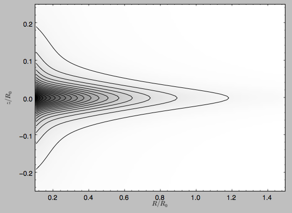

Another example of this is for an exponential disk potential

>>> from galpy.potential import DoubleExponentialDiskPotential
>>> dp= DoubleExponentialDiskPotential(hr=1./4.,hz=1./20.,normalize=1.)

The density computed using the Poisson equation now requires multiple
numerical integrations, so the agreement between the analytical
density and that computed using the Poisson equation is slightly less good, but still better than a percent

>>> (dp.dens(1.,0.,forcepoisson=True)-dp.dens(1.,0.))/dp.dens(1.,0.)
# 0.0032522956769123019

The density is

>>> dp.plotDensity(rmin=0.1,zmax=0.25,zmin=-0.25,nrs=101,nzs=101)

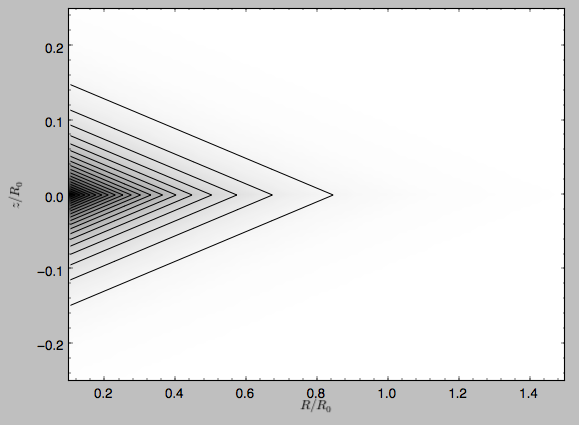

and the potential is

>>> dp.plot(rmin=0.1,zmin=-0.25,zmax=0.25)

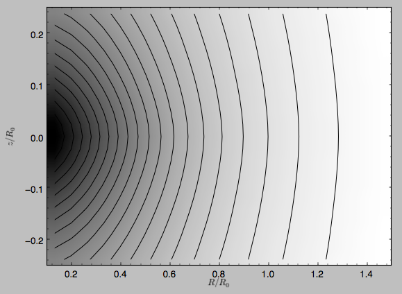

Clearly, the potential is much less flattened than the density.

.. _potwrappers:

Modifying potential instances using wrappers
--------------------------------------------

Potentials implemented in galpy can be modified using different kinds
of wrappers. These wrappers modify potentials to, for example, change
their amplitude as a function of time (e.g., to grow or decay the bar
contribution to a potential) or to make a potential rotate. Specific
kinds of wrappers are listed on the :ref:`Potential wrapper API page
<potwrapperapi>`. These wrappers can be applied to instances of *any*
potential implemented in galpy (including other wrappers). An example
is to grow a bar using the polynomial smoothing of `Dehnen (2000)
<http://adsabs.harvard.edu/abs/2000AJ....119..800D>`__. We first setup
an instance of a ``DehnenBarPotential`` that is essentially fully
grown already

>>> from galpy.potential import DehnenBarPotential
>>> dpn= DehnenBarPotential(tform=-100.,tsteady=0.) # DehnenBarPotential has a custom implementation of growth that we ignore by setting tform to -100

and then wrap it

>>> from galpy.potential import DehnenSmoothWrapperPotential
>>> dswp= DehnenSmoothWrapperPotential(pot=dpn,tform=-4.*2.*numpy.pi/dpn.OmegaP(),tsteady=2.*2.*numpy.pi/dpn.OmegaP())

This grows the ``DehnenBarPotential`` starting at 4 bar periods before
``t=0`` over a period of 2 bar periods. ``DehnenBarPotential`` has an
older, custom implementation of the same smoothing and the
``(tform,tsteady)`` pair used here corresponds to the default setting
for ``DehnenBarPotential``. Thus we can compare the two

>>> dp= DehnenBarPotential()
>>> print(dp(0.9,0.3,phi=3.,t=-2.)-dswp(0.9,0.3,phi=3.,t=-2.))
# 0.0
>>> print(dp.Rforce(0.9,0.3,phi=3.,t=-2.)-dswp.Rforce(0.9,0.3,phi=3.,t=-2.))
# 0.0

The wrapper ``SolidBodyRotationWrapperPotential`` allows one to make any potential rotate around the z axis. This can be used, for example, to make general bar-shaped potentials, which one could construct from a basis-function expansion with ``SCFPotential``, rotate without having to implement the rotation directly. As an example consider this ``SoftenedNeedleBarPotential`` (which has a potential-specific implementation of rotation)

>>> sp= SoftenedNeedleBarPotential(normalize=1.,omegab=1.8,pa=0.)

The same potential can be obtained from a non-rotating ``SoftenedNeedleBarPotential`` run through the ``SolidBodyRotationWrapperPotential`` to add rotation

>>> sp_still= SoftenedNeedleBarPotential(omegab=0.,pa=0.,normalize=1.)
>>> swp= SolidBodyRotationWrapperPotential(pot=sp_still,omega=1.8,pa=0.)

Compare for example

>>> print(sp(0.8,0.2,phi=0.2,t=3.)-swp(0.8,0.2,phi=0.2,t=3.))
# 0.0
>>> print(sp.Rforce(0.8,0.2,phi=0.2,t=3.)-swp.Rforce(0.8,0.2,phi=0.2,t=3.))
# 8.881784197e-16

Wrapper potentials can be used anywhere in galpy where general
potentials can be used. They can be part of lists of Potential
instances. They can also be used in C for orbit integration provided
that both the wrapper and the potentials that it wraps are implemented
in C. For example, a static ``LogarithmicHaloPotential`` with a bar
potential grown as above would be

>>> from galpy.potential import LogarithmicHaloPotential, evaluateRforces
>>> lp= LogarithmicHaloPotential(normalize=1.)
>>> pot= lp+dswp
>>> print(evaluateRforces(pot,0.9,0.3,phi=3.,t=-2.))
# -1.00965326579

.. TIP::
   To simply adjust the amplitude of a Potential instance, you can multiply the instance with a number or divide it by a number. For example, ``pot= 2.*LogarithmicHaloPotential(amp=1.)`` is equivalent to ``pot= LogarithmicHaloPotential(amp=2.)``. This is useful if you want to, for instance, quickly adjust the mass of a potential.

Close-to-circular orbits and orbital frequencies
-------------------------------------------------

We can also compute the properties of close-to-circular orbits. First
of all, we can calculate the circular velocity and its derivative

>>> mp.vcirc(1.)
# 1.0
>>> mp.dvcircdR(1.)
# -0.163777427566978

or, for lists of Potential instances

>>> from galpy.potential import vcirc
>>> vcirc(MWPotential2014,1.)
# 1.0
>>> from galpy.potential import dvcircdR
>>> dvcircdR(MWPotential2014,1.)
# -0.10091361254334696

We can also calculate the various frequencies for close-to-circular
orbits. For example, the rotational frequency

>>> mp.omegac(0.8)
# 1.2784598203204887
>>> from galpy.potential import omegac
>>> omegac(MWPotential2014,0.8)
# 1.2733514576122869

and the epicycle frequency

>>> mp.epifreq(0.8)
# 1.7774973530267848
>>> from galpy.potential import epifreq
>>> epifreq(MWPotential2014,0.8)
# 1.7452189766287691

as well as the vertical frequency

>>> mp.verticalfreq(1.0)
# 3.7859388972001828
>>> from galpy.potential import verticalfreq
>>> verticalfreq(MWPotential2014,1.)
# 2.7255405754769875

We can also for example easily make the diagram of :math:`\Omega-n
\kappa /m` that is important for understanding kinematic spiral
density waves. For example, for ``MWPotential2014``

>>> def OmegaMinusKappa(pot,Rs,n,m,ro=8.,vo=220.): # ro,vo for physical units
        return omegac(pot,Rs,ro=ro,vo=vo)-n/m*epifreq(pot,Rs,ro=ro,vo=vo)
>>> plot(Rs,OmegaMinusKappa(MWPotential2014,Rs,0,1))
>>> plot(Rs,OmegaMinusKappa(MWPotential2014,Rs,1,2))
>>> plot(Rs,OmegaMinusKappa(MWPotential2014,Rs,1,1))
>>> plot(Rs,OmegaMinusKappa(MWPotential2014,Rs,1,-2))
>>> ylim(-20.,100.)
>>> xlabel(r'$R\,(\mathrm{kpc})$')
>>> ylabel(r'$(\mathrm{km\,s}^{-1}\,\mathrm{kpc}^{-1})$')
>>> text(3.,21.,r'$\Omega-\kappa/2$',size=18.)
>>> text(5.,50.,r'$\Omega$',size=18.)
>>> text(7.,60.,r'$\Omega+\kappa/2$',size=18.)
>>> text(6.,-7.,r'$\Omega-\kappa$',size=18.)

which gives

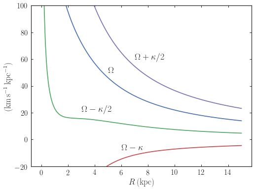

For close-to-circular orbits, we can also compute the radii of the
Lindblad resonances. For example, for a frequency similar to that of
the Milky Way's bar

>>> mp.lindbladR(5./3.,m='corotation') #args are pattern speed and m of pattern
# 0.6027911166042229 #~ 5kpc
>>> print(mp.lindbladR(5./3.,m=2))
# None
>>> mp.lindbladR(5./3.,m=-2)
# 0.9906190683480501

The ``None`` here means that there is no inner Lindblad resonance, the
``m=-2`` resonance is in the Solar neighborhood (see the section on
the :ref:`Hercules stream <hercules>` in this documentation).

Using interpolations of potentials
-----------------------------------

``galpy`` contains a general ``Potential`` class ``interpRZPotential``
that can be used to generate interpolations of potentials that can be
used in their stead to speed up calculations when the calculation of
the original potential is computationally expensive (for example, for
the ``DoubleExponentialDiskPotential``). Full details on how to set
this up are given :ref:`here <interprz>`. Interpolated potentials can
be used anywhere that general three-dimensional galpy potentials can
be used. Some care must be taken with outside-the-interpolation-grid
evaluations for functions that use ``C`` to speed up computations.

.. _physunits_pot:

Initializing potentials with parameters with units
--------------------------------------------------

As already discussed in the section on :ref:`physical units
<physunits>`, potentials in galpy can be specified with parameters
with units since v1.2. For most inputs to the initialization it is
straightforward to know what type of units the input Quantity needs to
have. For example, the scale length parameter ``a=`` of a
Miyamoto-Nagai disk needs to have units of distance. 

The amplitude of a potential is specified through the ``amp=``
initialization parameter. The units of this parameter vary from
potential to potential. For example, for a logarithmic potential the
units are velocity squared, while for a Miyamoto-Nagai potential they
are units of mass. Check the documentation of each potential on the
:ref:`API page <potential-api>` for the units of the ``amp=``
parameter of the potential that you are trying to initialize and
please report an `Issue <https://github.com/jobovy/galpy/issues>`__ if
you find any problems with this.

.. _scf_potential_docs:

General density/potential pairs with basis-function expansions
--------------------------------------------------------------

``galpy`` allows for the potential and forces of general,
time-independent density functions to be computed by expanding the
potential and density in terms of basis functions. This is supported
for ellipsoidal-ish as well as for disk-y density distributions, in
both cases using the basis-function expansion of the
self-consistent-field (SCF) method of `Hernquist & Ostriker (1992)
<http://adsabs.harvard.edu/abs/1992ApJ...386..375H>`__. On its own,
the SCF technique works well for ellipsoidal-ish density
distributions, but using a trick due to `Kuijken & Dubinski (1995)
<http://adsabs.harvard.edu/abs/1995MNRAS.277.1341K>`__ it can also be
made to work well for disky potentials. We first describe the basic
SCF implementation and then discuss how to use it for disky
potentials.

The basis-function approach in the SCF method is implemented in the
:ref:`SCFPotential <scf_potential>` class, which is also implemented
in C for fast orbit integration. The coefficients of the
basis-function expansion can be computed using the
:ref:`scf_compute_coeffs_spherical <scf_compute_coeffs_sphere>`
(for spherically-symmetric density distribution),
:ref:`scf_compute_coeffs_axi <scf_compute_coeffs_axi>` (for
axisymmetric densities), and :ref:`scf_compute_coeffs
<scf_compute_coeffs>` (for the general case). The coefficients
obtained from these functions can be directly fed into the
:ref:`SCFPotential <scf_potential>` initialization. The basis-function
expansion has a free scale parameter ``a``, which can be specified for
the ``scf_compute_coeffs_XX`` functions and for the ``SCFPotential``
itself. Make sure that you use the same ``a``! Note that the general
functions are quite slow.

The simplest example is that of the Hernquist potential, which is the
lowest-order basis function. When we compute the first ten radial
coefficients for this density we obtain that only the lowest-order
coefficient is non-zero

>>> from galpy.potential import HernquistPotential
>>> from galpy.potential import scf_compute_coeffs_spherical
>>> hp= HernquistPotential(amp=1.,a=2.)
>>> Acos, Asin= scf_compute_coeffs_spherical(hp.dens,10,a=2.)
>>> print(Acos)
# array([[[  1.00000000e+00]],
#         [[ -2.83370393e-17]],
#         [[  3.31150709e-19]],
#         [[ -6.66748299e-18]],
#         [[  8.19285777e-18]],
#         [[ -4.26730651e-19]],
#         [[ -7.16849567e-19]],
#         [[  1.52355608e-18]],
#         [[ -2.24030288e-18]],
#         [[ -5.24936820e-19]]])

As a more complicated example, consider a prolate NFW potential

>>> from galpy.potential import TriaxialNFWPotential
>>> np= TriaxialNFWPotential(normalize=1.,c=1.4,a=1.)

and we compute the coefficients using the axisymmetric
``scf_compute_coeffs_axi``

>>> a_SCF= 50. # much larger a than true scale radius works well for NFW
>>> Acos, Asin= scf_compute_coeffs_axi(np.dens,80,40,a=a_SCF)
>>> sp= SCFPotential(Acos=Acos,Asin=Asin,a=a_SCF)

If we compare the densities along the ``R=Z`` line as

>>> xs= numpy.linspace(0.,3.,1001)
>>> loglog(xs,np.dens(xs,xs))
>>> loglog(xs,sp.dens(xs,xs))

we get

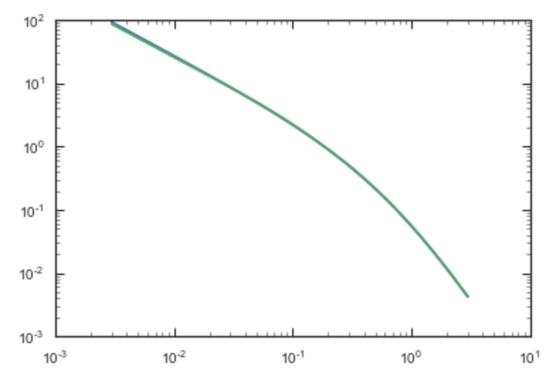

If we then integrate an orbit, we also get good agreement

>>> from galpy.orbit import Orbit
>>> o= Orbit([1.,0.1,1.1,0.1,0.3,0.])
>>> ts= numpy.linspace(0.,100.,10001)
>>> o.integrate(ts,hp)
>>> o.plot()
>>> o.integrate(ts,sp)
>>> o.plot(overplot=True)

which gives

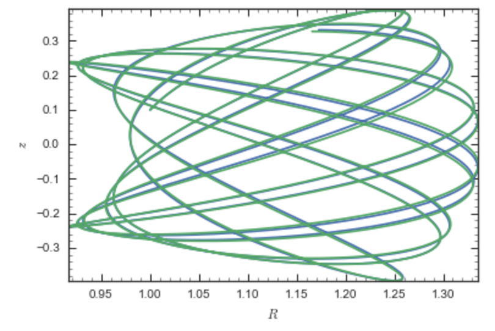

Near the end of the orbit integration, the slight differences between
the original potential and the basis-expansion version cause the two
orbits to deviate from each other.

To use the SCF method for disky potentials, we use the trick from
`Kuijken & Dubinski (1995)
<http://adsabs.harvard.edu/abs/1995MNRAS.277.1341K>`__. This trick works by approximating the disk density as :math:`\rho_{\mathrm{disk}}(R,\phi,z) \approx \sum_i \Sigma_i(R)\,h_i(z)`, with :math:`h_i(z) = \mathrm{d}^2 H(z) / \mathrm{d} z^2` and searching for solutions of the form

    .. math::

       \Phi(R,\phi,z = \Phi_{\mathrm{ME}}(R,\phi,z) + 4\pi G\sum_i \Sigma_i(r)\,H_i(z)\,,

where :math:`r` is the spherical radius :math:`r^2 = R^2+z^2`. The density which gives rise to :math:`\Phi_{\mathrm{ME}}(R,\phi,z)` is not strongly confined to a plane when :math:`\rho_{\mathrm{disk}}(R,\phi,z) \approx \sum_i \Sigma_i(R)\,h_i(z)` and can be obtained using the SCF basis-function-expansion technique discussed above. See the documentation of the :ref:`DiskSCFPotential <disk_scf_potential>` class for more details on this procedure.

As an example, consider a double-exponential disk, which we can
compare to the ``DoubleExponentialDiskPotential`` implementation

>>> from galpy import potential
>>> dp= potential.DoubleExponentialDiskPotential(amp=13.5,hr=1./3.,hz=1./27.)

and then setup the ``DiskSCFPotential`` approximation to this as

>>> dscfp= potential.DiskSCFPotential(dens=lambda R,z: dp.dens(R,z),
                                      Sigma={'type':'exp','h':1./3.,'amp':1.},
                                      hz={'type':'exp','h':1./27.},
                                      a=1.,N=10,L=10)

The ``dens=`` keyword specifies the target density, while the
``Sigma=`` and ``hz=`` inputs specify the approximation functions
:math:`\Sigma_i(R)` and :math:`h_i(z)`. These are specified as
dictionaries here for a few pre-defined approximation functions, but
general functions are supported as well. Care should be taken that the
``dens=`` input density and the approximation functions have the same
normalization. We can compare the density along the ``R=10 z`` line as

>>> xs= numpy.linspace(0.3,2.,1001)
>>> semilogy(xs,dp.dens(xs,xs/10.))
>>> semilogy(xs,dscfp.dens(xs,xs/10.))

which gives

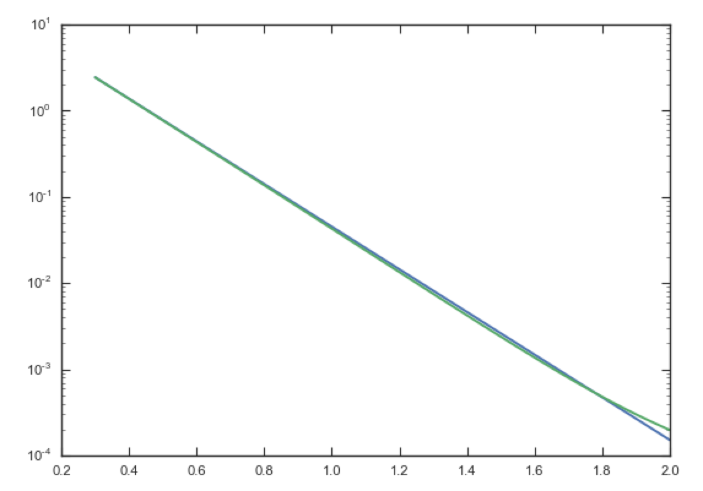

The agreement is good out to 5 scale lengths and scale heights and
then starts to degrade. We can also integrate orbits and compare them

>>> from galpy.orbit import Orbit
>>> o= Orbit([1.,0.1,0.9,0.,0.1,0.])
>>> ts= numpy.linspace(0.,100.,10001)
>>> o.integrate(ts,dp)
>>> o.plot()
>>> o.integrate(ts,dscfp)
>>> o.plot(overplot=True)

which gives

.. image:: images/dscf-dblexp-orbit.png
   :scale: 50 %

The orbits diverge slightly because the potentials are not quite the
same, but have very similar properties otherwise (peri- and
apogalacticons, eccentricity, ...). By increasing the order of the SCF
approximation, the potential can be gotten closer to the target
density. Note that orbit integration in the ``DiskSCFPotential`` is
much faster than that of the ``DoubleExponentialDisk`` potential

>>> timeit(o.integrate(ts,dp))
# 1 loops, best of 3: 5.83 s per loop
>>> timeit(o.integrate(ts,dscfp))
# 1 loops, best of 3: 286 ms per loop

The :ref:`SCFPotential <scf_potential>` and :ref:`DiskSCFPotential
<disk_scf_potential>` can be used wherever general potentials can be
used in galpy.

The potential of N-body simulations
--------------------------------------

.. _potnbody:

``galpy`` can setup and work with the frozen potential of an N-body
simulation. This allows us to study the properties of such potentials
in the same way as other potentials in ``galpy``. We can also
investigate the properties of orbits in these potentials and calculate
action-angle coordinates, using the ``galpy`` framework. Currently,
this functionality is limited to axisymmetrized versions of the N-body
snapshots, although this capability could be somewhat
straightforwardly expanded to full triaxial potentials. The use of
this functionality requires `pynbody
<https://github.com/pynbody/pynbody>`_ to be installed; the potential
of any snapshot that can be loaded with ``pynbody`` can be used within
``galpy``.

As a first, simple example of this we look at the potential of a
single simulation particle, which should correspond to galpy's
``KeplerPotential``. We can create such a single-particle snapshot
using ``pynbody`` by doing

>>> import pynbody
>>> s= pynbody.new(star=1)
>>> s['mass']= 1.
>>> s['eps']= 0.

and we get the potential of this snapshot in ``galpy`` by doing

>>> from galpy.potential import SnapshotRZPotential
>>> sp= SnapshotRZPotential(s,num_threads=1)

With these definitions, this snapshot potential should be the same as
``KeplerPotential`` with an amplitude of one, which we can test as
follows

>>> from galpy.potential import KeplerPotential
>>> kp= KeplerPotential(amp=1.)
>>> print(sp(1.1,0.),kp(1.1,0.),sp(1.1,0.)-kp(1.1,0.))
# (-0.90909090909090906, -0.9090909090909091, 0.0)
>>> print(sp.Rforce(1.1,0.),kp.Rforce(1.1,0.),sp.Rforce(1.1,0.)-kp.Rforce(1.1,0.))
# (-0.82644628099173545, -0.8264462809917353, -1.1102230246251565e-16)

``SnapshotRZPotential`` instances can be used wherever other ``galpy``
potentials can be used (note that the second derivatives have not been
implemented, such that functions depending on those will not
work). For example, we can plot the rotation curve

>>> sp.plotRotcurve()

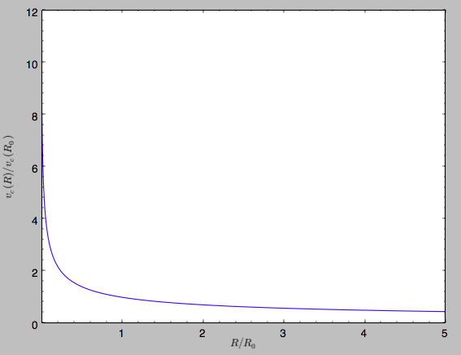

Because evaluating the potential and forces of a snapshot is
computationally expensive, most useful applications of frozen N-body
potentials employ interpolated versions of the snapshot
potential. These can be setup in ``galpy`` using an
``InterpSnapshotRZPotential`` class that is a subclass of the
``interpRZPotential`` described above and that can be used in the same
manner. To illustrate its use we will make use of one of ``pynbody``'s
example snapshots, ``g15784``. This snapshot is used `here
<http://pynbody.github.io/pynbody/tutorials/snapshot_manipulation.html>`_
to illustrate ``pynbody``'s use. Please follow the instructions there
on how to download this snapshot.

Once you have downloaded the ``pynbody`` testdata, we can load this
snapshot using

>>> s = pynbody.load('testdata/g15784.lr.01024.gz')

(please adjust the path according to where you downloaded the
``pynbody`` testdata). We get the main galaxy in this snapshot, center
the simulation on it, and align the galaxy face-on using

>>> h = s.halos()
>>> h1 = h[1]
>>> pynbody.analysis.halo.center(h1,mode='hyb')
>>> pynbody.analysis.angmom.faceon(h1, cen=(0,0,0),mode='ssc')

we also convert the simulation to physical units, but set `G=1` by
doing the following

>>> s.physical_units()
>>> from galpy.util.bovy_conversion import _G
>>> g= pynbody.array.SimArray(_G/1000.)
>>> g.units= 'kpc Msol**-1 km**2 s**-2 G**-1'
>>> s._arrays['mass']= s._arrays['mass']*g

We can now load an interpolated version of this snapshot's potential
into ``galpy`` using

>>> from galpy.potential import InterpSnapshotRZPotential
>>> spi= InterpSnapshotRZPotential(h1,rgrid=(numpy.log(0.01),numpy.log(20.),101),logR=True,zgrid=(0.,10.,101),interpPot=True,zsym=True)

where we further assume that the potential is symmetric around the
mid-plane (`z=0`). This instantiation will take about ten to fiteen
minutes. This potential instance has `physical` units (and thus the
``rgrid=`` and ``zgrid=`` inputs are given in kpc if the simulation's
distance unit is kpc). For example, if we ask for the rotation curve,
we get the following:

>>> spi.plotRotcurve(Rrange=[0.01,19.9],xlabel=r'$R\,(\mathrm{kpc})$',ylabel=r'$v_c(R)\,(\mathrm{km\,s}^{-1})$')

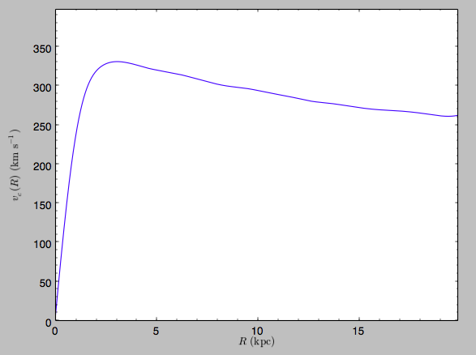

This can be compared to the rotation curve calculated by ``pynbody``,
see `here
<http://pynbody.github.io/pynbody/tutorials/snapshot_manipulation.html>`_.

Because ``galpy`` works best in a system of `natural units` as
explained in :ref:`Units in galpy <units>`, we will convert this
instance to natural units using the circular velocity at `R=10` kpc,
which is

>>> spi.vcirc(10.)
# 294.62723076942245

To convert to `natural units` we do

>>> spi.normalize(R0=10.)

We can then again plot the rotation curve, keeping in mind that the
distance unit is now :math:`R_0`

>>> spi.plotRotcurve(Rrange=[0.01,1.99])

which gives

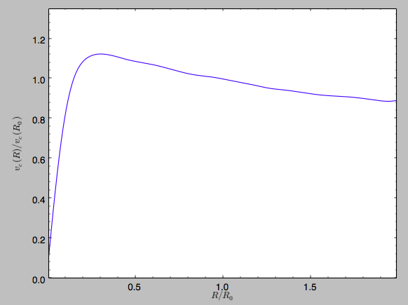

in particular

>>> spi.vcirc(1.)
# 1.0000000000000002

We can also plot the potential

>>> spi.plot(rmin=0.01,rmax=1.9,nrs=51,zmin=-0.99,zmax=0.99,nzs=51)

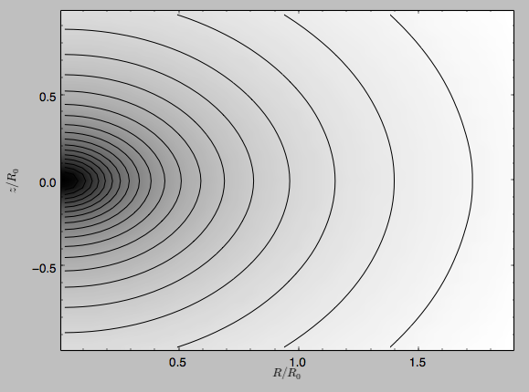

Clearly, this simulation's potential is quite spherical, which is
confirmed by looking at the flattening

>>> spi.flattening(1.,0.1)
# 0.86675711023391921
>>> spi.flattening(1.5,0.1)
# 0.94442750306256895

The epicyle and vertical frequencies can also be interpolated by
setting the ``interpepifreq=True`` or ``interpverticalfreq=True``
keywords when instantiating the ``InterpSnapshotRZPotential`` object.

.. _nemopot:

Conversion to NEMO potentials
------------------------------

`NEMO <http://bima.astro.umd.edu/nemo/>`_ is a set of tools for
studying stellar dynamics. Some of its functionality overlaps with
that of ``galpy``, but many of its programs are very complementary to
``galpy``. In particular, it has the ability to perform N-body
simulations with a variety of poisson solvers, which is currently not
supported by ``galpy`` (and likely will never be directly
supported). To encourage interaction between ``galpy`` and NEMO it
is quite useful to be able to convert potentials between these two
frameworks, which is not completely trivial. In particular, NEMO
contains Walter Dehnen's fast collisionless ``gyrfalcON`` code (see
`2000ApJ...536L..39D
<http://adsabs.harvard.edu/abs/2000ApJ...536L..39D>`_ and
`2002JCoPh.179...27D
<http://adsabs.harvard.edu/abs/2002JCoPh.179...27D>`_) and the
discussion here focuses on how to run N-body simulations using
external potentials defined in ``galpy``.

Some ``galpy`` potential instances support the functions
``nemo_accname`` and ``nemo_accpars`` that return the name of the
NEMO potential corresponding to this ``galpy`` Potential and its
parameters in NEMO units. These functions assume that you use NEMO
with WD_units, that is, positions are specified in kpc, velocities in
kpc/Gyr, times in Gyr, and G=1. For the Miyamoto-Nagai potential
above, you can get its name in the NEMO framework as

>>> mp.nemo_accname()
# 'MiyamotoNagai'

and its parameters as

>>> mp.nemo_accpars(220.,8.)
# '0,592617.11132,4.0,0.3'

assuming that we scale velocities by ``vo=220`` km/s and positions by
``ro=8`` kpc in galpy. These two strings can then be given to the
``gyrfalcON`` ``accname=`` and ``accpars=`` keywords.

We can do the same for lists of potentials. For example, for
``MWPotential2014`` we do

>>> from galpy.potential import nemo_accname, nemo_accpars
>>> nemo_accname(MWPotential2014)
# 'PowSphwCut+MiyamotoNagai+NFW'
>>> nemo_accpars(MWPotential2014,220.,8.)
# '0,1001.79126907,1.8,1.9#0,306770.418682,3.0,0.28#0,16.0,162.958241887'

Therefore, these are the ``accname=`` and ``accpars=`` that one needs
to provide to ``gyrfalcON`` to run a simulation in
``MWPotential2014``.

Note that the NEMO potential ``PowSphwCut`` is *not* a standard
NEMO potential. This potential can be found in the nemo/ directory of
the ``galpy`` source code; this directory also contains a Makefile that
can be used to compile the extra NEMO potential and install it in
the correct NEMO directory (this requires one to have NEMO
running, i.e., having sourced nemo_start).

You can use the ``PowSphwCut.cc`` file in the nemo/ directory as a
template for adding additional potentials in ``galpy`` to the NEMO
framework. To figure out how to convert the normalized ``galpy``
potential to an amplitude when scaling to physical coordinates (like
kpc and kpc/Gyr), one needs to look at the scaling of the radial force
with R. For example, from the definition of MiyamotoNagaiPotential, we
see that the radial force scales as :math:`R^{-2}`. For a general
scaling :math:`R^{-\alpha}`, the amplitude will scale as
:math:`V_0^2\,R_0^{\alpha-1}` with the velocity :math:`V_0` and
position :math:`R_0` of the ``v=1`` at ``R=1``
normalization. Therefore, for the MiyamotoNagaiPotential, the physical
amplitude scales as :math:`V_0^2\,R_0`. For the
LogarithmicHaloPotential, the radial force scales as :math:`R^{-1}`,
so the amplitude scales as :math:`V_0^2`.

Currently, only the ``MiyamotoNagaiPotential``, ``NFWPotential``,
``PowerSphericalPotentialwCutoff``, ``HernquistPotential``,
``PlummerPotential``, ``MN3ExponentialDiskPotential``, and the
``LogarithmicHaloPotential`` have this NEMO support. Combinations of
all but the ``LogarithmicHaloPotential`` are allowed in general (e.g.,
``MWPotential2014``); they can also be combined with spherical
``LogarithmicHaloPotentials``. Because of the definition of the
logarithmic potential in NEMO, it cannot be flattened in ``z``, so to
use a flattened logarithmic potential, one has to flip ``y`` and ``z``
between ``galpy`` and NEMO (one can flatten in ``y``).

.. _amusepot:

**NEW in v1.5**: Conversion to AMUSE potentials
-----------------------------------------------

`AMUSE <http://amusecode.org/>`_ is a Python software framework for
astrophysical simulations, in which existing codes from different
domains, such as stellar dynamics, stellar evolution, hydrodynamics
and radiative transfer can be easily coupled. AMUSE allows you to run
N-body simulations that include a wide range of physics (gravity,
stellar evolution, hydrodynamics, radiative transfer) with a large
variety of numerical codes (collisionless, collisional, etc.).

The ``galpy.potential.to_amuse`` function allows you to create an
AMUSE representation of any ``galpy`` potential. This is useful, for
instance, if you want to run a simulation of a stellar cluster in an
external gravitational field, because ``galpy`` has wide support for
representing external gravitational fields. Creating the AMUSE
representation is as simple as (for ``MWPotential2014``):

>>> from galpy.potential import to_amuse, MWPotential2014
>>> mwp_amuse= to_amuse(MWPotential2014)
>>> print(mwp_amuse)
# <galpy.potential.amuse.galpy_profile object at 0x7f6b366d13c8>

Schematically, this potential can then be used in AMUSE as

>>> gravity = bridge.Bridge(use_threading=False)
>>> gravity.add_system(cluster_code, (mwp_amuse,))
>>> gravity.add_system(mwp_amuse,)

where ``cluster_code`` is a code to perform the N-body integration of
a system (e.g., a ``BHTree`` in AMUSE). A fuller example is given below.

AMUSE uses physical units when interacting with the galpy potential
and it is therefore necessary to make sure that the correct physical
units are used. The ``to_amuse`` function takes the ``galpy`` unit
conversion parameters ``ro=`` and ``vo=`` as keyword parameters to
perform the conversion between internal galpy units and physical
units; if these are not explicitly set, ``to_amuse`` attempts to set
them automatically using the potential that you input using the
``galpy.util.bovy_conversion.get_physical`` function.

Another difference between ``galpy`` and AMUSE is that in AMUSE
integration times can only be positive and they have to increase in
time. ``to_amuse`` takes as input the ``t=`` and ``tgalpy=`` keywords
that specify (a) the initial time in AMUSE and (b) the initial time in
``galpy`` that this time corresponds to. Typically these will be the
same (and equal to zero), but if you want to run a simulation where
the initial time in ``galpy`` is negative it is useful to give them
different values. The time inputs can be either given in ``galpy``
internal units or using AMUSE's units. Similarly, to integrate
backwards in time in AMUSE, ``to_amuse`` has a keyword ``reverse=``
(default: ``False``) that reverses the time direction given to the
``galpy`` potential; ``reverse=True`` does this (note that you also
have to flip the velocities to actually go backwards).

A full example of setting up a Plummer-sphere cluster and evolving its
N-body dynamics using an AMUSE ``BHTree`` in the external
``MWPotential2014`` potential is:

>>> from amuse.lab import *
>>> from amuse.couple import bridge
>>> from amuse.datamodel import Particles
>>> from galpy.potential import to_amuse, MWPotential2014
>>> from galpy.util import bovy_plot
>>>
>>> # Convert galpy MWPotential2014 to AMUSE representation
>>> mwp_amuse= to_amuse(MWPotential2014)
>>> 
>>> # Set initial cluster parameters
>>> N= 1000
>>> Mcluster= 1000. | units.MSun
>>> Rcluster= 10. | units.parsec
>>> Rinit= [10.,0.,0.] | units.kpc
>>> Vinit= [0.,220.,0.] | units.km/units.s
>>> # Setup star cluster simulation
>>> tend= 100.0 | units.Myr
>>> dtout= 5.0 | units.Myr
>>> dt= 1.0 | units.Myr
>>>
>>> def setup_cluster(N,Mcluster,Rcluster,Rinit,Vinit):
>>>     converter= nbody_system.nbody_to_si(Mcluster,Rcluster)
>>>     stars= new_plummer_sphere(N,converter)
>>>     stars.x+= Rinit[0]
>>>     stars.y+= Rinit[1]
>>>     stars.z+= Rinit[2]
>>>     stars.vx+= Vinit[0]
>>>     stars.vy+= Vinit[1]
>>>     stars.vz+= Vinit[2]
>>>     return stars,converter
>>> 
>>> # Setup cluster
>>> stars,converter= setup_cluster(N,Mcluster,Rcluster,Rinit,Vinit)
>>> cluster_code= BHTree(converter,number_of_workers=1) #Change number of workers depending no. of CPUs
>>> cluster_code.parameters.epsilon_squared= (3. | units.parsec)**2
>>> cluster_code.parameters.opening_angle= 0.6
>>> cluster_code.parameters.timestep= dt
>>> cluster_code.particles.add_particles(stars)
>>>
>>> # Setup channels between stars particle dataset and the cluster code
>>> channel_from_stars_to_cluster_code= stars.new_channel_to(cluster_code.particles,
>>>                                        attributes=["mass", "x", "y", "z", "vx", "vy", "vz"])    
>>> channel_from_cluster_code_to_stars= cluster_code.particles.new_channel_to(stars,
>>>                                        attributes=["mass", "x", "y", "z", "vx", "vy", "vz"])
>>>
>>> # Setup gravity bridge
>>> gravity= bridge.Bridge(use_threading=False)
>>> # Stars in cluster_code depend on gravity from external potential mwp_amuse (i.e., MWPotential2014)
>>> gravity.add_system(cluster_code, (mwp_amuse,))
>>> # External potential mwp_amuse still needs to be added to system so it evolves with time
>>> gravity.add_system(mwp_amuse,)
>>> # Set how often to update external potential
>>> gravity.timestep= cluster_code.parameters.timestep/2.
>>> # Evolve
>>> time= 0.0 | tend.unit
>>> while time<tend:
>>>     gravity.evolve_model(time+dt)
>>>     # If you want to output or analyze the simulation, you need to copy 
>>>     # stars from cluster_code
>>>     #channel_from_cluster_code_to_stars.copy()
>>>
>>>     # If you edited the stars particle set, for example to remove stars from the 
>>>     # array because they have been kicked far from the cluster, you need to
>>>     # copy the array back to cluster_code:
>>>     #channel_from_stars_to_cluster_code.copy()
>>>
>>>     # Update time
>>>     time= gravity.model_time
>>>
>>> channel_from_cluster_code_to_stars.copy()
>>> gravity.stop()
>>>
>>> bovy_plot.bovy_plot(stars.x.value_in(units.kpc),stars.y.value_in(units.kpc),'.',
>>>                     xlabel=r'$X\,(\mathrm{kpc})$',ylabel=r'$Y\,(\mathrm{kpc})$')

After about 30 seconds, you should get a plot like the following,
which shows a cluster in the first stages of disruption:

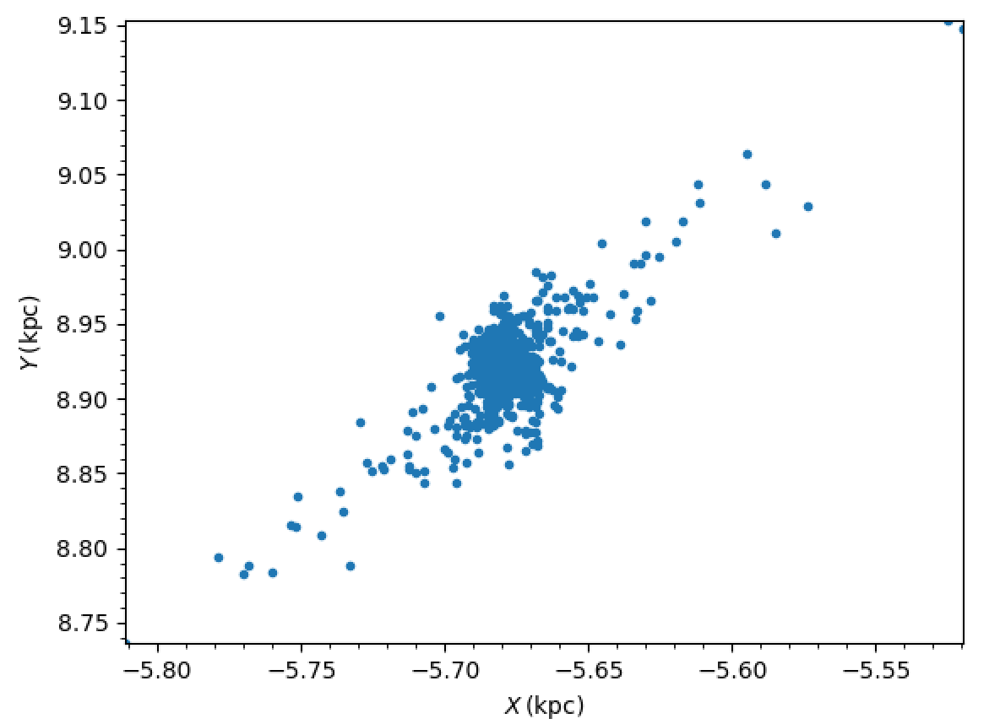

Dissipative forces
------------------

While almost all of the forces that you can use in ``galpy`` derive
from a potential (that is, the force is the gradient of a scalar
function, the potential, meaning that the forces are *conservative*),
``galpy`` also supports dissipative forces. Dissipative forces all
inherit from the ``DissipativeForce`` class and they are required to
take the velocity ``v=[vR,vT,vZ]`` in cylindrical coordinates as an
argument to the force in addition to the standard
``(R,z,phi=0,t=0)``. The set of functions ``evaluateXforces`` (with
``X=R,z,r,phi,etc.``) will evaluate the force due to ``Potential``
instances, ``DissipativeForce`` instances, or lists of combinations of
these two.

Currently, the only dissipative force implemented in ``galpy`` is
:ref:`ChandrasekharDynamicalFrictionForce <dynamfric_potential>`, an
implementation of the classic Chandrasekhar dynamical-friction
formula, with recent tweaks to better represent the results from
*N*-body simulations.

Note that there is currently no support for implementing dissipative
forces in C. Thus, only Python-based integration methods are available
for any dissipative forces.

.. WARNING::
   Dissipative forces can currently only be used for 3D orbits in ``galpy``. The code should throw an error when they are used for 2D orbits.

Adding potentials to the galpy framework
-----------------------------------------

Potentials in galpy can be used in many places such as orbit
integration, distribution functions, or the calculation of
action-angle variables, and in most cases any instance of a potential
class that inherits from the general ``Potential`` class (or a list of
such instances) can be given. For example, all orbit integration
routines work with any list of instances of the general ``Potential``
class. Adding new potentials to galpy therefore allows them to be used
everywhere in galpy where general ``Potential`` instances can be
used. Adding a new class of potentials to galpy consists of the
following series of steps (for steps to add a new wrapper potential,
also see :ref:`the next section <addwrappot>`):

1. Implement the new potential in a class that inherits from ``galpy.potential.Potential``. The new class should have an ``__init__`` method that sets up the necessary parameters for the class. An amplitude parameter ``amp=`` and two units parameters ``ro=`` and ``vo=`` should be taken as an argument for this class and before performing any other setup, the   ``galpy.potential.Potential.__init__(self,amp=amp,ro=ro,vo=vo,amp_units=)`` method should   be called to setup the amplitude and the system of units; the ``amp_units=`` keyword specifies the physical units of the amplitude parameter (e.g., ``amp_units='velocity2'`` when the units of the amplitude are velocity-squared) To add support for normalizing the   potential to standard galpy units, one can call the   ``galpy.potential.Potential.normalize`` function at the end of the __init__ function. 

.. _addpypot:

  The new potential class should implement some of the following
  functions: 

  * ``_evaluate(self,R,z,phi=0,t=0)`` which evaluates the
    potential itself (*without* the amp factor, which is added in the
    ``__call__`` method of the general Potential class).

  * ``_Rforce(self,R,z,phi=0.,t=0.)`` which evaluates the radial force
    in cylindrical coordinates (-d potential / d R).

  * ``_zforce(self,R,z,phi=0.,t=0.)`` which evaluates the vertical force
    in cylindrical coordinates (-d potential / d z).

  * ``_R2deriv(self,R,z,phi=0.,t=0.)`` which evaluates the second
    (cylindrical) radial derivative of the potential (d^2 potential /
    d R^2).

  * ``_z2deriv(self,R,z,phi=0.,t=0.)`` which evaluates the second
    (cylindrical) vertical derivative of the potential (d^2 potential /
    d z^2).

  * ``_Rzderiv(self,R,z,phi=0.,t=0.)`` which evaluates the mixed
    (cylindrical) radial and vertical derivative of the potential (d^2
    potential / d R d z).

  * ``_dens(self,R,z,phi=0.,t=0.)`` which evaluates the density. If
    not given, the density is computed using the Poisson equation from
    the first and second derivatives of the potential (if all are
    implemented).

  * ``_mass(self,R,z=0.,t=0.)`` which evaluates the mass. For
    spherical potentials this should give the mass enclosed within the
    spherical radius; for axisymmetric potentials this should return
    the mass up to ``R`` and between ``-Z`` and ``Z``. If not given,
    the mass is computed by integrating the density (if it is
    implemented or can be calculated from the Poisson equation).

  * ``_phiforce(self,R,z,phi=0.,t=0.)``: the azimuthal force in
    cylindrical coordinates (assumed zero if not implemented).

  * ``_phi2deriv(self,R,z,phi=0.,t=0.)``: the second azimuthal
    derivative of the potential in cylindrical coordinates (d^2
    potential / d phi^2; assumed zero if not given).

  * ``_Rphideriv(self,R,z,phi=0.,t=0.)``: the mixed radial and
    azimuthal derivative of the potential in cylindrical coordinates
    (d^2 potential / d R d phi; assumed zero if not given).

  * ``OmegaP(self)``: returns the pattern speed for potentials with a
    pattern speed (used to compute the Jacobi integral for orbits).

  If you want to be able to calculate the concentration for a
  potential, you also have to set self._scale to a scale parameter for
  your potential.

  The code for ``galpy.potential.MiyamotoNagaiPotential`` gives a good
  template to follow for 3D axisymmetric potentials. Similarly, the
  code for ``galpy.potential.CosmphiDiskPotential`` provides a good
  template for 2D, non-axisymmetric potentials.

  During development or if some of the forces or second derivatives
  are too tedious to implement, it is possible to numerically compute
  any non-implemented forces and second derivatives by inheriting from
  the :ref:`NumericalPotentialDerivativesMixin
  <numderivsmixin_potential>` class. Thus, a functioning potential can
  be implemented by simply implementing the ``_evaluate`` function and
  adding all forces and second derivatives using the
  ``NumericalPotentialDerivativesMixin``.

  After this step, the new potential will work in any part of galpy
  that uses pure python potentials. To get the potential to work with
  the C implementations of orbit integration or action-angle
  calculations, the potential also has to be implemented in C and the
  potential has to be passed from python to C.

  The ``__init__`` method should be written in such a way that a
  relevant object can be initialized using ``Classname()`` (i.e.,
  there have to be reasonable defaults given for all parameters,
  including the amplitude); doing this allows the nose tests for
  potentials to automatically check that your Potential's potential
  function, force functions, second derivatives, and density (through
  the Poisson equation) are correctly implemented (if they are
  implemented). The continuous-integration platform that builds the
  galpy codebase upon code pushes will then automatically test all of
  this, streamlining push requests of new potentials.

  A few atrributes need to be set depending on the potential:
  ``hasC=True`` for potentials for which the forces and potential are
  implemented in C (see below); ``self.hasC_dxdv=True`` for potentials
  for which the (planar) second derivatives are implemented in C;
  ``self.isNonAxi=True`` for non-axisymmetric potentials.

2. To add a C implementation of the potential, implement it in a .c file under ``potential/potential_c_ext``. Look at ``potential/potential_c_ext/LogarithmicHaloPotential.c`` for the right format for 3D, axisymmetric potentials, or at ``potential/potential_c_ext/LopsidedDiskPotential.c`` for 2D, non-axisymmetric potentials. 

 For orbit integration, the functions such as:

 * double LogarithmicHaloPotentialRforce(double R,double Z, double phi,double t,struct potentialArg * potentialArgs)
 * double LogarithmicHaloPotentialzforce(double R,double Z, double phi,double t,struct potentialArg * potentialArgs) 

 are most important. For some of the action-angle calculations

 * double LogarithmicHaloPotentialEval(double R,double Z, double phi,double t,struct potentialArg * potentialArgs)
 is most important (i.e., for those algorithms that evaluate the potential). The arguments of the potential are passed in a ``potentialArgs`` structure that contains ``args``, which are the arguments that should be unpacked. Again, looking at some example code will make this clear. The ``potentialArgs`` structure is defined in ``potential/potential_c_ext/galpy_potentials.h``.

3. Add the potential's function declarations to
``potential/potential_c_ext/galpy_potentials.h``

4. (4. and 5. for planar orbit integration) Edit the code under
``orbit/orbit_c_ext/integratePlanarOrbit.c`` to set up your new
potential (in the **parse_leapFuncArgs** function).

5. Edit the code in ``orbit/integratePlanarOrbit.py`` to set up your
new potential (in the **_parse_pot** function).

6. Edit the code under ``orbit/orbit_c_ext/integrateFullOrbit.c`` to
set up your new potential (in the **parse_leapFuncArgs_Full** function).

7. Edit the code in ``orbit/integrateFullOrbit.py`` to set up your
new potential (in the **_parse_pot** function).

8. (for using the actionAngleStaeckel methods in C) Edit the code in
``actionAngle/actionAngle_c_ext/actionAngle.c`` to parse the new
potential (in the **parse_actionAngleArgs** function).

9. Finally, add ``self.hasC= True`` to the initialization of the
potential in question (after the initialization of the super class, or
otherwise it will be undone). If you have implemented the necessary
second derivatives for integrating phase-space volumes, also add
``self.hasC_dxdv=True``.

After following the relevant steps, the new potential class can be
used in any galpy context in which C is used to speed up computations.

.. _addwrappot:

Adding wrapper potentials to the galpy framework
------------------------------------------------

Wrappers all inherit from the general ``WrapperPotential`` or
``planarWrapperPotential`` classes (which themselves inherit from the
``Potential`` and ``planarPotential`` classes and therefore all
wrappers are ``Potentials`` or ``planarPotentials``). Depending on the
complexity of the wrapper, wrappers can be implemented much more
economically in Python than new ``Potential`` instances as described
:ref:`above <addpot>`.

To add a Python implementation of a new wrapper, classes need to
inherit from ``parentWrapperPotential``, take the potentials to be
wrapped as a ``pot=`` (a ``Potential``, ``planarPotential``, or a list
thereof; automatically assigned to ``self._pot``) input to
``__init__``, and implement the
``_wrap(self,attribute,*args,**kwargs)`` function. This function
modifies the Potential functions ``_evaluate``, ``_Rforce``, etc. (all
of those listed :ref:`above <addpypot>`), with ``attribute`` the
function that is being modified. Inheriting from
``parentWrapperPotential`` gives the class access to the
``self._wrap_pot_func(attribute)`` function which returns the relevant
function for each attribute. For example,
``self._wrap_pot_func('_evaluate')`` returns the
``evaluatePotentials`` function that can then be called as
``self._wrap_pot_func('_evaluate')(self._pot,R,Z,phi=phi,t=t)`` to
evaluate the potentials being wrapped. By making use of
``self._wrap_pot_func``, wrapper potentials can be implemented in just
a few lines. Your ``__init__`` function should *only* initialize
things in your wrapper; there is no need to manually assign
``self._pot`` or to call the superclass' ``__init__`` (all
automatically done for you!).

To correctly work with both 3D and 2D potentials, inputs to ``_wrap``
need to be specified as ``*args,**kwargs``: grab the values you need
for ``R,z,phi,t`` from these as ``R=args[0], z=0 if len(args) == 1
else args[1], phi=kwargs.get('phi',0.), t=kwargs.get('t',0.)``, where
the complicated expression for z is to correctly deal with both 3D and
2D potentials (of course, if your wrapper depends on z, it probably
doesn't make much sense to apply it to a 2D planarPotential; you could
check the dimensionality of ``self._pot`` in your wrapper's
``__init__`` function with ``from galpy.potential.Potential._dim``
and raise an error if it is not 3 in this case). Wrapping a 2D
potential automatically results in a wrapper that is a subclass of
``planarPotential`` rather than ``Potential``; this is done by the
setup in ``parentWrapperPotential`` and hidden from the user. For
wrappers of planar Potentials, ``self._wrap_pot_func(attribute)`` will
return the ``evaluateplanarPotentials`` etc. functions instead, but
this is again hidden from the user if you implement the ``_wrap``
function as explained above.

As an example, for the ``DehnenSmoothWrapperPotential``, the ``_wrap``
function is

.. code-block:: Python

    def _wrap(self,attribute,*args,**kwargs):
        return self._smooth(kwargs.get('t',0.))\
                *self._wrap_pot_func(attribute)(self._pot,*args,**kwargs)

where ``smooth(t)`` returns the smoothing function of the
amplitude. When any of the basic ``Potential`` functions are called
(``_evaluate``, ``_Rforce``, etc.), ``_wrap`` gets called by the
superclass ``WrapperPotential``, and the ``_wrap`` function returns
the corresponding function for the wrapped potentials with the
amplitude modified by ``smooth(t)``. Therefore, one does not need to
implement each of the ``_evaluate``, ``_Rforce``, etc. functions like
for regular potential. The rest of the
``DehnenSmoothWrapperPotential`` is essentially (slightly simplified
in non-crucial aspects)

.. code-block:: Python

    def __init__(self,amp=1.,pot=None,tform=-4.,tsteady=None,ro=None,vo=None):
    	# Note: (i) don't assign self._pot and (ii) don't run super.__init__
        self._tform= tform
        if tsteady is None:
            self._tsteady= self._tform/2.
        else:
            self._tsteady= self._tform+tsteady
        self.hasC= True
        self.hasC_dxdv= True

    def _smooth(self,t):
        #Calculate relevant time
        if t < self._tform:
            smooth= 0.
        elif t < self._tsteady:
            deltat= t-self._tform
            xi= 2.*deltat/(self._tsteady-self._tform)-1.
            smooth= (3./16.*xi**5.-5./8*xi**3.+15./16.*xi+.5)
        else: #bar is fully on
            smooth= 1.
        return smooth

The source code for ``DehnenSmoothWrapperPotential`` potential may act
as a guide to implementing new wrappers.

C implementations of potential wrappers can also be added in a similar
way as C implementations of regular potentials (all of the steps
listed in the :ref:`previous section <addpypot>` for adding a
potential to C need to be followed). All of the necessary functions
(``...Rforce``, ``...zforce``, ``..phiforce``, etc.) need to be
implemented separately, but by including ``galpy_potentials.h``
calling the relevant functions of the wrapped potentials is easy. Look
at ``DehnenSmoothWrapperPotential.c`` for an example that can be
straightforwardly edited for other wrappers.

The glue between Python and C for wrapper potentials needs to glue
both the wrapper and the wrapped potentials. This can be easily
achieved by recursively calling the ``_parse_pot`` glue functions in
Python (see the previous section; this needs to be done separately for
each potential currently) and the ``parse_leapFuncArgs`` and
``parse_leapFuncArgs_Full`` functions in C (done automatically for all
wrappers). Again, following the example of
``DehnenSmoothWrapperPotential.py`` should allow for a straightforward
implementation of the glue for any new wrappers.  Wrapper potentials
should be given negative potential types in the glue to distinguish
them from regular potentials.

Adding dissipative forces to the galpy framework
------------------------------------------------

Dissipative forces are implemented in much the same way as forces that
derive from potentials. Rather than inheriting from
``galpy.potential.Potential``, dissipative forces inherit from
``galpy.potential.DissipativeForce``. The procedure for implementing a
new class of dissipative force is therefore very similar to that for
:ref:`implementing a new potential <addpypot>`. The main differences
are that (a) you only need to implement the forces and (b) the forces
are required to take an extra keyword argument ``v=`` that gives the
velocity in cylindrical coordinates (because dissipative forces will
in general depend on the current velocity). Thus, the steps are:

1. Implement the new dissipative force in a class that inherits from ``galpy.potential.DissipativeForce``. The new class should have an ``__init__`` method that sets up the necessary parameters for the class. An amplitude parameter ``amp=`` and two units parameters ``ro=`` and ``vo=`` should be taken as an argument for this class  and before performing any other setup, the   ``galpy.potential.DissipativeForce.__init__(self,amp=amp,ro=ro,vo=vo,amp_units=)`` method should   be called to setup the amplitude and the system of units; the ``amp_units=`` keyword specifies the physical units of the amplitude parameter (e.g., ``amp_units='mass'`` when the units of the amplitude are mass) 

  The new dissipative-force class should implement the following
  functions:

  * ``_Rforce(self,R,z,phi=0.,t=0.,v=None)`` which evaluates the
    radial force in cylindrical coordinates

  * ``_phiforce(self,R,z,phi=0.,t=0.,v=None)`` which evaluates the
    azimuthal force in cylindrical coordinates

  * ``_zforce(self,R,z,phi=0.,t=0.,v=None)`` which evaluates the
    vertical force in cylindrical coordinates

  The code for ``galpy.potential.ChandrasekharDynamicalFrictionForce``
  gives a good template to follow.

2. That's it, as for now there is no support for implementing a C
version of dissipative forces.
