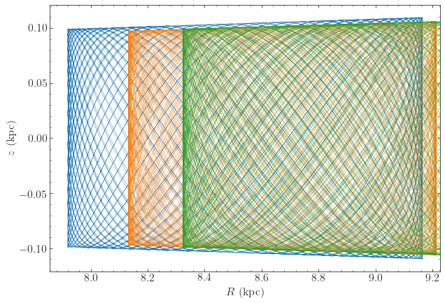
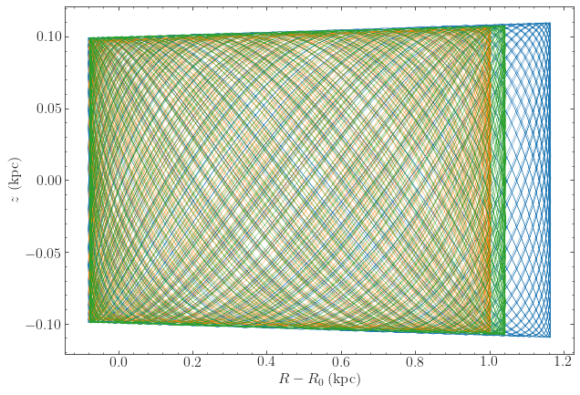
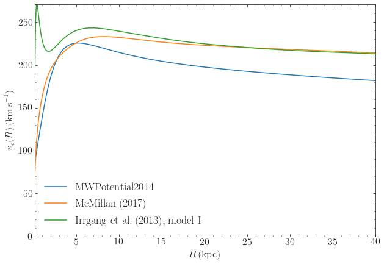

.. _potential-api:
Potential (``galpy.potential``)
===============================

3D potentials
-------------

General instance routines
+++++++++++++++++++++++++

Use as ``Potential-instance.method(...)``

.. toctree::
   :maxdepth: 2

   __add__ <potentialadd.rst>
   __mul__ <potentialmul.rst>
   __call__ <potentialcall.rst>
   dens <potentialdens.rst>
   dvcircdR <potentialdvcircdr.rst>
   epifreq <potentialepifreq.rst>
   flattening <potentialflattening.rst>
   lindbladR <potentiallindbladR.rst>
   mass <potentialmass.rst>
   nemo_accname <potentialnemoaccname.rst>
   nemo_accpars <potentialnemoaccpars.rst>
   omegac <potentialomegac.rst>
   phiforce <potentialphiforce.rst>
   phi2deriv <potentialphi2deriv.rst>
   plot <potentialplot.rst>
   plotDensity <potentialplotdensity.rst>
   plotEscapecurve <potentialplotescapecurve.rst>
   plotRotcurve <potentialplotrotcurve.rst>
   plotSurfaceDensity <potentialplotsurfacedensity.rst>
   Rphideriv <potentialrphideriv.rst>
   R2deriv <potentialr2deriv.rst>
   r2deriv <potentialsphr2deriv.rst>
   Rzderiv <potentialrzderiv.rst>
   Rforce <potentialrforce.rst>
   rforce <potentialsphrforce.rst>
   rhalf <potentialrhalf.rst>
   rl <potentialrl.rst>
   rtide <potentialrtide.rst>
   surfdens <potentialsurfdens.rst>
   tdyn <potentialtdyn.rst>
   toPlanar <potentialtoplanar.rst>
   toVertical <potentialtovertical.rst>
   ttensor <potentialttensor.rst>
   turn_physical_off <potentialturnphysicaloff.rst>
   turn_physical_on <potentialturnphysicalon.rst>
   vcirc <potentialvcirc.rst>
   verticalfreq <potentialverticalfreq.rst>
   vesc <potentialvesc.rst>
   vterm <potentialvterm.rst>
   z2deriv <potentialz2deriv.rst>
   zforce <potentialzforce.rst>
   zvc <potentialzvc.rst>
   zvc_range <potentialzvcrange.rst>

In addition to these, the ``NFWPotential`` also has methods to calculate virial quantities

.. toctree::
   :maxdepth: 2

   conc <potentialconc.rst>
   mvir <potentialmvir.rst>
   rmax <potentialrmax.rst>
   rvir <potentialrvir.rst>
   vmax <potentialvmax.rst>

General 3D potential routines
+++++++++++++++++++++++++++++

Use as ``method(...)``

.. toctree::
   :maxdepth: 2

   dvcircdR <potentialdvcircdrs.rst>
   epifreq <potentialepifreqs.rst>
   evaluateDensities <potentialdensities.rst>
   evaluatephiforces <potentialphiforces.rst>
   evaluatePotentials <potentialevaluate.rst>
   evaluatephi2derivs <potentialphi2derivs.rst>
   evaluateRphiderivs <potentialrphiderivs.rst>
   evaluateR2derivs <potentialr2derivs.rst>
   evaluater2derivs <potentialsphr2derivs.rst>
   evaluateRzderivs <potentialrzderivs.rst>
   evaluateRforces <potentialrforces.rst>
   evaluaterforces <potentialsphrforces.rst>
   evaluateSurfaceDensities <potentialsurfdensities.rst>
   evaluatez2derivs <potentialz2derivs.rst>
   evaluatezforces <potentialzforces.rst>
   flatten <potentialflatten.rst>
   flattening <potentialflattenings.rst>
   lindbladR <potentiallindbladRs.rst>
   mass <potentialmasses.rst>
   nemo_accname <potentialnemoaccnames.rst>
   nemo_accpars <potentialnemoaccparss.rst>
   omegac <potentialomegacs.rst>
   plotDensities <potentialplotdensities.rst>
   plotEscapecurve <potentialplotescapecurves.rst>
   plotPotentials <potentialplots.rst>
   plotRotcurve <potentialplotrotcurves.rst>
   plotSurfaceDensities <potentialplotsurfacedensities.rst>
   rhalf <potentialrhalfs.rst>
   rl <potentialrls.rst>
   rtide <potentialrtides.rst>
   tdyn <potentialtdyns.rst>
   to_amuse <potentialtoamuses.rst>
   ttensor <potentialttensors.rst>
   turn_physical_off <potentialturnphysicaloffs.rst>
   turn_physical_on <potentialturnphysicalons.rst>
   vcirc <potentialvcircs.rst>
   verticalfreq <potentialverticalfreqs.rst>
   vesc <potentialvescs.rst>
   vterm <potentialvterms.rst>
   zvc <potentialzvcs.rst>
   zvc_range <potentialzvcranges.rst>

In addition to these, the following methods are available to compute expansion coefficients for the ``SCFPotential`` class for a given density

.. toctree::
   :maxdepth: 2

   scf_compute_coeffs <potentialscfcompute.rst>
   scf_compute_coeffs_axi <potentialscfcomputeaxi.rst>
   scf_compute_coeffs_axi_nbody <potentialscfcomputeaxinbody.rst>
   scf_compute_coeffs_nbody <potentialscfcomputenbody.rst>
   scf_compute_coeffs_spherical <potentialscfcomputesphere.rst>
   scf_compute_coeffs_spherical_nbody <potentialscfcomputespherenbody.rst>

Specific potentials
+++++++++++++++++++

All of the following potentials can also be modified by the specific ``WrapperPotentials`` listed :ref:`below <potwrapperapi>`.

Spherical potentials
********************

Spherical potentials in ``galpy`` can be implemented in two ways: a)
directly by inheriting from ``Potential`` and implementing the usual
methods (``_evaluate``, ``_Rforce``, etc.) or b) by inheriting from
the general :ref:`SphericalPotential <sphericalpot>` class and
implementing the functions ``_revaluate(self,r,t=0.)``,
``_rforce(self,r,t=0.)``, ``_r2deriv(self,r,t=0.)``, and
``_rdens(self,r,t=0.)`` that evaluate the potential, radial force,
(minus the) radial force derivative, and density as a function of the
(here natural) spherical radius. For adding a C implementation when
using method b), follow similar steps in C (use
``interpSphericalPotential`` as an example to follow). For historical
reasons, most spherical potentials in ``galpy`` are directly
implemented (option a above), but for new spherical potentials it is
typically easier to follow option b).

Additional spherical potentials can be obtained by setting the axis
ratios equal for the triaxial potentials listed in the section on
ellipsoidal triaxial potentials below.

.. toctree::
   :maxdepth: 2

   potentialanyspherical.rst
   potentialburkert.rst
   potentialdoublepowerspher.rst
   potentialcoredehnen.rst
   potentialdehnen.rst
   potentialhernquist.rst
   potentialhomogsphere.rst
   potentialinterpsphere.rst
   potentialisochrone.rst
   potentialjaffe.rst
   potentialkepler.rst
   potentialnfw.rst
   potentialplummer.rst
   potentialpowerspher.rst
   potentialpowerspherwcut.rst
   potentialpseudoiso.rst
   potentialsphericalshell.rst

Axisymmetric potentials
***********************

Additional axisymmetric potentials can be obtained by setting the x/y
axis ratio equal to 1 for the triaxial potentials listed in the
section on ellipsoidal triaxial potentials below.

.. toctree::
   :maxdepth: 2

   potentialanyaxirazorthin.rst
   potentialdoubleexp.rst
   potentialflattenedpower.rst
   potentialinterprz.rst
   potentialinterpsnapshotrzpotential.rst
   potentialkuzmindisk.rst
   potentialkuzminkutuzov.rst
   potentialloghalo.rst
   potentialmiyamoto.rst
   potential3mn.rst
   potentialrazorexp.rst
   potentialring.rst
   potentialsnapshotrzpotential.rst

Ellipsoidal triaxial potentials
*******************************

``galpy`` has very general support for implementing triaxial (or the
oblate and prolate special cases) of ellipsoidal potentials through
the general :ref:`EllipsoidalPotential <ellipsoidal>` class. These
potentials have densities that are uniform on ellipsoids, thus only
functions of :math:`m^2 = x^2 + \frac{y^2}{b^2}+\frac{z^2}{c^2}`. New
potentials of this type can be implemented by inheriting from this
class and implementing the ``_mdens(self,m)``, ``_psi(self,m)``, and
``_mdens_deriv`` functions for the density, its integral with respect
to :math:`m^2`, and its derivative with respect to m,
respectively. For adding a C implementation, follow similar steps (use
``PerfectEllipsoidPotential`` as an example to follow).

.. toctree::
   :maxdepth: 2

   potentialperfectellipsoid.rst
   potentialdoublepowertriaxial.rst
   potentialtriaxialgaussian.rst
   potentialtriaxialjaffe.rst
   potentialtriaxialhernquist.rst
   potentialtriaxialnfw.rst

Note that the Ferrers potential listed below is a potential of this
type, but it is currently not implemented using the
``EllipsoidalPotential`` class.

Spiral, bar, other triaxial, and miscellaneous potentials
**********************************************************

.. toctree::
   :maxdepth: 2

   potentialdehnenbar.rst
   potentialferrers.rst
   potentialloghalo.rst
   potentialmovingobj.rst
   potentialsoftenedneedle.rst
   potentialspiralarms.rst

All ``galpy`` potentials can also be made to rotate using the ``SolidBodyRotationWrapperPotential`` listed in the section on wrapper potentials :ref:`below <potwrapperapi>`.

General Poisson solvers for disks and halos
*******************************************

.. toctree::
   :maxdepth: 2

   potentialdiskscf.rst
   potentialscf.rst

Dissipative forces
*******************

.. toctree::
   :maxdepth: 2

   potentialchandrasekhardynfric.rst

Helper classes
**************

.. toctree::
   :maxdepth: 2

   potentialnumericalpotentialderivsmixin.rst

.. _potential-mw:

Milky-Way-like potentials
-------------------------

``galpy`` contains various simple models for the Milky Way's
gravitational potential. The recommended model, described in `Bovy
(2015) <http://arxiv.org/abs/1412.3451>`_, is included as
``galpy.potential.MWPotential2014``. This potential was fit to a large
variety of data on the Milky Way and thus serves as both a simple and
accurate model for the Milky Way's potential (see `Bovy 2015
<http://arxiv.org/abs/1412.3451>`_ for full information on how this
potential was fit). Note that this potential assumes a circular
velocity of 220 km/s at the solar radius at 8 kpc. This potential is
defined as

>>> bp= PowerSphericalPotentialwCutoff(alpha=1.8,rc=1.9/8.,normalize=0.05)
>>> mp= MiyamotoNagaiPotential(a=3./8.,b=0.28/8.,normalize=.6)
>>> np= NFWPotential(a=16/8.,normalize=.35)
>>> MWPotential2014= bp+mp+np

and can thus be used like any list of ``Potentials``. The mass of the
dark-matter halo in ``MWPotential2014`` is on the low side of
estimates of the Milky Way's halo mass; if you want to adjust it, for
example making it 50% larger, you can simply multiply the halo part of
``MWPotential2014`` by 1.5 as (this type of multiplication works for
*any* potential in galpy)

>>> MWPotential2014[2]*= 1.5

If one wants to add the supermassive black hole at the Galactic
center, this can be done by

>>> from galpy.potential import KeplerPotential
>>> from galpy.util import conversion
>>> MWPotential2014wBH= MWPotential2014+KeplerPotential(amp=4*10**6./conversion.mass_in_msol(220.,8.))

for a black hole with a mass of :math:`4\times10^6\,M_{\odot}`. If you
want to take into account dynamical friction for, say, an object of
mass :math:`5\times 10^{10}\,M_\odot` and a half-mass radius of 5 kpc,
do

>>> from galpy.potential import ChandrasekharDynamicalFrictionForce
>>> from astropy import units
>>> cdf= ChandrasekharDynamicalFrictionForce(GMs=5.*10.**10.*units.Msun,
					     rhm=5.*units.kpc,
					     dens=MWPotential2014)
>>> MWPotential2014wDF= MWPotential2014+cdf

where we have specified the parameters of the dynamical friction with units; alternatively, convert them directly to ``galpy`` natural units  as

>>> cdf= ChandrasekharDynamicalFrictionForce(GMs=5.*10.**10./conversion.mass_in_msol(220.,8.),
					     rhm=5./8.,
					     dens=MWPotential2014)
>>> MWPotential2014wDF= MWPotential2014+cdf

As explained in :ref:`this section <nemopot>`, *without* this black
hole or dynamical friction, ``MWPotential2014`` can be used with
Dehnen's gyrfalcON code using ``accname=PowSphwCut+MiyamotoNagai+NFW``
and
``accpars=0,1001.79126907,1.8,1.9#0,306770.418682,3.0,0.28#0,16.0,162.958241887``.

``galpy`` also contains other models for the Milky Way's potential
from the literature in the ``galpy.potential.mwpotentials`` module
(which also contains ``MWPotential2014``). Currently, these are:

* ``McMillan17``: the potential model from `McMillan (2017) <https://ui.adsabs.harvard.edu/abs/2017MNRAS.465...76M>`_
* ``Irrgang13I``: model I from `Irrgang et al. (2013) <https://ui.adsabs.harvard.edu/abs/2013A%26A...549A.137I>`_, which is an updated version of the classic `Allen & Santillan (1991) <https://ui.adsabs.harvard.edu/abs/1991RMxAA..22..255A>`_
* ``Irrgang13II`` and ``Irrgang13III``: model II and III from `Irrgang et al. (2013) <https://ui.adsabs.harvard.edu/abs/2013A%26A...549A.137I>`_
* ``Cautun20``: the potential model from `Cautun et al. (2020) <https://ui.adsabs.harvard.edu/abs/2020MNRAS.494.4291C>`_
* ``DehnenBinney98I``, ``DehnenBinney98II``, ``DehnenBinney98III``, and ``DehnenBinney98IV`` for models 1 through 4 from `Dehnen & Binney (1998) <https://ui.adsabs.harvard.edu/abs/1998MNRAS.294..429D/abstract>`__.

Unlike ``MWPotential2014``, these potentials have physical units
turned on, using as the unit scaling parameters ``ro`` and ``vo`` the
distance to the Galactic center and the circular velocity at the Sun's
radius of each potential. These can be obtained using the
``galpy.util.conversion.get_physical`` function, e.g.,

>>> from galpy.potential.mwpotentials import McMillan17
>>> from galpy.util.conversion import get_physical
>>> get_physical(McMillan17)
# {'ro': 8.21, 'vo': 233.1}

This function returns the unit-conversion parameters as a dictionary,
so they can be easily passed to other functions. For example, when
integrating an orbit in these potentials and either initializing the
orbit using observed coordinates or converting the integrated orbit to
observed coordinates, it is important to use the same unit-conversion
parameters (otherwise an error will be raised). For example, to obtain
the orbit of the Sun in the ``McMillan17`` potential, we do

>>> from galpy.orbit import Orbit
>>> o= Orbit(**get_physical(McMillan17))

As an example, we integrate the Sun's orbit for 10 Gyr in
``MWPotential2014``, ``McMillan17`` and ``Irrgang13I``

>>> from galpy.potential.mwpotentials import MWPotential2014, McMillan17, Irrgang13I
>>> from galpy.orbit import Orbit
>>> from galpy.util.conversion import get_physical
>>> from astropy import units
>>> times= numpy.linspace(0.,10.,3001)*units.Gyr
>>> o_mwp14= Orbit(ro=8.,vo=220.) # Need to set these by hand
>>> o_mcm17= Orbit(**get_physical(McMillan17))
>>> o_irrI= Orbit(**get_physical(Irrgang13I))
>>> o_mwp14.integrate(times,MWPotential2014)
>>> o_mcm17.integrate(times,McMillan17)
>>> o_irrI.integrate(times,Irrgang13I)
>>> o_mwp14.plot(lw=0.6)
>>> o_mcm17.plot(overplot=True,lw=0.6)
>>> o_irrI.plot(overplot=True,lw=0.6)

which gives

Much of the difference between these orbits is due to the different
present Galactocentric radius of the Sun, if we simply plot the
difference with respect to the present Galactocentric radius, they
agree better

>>> o_mwp14.plot(d1='R-8.',d2='z',lw=0.6,xlabel=r'$R-R_0\,(\mathrm{kpc})$')
>>> o_mcm17.plot(d1='R-{}'.format(get_physical(McMillan17)['ro']),d2='z',overplot=True,lw=0.6)
>>> o_irrI.plot(d1='R-{}'.format(get_physical(Irrgang13I)['ro']),d2='z',overplot=True,lw=0.6)

We can also compare the rotation curves of these different models

>>> from galpy.potential import plotRotcurve
>>> plotRotcurve(MWPotential2014,label=r'$\mathrm{MWPotential2014}$',ro=8.,vo=220.) # need to set ro and vo explicitly, because MWPotential2014 has units turned off
>>> plotRotcurve(McMillan17,overplot=True,label=r'$\mathrm{McMillan\, (2017)}$')
>>> plotRotcurve(Irrgang13I,overplot=True,label=r'$\mathrm{Irrgang\ et\ al.\, (2017), model\ I}$')
>>> legend()

An older version ``galpy.potential.MWPotential`` of
``MWPotential2014`` that was *not* fit to data on the Milky Way is
defined as

>>> mp= MiyamotoNagaiPotential(a=0.5,b=0.0375,normalize=.6)
>>> np= NFWPotential(a=4.5,normalize=.35)
>>> hp= HernquistPotential(a=0.6/8,normalize=0.05)
>>> MWPotential= mp+np+hp

but ``galpy.potential.MWPotential2014`` supersedes
``galpy.potential.MWPotential`` and its use is no longer recommended.

2D potentials
-------------

General instance routines
+++++++++++++++++++++++++

Use as ``Potential-instance.method(...)``

.. toctree::
   :maxdepth: 2

   __add__ <potential2dadd.rst>
   __mul__ <potential2dmul.rst>
   __call__ <potential2dcall.rst>
   phiforce <potential2dphiforce.rst>
   Rforce <potential2drforce.rst>
   turn_physical_off <potential2dturnphysicaloff.rst>
   turn_physical_on <potential2dturnphysicalon.rst>

General axisymmetric potential instance routines
++++++++++++++++++++++++++++++++++++++++++++++++

Use as ``Potential-instance.method(...)``

.. toctree::
   :maxdepth: 2

   epifreq <potential2depifreq.rst>
   lindbladR <potential2dlindbladR.rst>
   omegac <potential2domegac.rst>
   plot <potential2dplot.rst>
   plotEscapecurve <potential2dplotescapecurve.rst>
   plotRotcurve <potential2dplotrotcurve.rst>
   vcirc <potential2dvcirc.rst>
   vesc <potential2dvesc.rst>

General 2D potential routines
+++++++++++++++++++++++++++++

Use as ``method(...)``

.. toctree::
   :maxdepth: 2

   evaluateplanarphiforces <potential2dphiforces.rst>
   evaluateplanarPotentials <potential2devaluate.rst>
   evaluateplanarRforces <potential2drforces.rst>
   evaluateplanarR2derivs <potential2dr2derivs.rst>
   flatten <potentialflatten.rst>
   LinShuReductionFactor <potential2dlinshureductionfactor.rst>
   plotEscapecurve <potentialplotescapecurves.rst>
   plotplanarPotentials <potential2dplots.rst>
   plotRotcurve <potentialplotrotcurves.rst>
   turn_physical_off <potentialturnphysicaloffs.rst>
   turn_physical_on <potentialturnphysicalons.rst>

Specific potentials
+++++++++++++++++++

All of the 3D potentials above can be used as two-dimensional
potentials in the mid-plane. 

.. toctree::
   :maxdepth: 2

   toPlanarPotential (general) <potential2dtoplanar.rst>
   RZToplanarPotential <potential2dRZtoplanar.rst>

In addition, a two-dimensional bar potential, two spiral potentials, the `Henon & Heiles (1964) <http://adsabs.harvard.edu/abs/1964AJ.....69...73H>`__ potential, and some static non-axisymmetric perturbations are included

.. toctree::
   :maxdepth: 2

   potentialdehnenbar.rst
   potentialcosmphidisk.rst
   potentialellipticaldisk.rst
   potentialhenonheiles.rst
   potentiallopsideddisk.rst
   potentialsteadylogspiral.rst
   potentialtransientlogspiral.rst

1D potentials
-------------

General instance routines
+++++++++++++++++++++++++

Use as ``Potential-instance.method(...)``

.. toctree::
   :maxdepth: 2

   __add__ <potential1dadd.rst>
   __mul__ <potential1dmul.rst>
   __call__ <potential1dcall.rst>
   force <potential1dforce.rst>
   plot <potential1dplot.rst>
   turn_physical_off <potential1dturnphysicaloff.rst>
   turn_physical_on <potential1dturnphysicalon.rst>

General 1D potential routines
+++++++++++++++++++++++++++++

Use as ``method(...)``

.. toctree::
   :maxdepth: 2

   evaluatelinearForces <potential1dforces.rst>
   evaluatelinearPotentials <potential1devaluate.rst>
   flatten <potentialflatten.rst>
   plotlinearPotentials <potential1dplots.rst>
   turn_physical_off <potentialturnphysicaloffs.rst>
   turn_physical_on <potentialturnphysicalons.rst>

Specific potentials
+++++++++++++++++++

.. toctree::
   :maxdepth: 2

   IsothermalDiskPotential <potentialisodisk.rst>
   KGPotential <potentialkg.rst>

One-dimensional potentials can also be derived from 3D axisymmetric potentials as the vertical potential at a certain Galactocentric radius

.. toctree::
   :maxdepth: 2

   toVerticalPotential (general) <potential1dtolinear.rst>
   RZToverticalPotential <potential1dRZtolinear.rst>

.. _potwrapperapi:

Potential wrappers
-------------------

Gravitational potentials in ``galpy`` can also be modified using wrappers, for example, to change their amplitude as a function of time. These wrappers can be applied to *any* ``galpy`` potential (although whether they can be used in C depends on whether the wrapper *and* all of the potentials that it wraps are implemented in C). Multiple wrappers can be applied to the same potential.

Specific wrappers
++++++++++++++++++

.. toctree::
   :maxdepth: 2

   potentialadiabaticcontractwrapper.rst
   potentialcorotwrapper.rst
   potentialdehnensmoothwrapper.rst
   potentialgaussampwrapper.rst
   potentialsolidbodyrotationwrapper.rst

