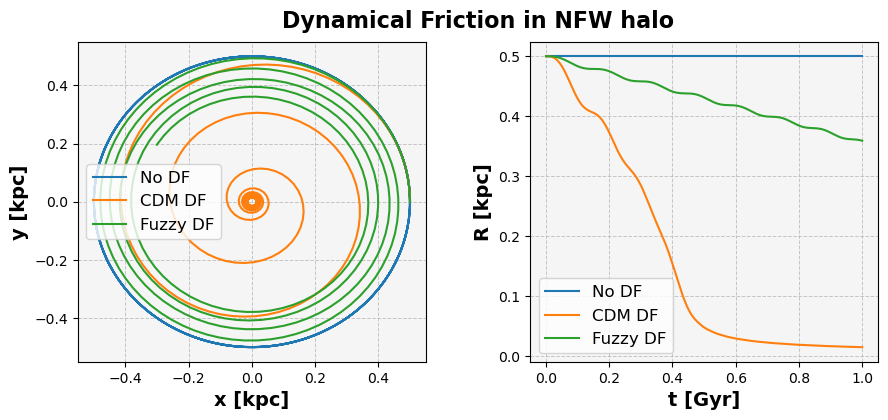

.. _dynamfric_potential:

Fuzzy-dark-matter dynamical friction
=====================================

As an example of using the ``FDMDynamicalFrictionForce`` detailed below, consider a dwarf galaxy:

.. code-block:: python

    import numpy
    from astropy import units as u
    from galpy.potential import NFWPotential
    M = 1e9  # Msol
    rs = 1.57  # kpc
    c = 18.4
    A_NFW = numpy.log(1 + c) - c / (1 + c)
    NFWHalo = NFWPotential(amp=M / A_NFW * u.Msun, a=rs * u.kpc)

and a globular cluster within it:

.. code-block:: python

    Mobj = 1e6  # Msol
    rhm = 1e-2  # kpc

Regular Chandrasekhar dynamical friction force can be computed using:

.. code-block:: python

    from galpy.potential import ChandrasekharDynamicalFrictionForce
    cdf = ChandrasekharDynamicalFrictionForce(GMs=Mobj * u.Msun, rhm=rhm * u.kpc, dens=NFWHalo)

The FDM dynamical friction force for a mass of :math:`3\times 10^{-22}\,\mathrm{eV}` can be computed using:

.. code-block:: python

    from galpy.potential import FDMDynamicalFrictionForce
    m = 3e-22  # mass of the fuzzy particle in eV
    fdf = FDMDynamicalFrictionForce(GMs=Mobj * u.Msun, rhm=rhm * u.kpc, dens=NFWHalo, m=m * u.eV)

We then set up an orbit and integrate it with both the CDM Chandrasekhar friction force and the FDM friction force as well as with no friction at all:

.. code-block:: python

    from galpy.orbit import Orbit
    # initial conditions
    R = 0.5
    z = 0.0
    phi = 0.0
    Menclosed = NFWHalo.mass(R * u.kpc)
    vR = 0.0
    vT = NFWHalo.vcirc(R * u.kpc, use_physical=True, quantity= False)
    vz = 0.0
    o = Orbit([R * u.kpc,vR * u.km / u.s,vT * u.km / u.s,z * u.kpc,vz * u.km / u.s,phi * u.rad])
    o_cdf = o()  # copy of orbit for dynamical friction
    o_fdf = o()  # copy of orbit for fuzzy dynamical friction
    # Integrate the orbit
    t = numpy.linspace(0, 1, 300) * u.Gyr
    o.integrate(t, NFWHalo)
    o_cdf.integrate(t, NFWHalo + cdf)
    o_fdf.integrate(t, NFWHalo + fdf)

The results can be plotted using:

.. code-block:: python

    import matplotlib.pyplot as plt
    plt.figure(figsize=(10, 4))
    plt.subplot(121)
    plt.plot(o.x(t), o.y(t), label="No DF")
    plt.plot(o_cdf.x(t), o_cdf.y(t), label="CDM DF")
    plt.plot(o_fdf.x(t), o_fdf.y(t), label="Fuzzy DF")
    plt.xlabel("x [kpc]", fontsize=14, fontweight="bold")
    plt.ylabel("y [kpc]", fontsize=14, fontweight="bold")
    plt.gca().set_facecolor("whitesmoke")
    plt.grid(True, which="both", linestyle="--", linewidth=0.7, alpha=0.7)
    plt.legend(fontsize=12)

    plt.subplot(122)
    plt.plot(t, o.R(t), label="No DF")
    plt.plot(t, o_cdf.R(t), label="CDM DF")
    plt.plot(t, o_fdf.R(t), label="Fuzzy DF")
    plt.xlabel("t [Gyr]", fontsize=14, fontweight="bold")
    plt.ylabel("R [kpc]", fontsize=14, fontweight="bold")
    plt.legend(fontsize=12)
    plt.tight_layout(pad=2.5)
    plt.subplots_adjust(left=0.1, right=0.9, top=0.9, bottom=0.1, wspace=0.3)
    plt.gca().set_facecolor("whitesmoke")
    plt.grid(True, which="both", linestyle="--", linewidth=0.7, alpha=0.7)

    plt.suptitle("Dynamical Friction in NFW halo", fontsize=16, fontweight="bold")
    plt.show()

which gives

.. autoclass:: galpy.potential.FDMDynamicalFrictionForce
   :members: __init__
