.. _stream-tutorial:

Dynamical modeling of tidal streams
++++++++++++++++++++++++++++++++++++

galpy contains tools to model the dynamics of tidal streams, making
extensive use of action-angle variables. As an example, we can model
the dynamics of the following tidal stream (that of Bovy 2014;
`2014ApJ...795...95B
<http://adsabs.harvard.edu/abs/2014ApJ...795...95B>`_). This movie
shows the disruption of a cluster on a GD-1-like orbit around the
Milky Way:

.. raw:: html

   <video width="600" height="400" controls>
     <source src="http://astro.utoronto.ca/~bovy/streams/gd1-sim/gd1_evol_orbplane_comov.mpg" type="video/mp4">
   </video>

The blue line is the orbit of the progenitor cluster and the black
points are cluster members. The disruption is shown in an approximate
orbital plane and the movie is comoving with the progenitor cluster.

Streams can be represented by simple dynamical models in action-angle
coordinates. In action-angle coordinates, stream members are stripped
from the progenitor cluster onto orbits specified by a set of actions
:math:`(J_R,J_\phi,J_Z)`, which remain constant after the stars have
been stripped. This is shown in the following movie, which shows the
generation of the stream in action space

.. raw:: html

   <video width="600" height="400" controls>
     <source src="http://astro.utoronto.ca/~bovy/streams/gd1-sim/gd1_evol_aai_jrjzlz_debris.mpg" type="video/mp4">
   </video>

The color-coding gives the angular momentum :math:`J_\phi` and the
black dot shows the progenitor orbit. These actions were calculated
using ``galpy.actionAngle.actionAngleIsochroneApprox``. The points
move slightly because of small errors in the action calculation (these
are correlated, so the cloud of points moves coherently because of
calculation errors). The same movie that also shows the actions of
stars in the cluster can be found `here
<http://astro.utoronto.ca/~bovy/streams/gd1-sim/gd1_evol_aai_jrjzlz.mpg>`_. This
shows that the actions of stars in the cluster are not conserved
(because the self-gravity of the cluster is important), but that the
actions of stream members freeze once they are stripped. The angle
difference between stars in a stream and the progenitor increases
linearly with time, which is shown in the following movie:

.. raw:: html

   <video width="600" height="400" controls>
     <source src="http://astro.utoronto.ca/~bovy/streams/gd1-sim/gd1_evol_aai_arazap.mpg" type="video/mp4">
   </video>

where the radial and vertical angle difference with respect to the
progenitor (co-moving at :math:`(\theta_R,\theta_\phi,\theta_Z) =
(\pi,\pi,\pi)`) is shown for each snapshot (the color-coding gives
:math:`\theta_\phi`).

One last movie provides further insight in how a stream evolves over
time. The following movie shows the evolution of the stream in the two
dimensional plane of frequency and angle along the stream (that is,
both are projections of the three dimensional frequencies or angles
onto the angle direction along the stream). The points are color-coded
by the time at which they were removed from the progenitor cluster.

.. raw:: html

   <video width="600" height="400" controls>
     <source src="http://astro.utoronto.ca/~bovy/streams/gd1-sim/gd1_evol_aai_oparapar.mpg" type="video/mp4">
   </video>

It is clear that disruption happens in bursts (at pericenter passages)
and that the initial frequency distribution at the time of removal
does not change (much) with time. However, stars removed at larger
frequency difference move away from the cluster faster, such that the
end of the stream is primarily made up of stars with large frequency
differences with respect to the progenitor. This leads to a gradient
in the typical orbit in the stream, and the stream is on average *not*
on a single orbit.

Modeling streams in galpy
-------------------------

In galpy we can model streams using the tools in
``galpy.df.streamdf``. We setup a streamdf instance by specifying the
host gravitational potential ``pot=``, an actionAngle method
(typically ``galpy.actionAngle.actionAngleIsochroneApprox``), a
``galpy.orbit.Orbit`` instance with the position of the progenitor, a
parameter related to the velocity dispersion of the progenitor, and
the time since disruption began. We first import all of the necessary
modules

>>> from galpy.df import streamdf
>>> from galpy.orbit import Orbit
>>> from galpy.potential import LogarithmicHaloPotential
>>> from galpy.actionAngle import actionAngleIsochroneApprox
>>> from galpy.util import conversion #for unit conversions

setup the potential and actionAngle instances

>>> lp= LogarithmicHaloPotential(normalize=1.,q=0.9)
>>> aAI= actionAngleIsochroneApprox(pot=lp,b=0.8)

define a progenitor Orbit instance

>>> obs= Orbit([1.56148083,0.35081535,-1.15481504,0.88719443,-0.47713334,0.12019596])

and instantiate the streamdf model

>>> sigv= 0.365 #km/s
>>> sdf= streamdf(sigv/220.,progenitor=obs,pot=lp,aA=aAI,leading=True,nTrackChunks=11,tdisrupt=4.5/conversion.time_in_Gyr(220.,8.))

for a leading stream. This runs in about half a minute on a 2011
Macbook Air. 

Bovy (2014) discusses how the calculation of the track needs to be
iterated for potentials where there is a large offset between the
track and a single orbit. One can increase the default number of
iterations by specifying ``nTrackIterations=`` in the streamdf
initialization (the default is set based on the angle between the
track's frequency vector and the progenitor orbit's frequency vector;
you can access the number of iterations used as
``sdf.nTrackIterations``). To check whether the track is calculated
accurately, one can use the following

>>> sdf.plotCompareTrackAAModel()

which in this case gives

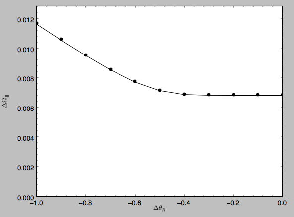

This displays the stream model's track in frequency offset (y axis)
versus angle offset (x axis) as the solid line; this is the track that
the model should have if it is calculated correctly. The points are
the frequency and angle offset calculated from the calculated track's
:math:`(\mathbf{x},\mathbf{v})`. For a properly computed track these
should line up, as they do in this figure. If they do not line up,
increasing ``nTrackIterations`` is necessary.

We can calculate some simple properties of the stream, such as the
ratio of the largest and second-to-largest eigenvalue of the Hessian
:math:`\partial \mathbf{\Omega} / \partial \mathbf{J}`

>>> sdf.freqEigvalRatio(isotropic=True)
# 34.450028399901434

or the model's ratio of the largest and second-to-largest eigenvalue
of the model frequency variance matrix

>>> sdf.freqEigvalRatio()
# 29.625538344985291

The fact that this ratio is so large means that an approximately one
dimensional stream will form.

Similarly, we can calculate the angle between the frequency vector of
the progenitor and of the model mean frequency vector

>>> sdf.misalignment()
# 0.0086441947505973005

which returns this angle in radians. We can also calculate the angle
between the frequency vector of the progenitor and the principal
eigenvector of :math:`\partial \mathbf{\Omega} / \partial \mathbf{J}`

>>> sdf.misalignment(isotropic=True)
# 0.02238411611147997

(the reason these are obtained by specifying ``isotropic=True`` is
that these would be the ratio of the eigenvalues or the angle if we
assumed that the disrupted materials action distribution were
isotropic).

Calculating the average stream location (track)
-----------------------------------------------

We can display the stream track in various coordinate systems as
follows

>>> sdf.plotTrack(d1='r',d2='z',interp=True,color='k',spread=2,overplot=False,lw=2.,scaleToPhysical=True)

which gives

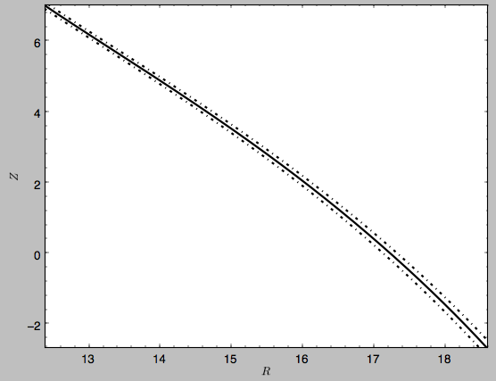

which shows the track in Galactocentric *R* and *Z* coordinates as
well as an estimate of the spread around the track as the dash-dotted
line. We can overplot the points along the track along which the
:math:`(\mathbf{x},\mathbf{v}) \rightarrow
(\mathbf{\Omega},\boldsymbol{\theta})` transformation and the track
position is explicitly calculated, by turning off the interpolation

>>> sdf.plotTrack(d1='r',d2='z',interp=False,color='k',spread=0,overplot=True,ls='none',marker='o',scaleToPhysical=True)

which gives

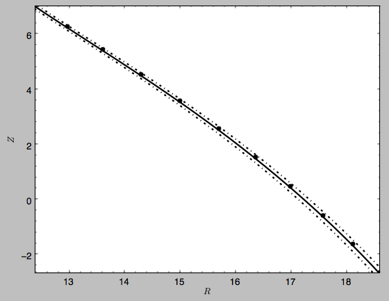

We can also overplot the orbit of the progenitor

>>> sdf.plotProgenitor(d1='r',d2='z',color='r',overplot=True,ls='--',scaleToPhysical=True)

to give

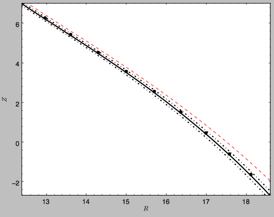

We can do the same in other coordinate systems, for example *X* and
*Z* (as in Figure 1 of Bovy 2014)

>>> sdf.plotTrack(d1='x',d2='z',interp=True,color='k',spread=2,overplot=False,lw=2.,scaleToPhysical=True)
>>> sdf.plotTrack(d1='x',d2='z',interp=False,color='k',spread=0,overplot=True,ls='none',marker='o',scaleToPhysical=True)
>>> sdf.plotProgenitor(d1='x',d2='z',color='r',overplot=True,ls='--',scaleToPhysical=True)
>>> xlim(12.,14.5); ylim(-3.5,7.6)

which gives

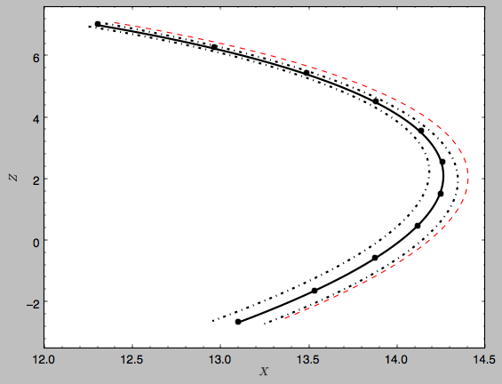

or we can calculate the track in observable coordinates, e.g., 

>>> sdf.plotTrack(d1='ll',d2='dist',interp=True,color='k',spread=2,overplot=False,lw=2.)
>>> sdf.plotTrack(d1='ll',d2='dist',interp=False,color='k',spread=0,overplot=True,ls='none',marker='o')
>>> sdf.plotProgenitor(d1='ll',d2='dist',color='r',overplot=True,ls='--')
>>> xlim(155.,255.); ylim(7.5,14.8)

which displays

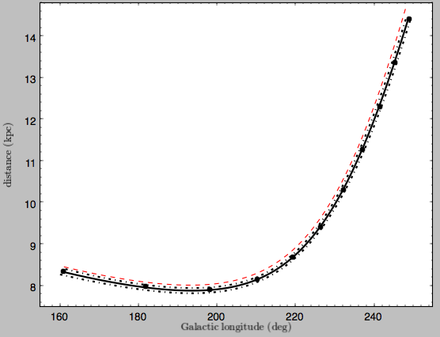

Coordinate transformations to physical coordinates are done using
parameters set when initializing the ``sdf`` instance. See the help
for ``?streamdf`` for a complete list of initialization parameters.

Mock stream data generation
----------------------------

We can also easily generate mock data from the stream model. This uses
``streamdf.sample``. For example,

>>> RvR= sdf.sample(n=1000)

which returns the sampled points as a set
:math:`(R,v_R,v_T,Z,v_Z,\phi)` in natural galpy coordinates. We can
plot these and compare them to the track location

>>> sdf.plotTrack(d1='r',d2='z',interp=True,color='b',spread=2,overplot=False,lw=2.,scaleToPhysical=True)
>>> plot(RvR[0]*8.,RvR[3]*8.,'k.',ms=2.) #multiply by the physical distance scale
>>> xlim(12.,16.5); ylim(2.,7.6)

which gives

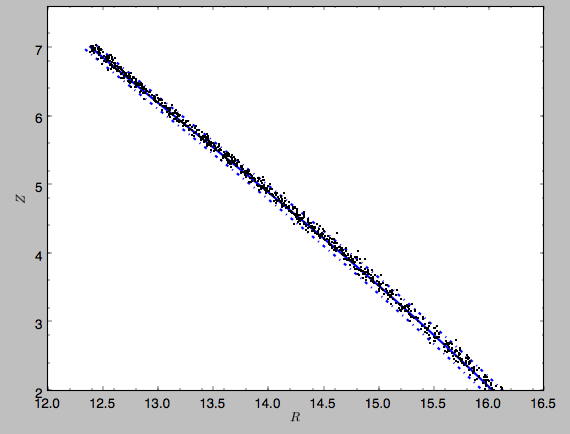

Similarly, we can generate mock data in observable coordinates

>>> lb= sdf.sample(n=1000,lb=True)

and plot it

>>> sdf.plotTrack(d1='ll',d2='dist',interp=True,color='b',spread=2,overplot=False,lw=2.)
>>> plot(lb[0],lb[2],'k.',ms=2.)
>>> xlim(155.,235.); ylim(7.5,10.8)

which displays

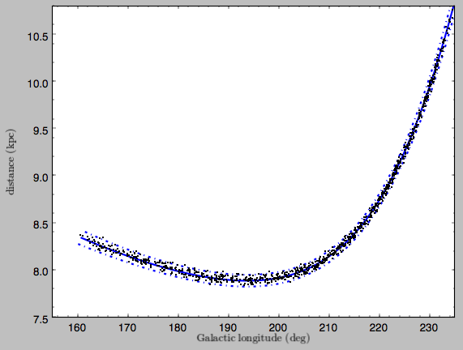

We can also just generate mock stream data in frequency-angle coordinates

>>> mockaA= sdf.sample(n=1000,returnaAdt=True)

which returns a tuple with three components: an array with shape [3,N]
of frequency vectors :math:`(\Omega_R,\Omega_\phi,\Omega_Z)`, an array
with shape [3,N] of angle vectors
:math:`(\theta_R,\theta_\phi,\theta_Z)` and :math:`t_s`, the stripping
time. We can plot the vertical versus the radial frequency

>>> plot(mockaA[0][0],mockaA[0][2],'k.',ms=2.)

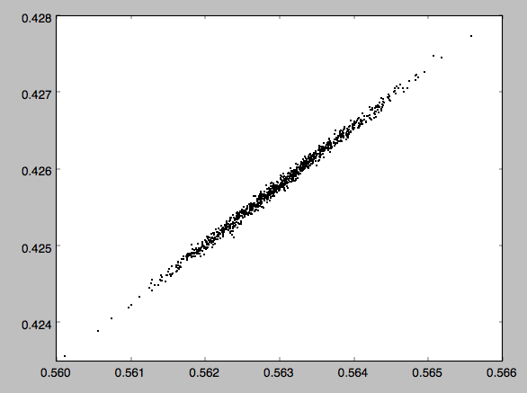

or we can plot the magnitude of the angle offset as a function of
stripping time

>>> plot(mockaA[2],numpy.sqrt(numpy.sum((mockaA[1]-numpy.tile(sdf._progenitor_angle,(1000,1)).T)**2.,axis=0)),'k.',ms=2.)

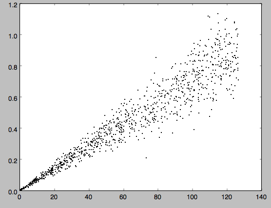

Evaluating and marginalizing the full PDF
-----------------------------------------

We can also evaluate the stream PDF, the probability of a
:math:`(\mathbf{x},\mathbf{v})` phase-space position in the stream. We
can evaluate the PDF, for example, at the location of the progenitor

>>> sdf(obs.R(),obs.vR(),obs.vT(),obs.z(),obs.vz(),obs.phi())
# array([-33.16985861])

which returns the natural log of the PDF. If we go to slightly higher in
*Z* and slightly smaller in *R*, the PDF becomes zero

>>> sdf(obs.R()-0.1,obs.vR(),obs.vT(),obs.z()+0.1,obs.vz(),obs.phi())
# array([-inf])

because this phase-space position cannot be reached by a leading
stream star. We can also marginalize the PDF over unobserved
directions. For example, similar to Figure 10 in Bovy (2014), we can
evaluate the PDF :math:`p(X|Z)` near a point on the track, say near
*Z* =2 kpc (=0.25 in natural units. We first find the approximate
Gaussian PDF near this point, calculated from the stream track and
dispersion (see above)

>>> meanp, varp= sdf.gaussApprox([None,None,2./8.,None,None,None])

where the input is a array with entries [X,Y,Z,vX,vY,vZ] and we
substitute None for directions that we want to establish the
approximate PDF for. So the above expression returns an approximation
to :math:`p(X,Y,v_X,v_Y,v_Z|Z)`. This approximation allows us to get a
sense of where the PDF peaks and what its width is

>>> meanp[0]*8.
# 14.267559400127833
>>> numpy.sqrt(varp[0,0])*8.
# 0.04152968631186698

We can now evaluate the PDF :math:`p(X|Z)` as a function of *X* near
the peak

>>> xs= numpy.linspace(-3.*numpy.sqrt(varp[0,0]),3.*numpy.sqrt(varp[0,0]),21)+meanp[0]
>>> logps= numpy.array([sdf.callMarg([x,None,2./8.,None,None,None]) for x in xs])
>>> ps= numpy.exp(logps)

and we normalize the PDF

>>> ps/= numpy.sum(ps)*(xs[1]-xs[0])*8.

and plot it together with the Gaussian approximation

>>> plot(xs*8.,ps)
>>> plot(xs*8.,1./numpy.sqrt(2.*numpy.pi)/numpy.sqrt(varp[0,0])/8.*numpy.exp(-0.5*(xs-meanp[0])**2./varp[0,0]))

which gives

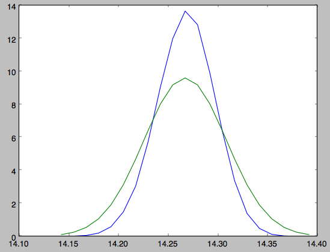

Sometimes it is hard to automatically determine the closest point on
the calculated track if only one phase-space coordinate is given. For
example, this happens when evaluating :math:`p(Z|X)` for *X* > 13 kpc
here, where there are two branches of the track in *Z* (see the figure
of the track above). In that case, we can determine the closest track
point on one of the branches by hand and then provide this closest
point as the basis of PDF calculations. The following example shows
how this is done for the upper *Z* branch at *X* = 13.5 kpc, which is
near *Z* =5 kpc (Figure 10 in Bovy 2014).

>>> cindx= sdf.find_closest_trackpoint(13.5/8.,None,5.32/8.,None,None,None,xy=True)

gives the index of the closest point on the calculated track. This index can then be given as an argument for the PDF functions:

>>> meanp, varp= meanp, varp= sdf.gaussApprox([13.5/8.,None,None,None,None,None],cindx=cindx)

computes the approximate :math:`p(Y,Z,v_X,v_Y,v_Z|X)` near the upper
*Z* branch. In *Z*, this PDF has mean and dispersion

>>> meanp[1]*8.
# 5.4005530328542077
>>> numpy.sqrt(varp[1,1])*8.
# 0.05796023309510244

We can then evaluate :math:`p(Z|X)` for the upper branch as

>>> zs= numpy.linspace(-3.*numpy.sqrt(varp[1,1]),3.*numpy.sqrt(varp[1,1]),21)+meanp[1]
>>> logps= numpy.array([sdf.callMarg([13.5/8.,None,z,None,None,None],cindx=cindx) for z in zs])
>>> ps= numpy.exp(logps)
>>> ps/= numpy.sum(ps)*(zs[1]-zs[0])*8.

and we can again plot this and the approximation

>>> plot(zs*8.,ps)
>>> plot(zs*8.,1./numpy.sqrt(2.*numpy.pi)/numpy.sqrt(varp[1,1])/8.*numpy.exp(-0.5*(zs-meanp[1])**2./varp[1,1]))

which gives

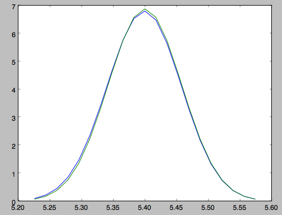

The approximate PDF in this case is very close to the correct
PDF. When supplying the closest track point, care needs to be taken
that this really is the closest track point. Otherwise the approximate
PDF will not be quite correct.
 

.. _streamgap-tutorial:

Modeling gaps in streams
------------------------

``galpy`` also contains tools to model the effect of impacts due to
dark-matter subhalos on streams (see `Sanders, Bovy, & Erkal 2015
<http://arxiv.org/abs/1510.03426>`__). This is implemented as a
subclass ``streamgapdf`` of ``streamdf``, because they share many of
the same methods. Setting up a ``streamgapdf`` object requires the
same arguments and keywords as setting up a ``streamdf`` instance (to
specify the smooth underlying stream model and the Galactic potential)
as well as parameters that specify the impact (impact parameter and
velocity, location and time of closest approach, mass and structure of
the subhalo, and helper keywords that specify how the impact should be
calculated). An example used in the paper (but not that with the
modifications in Sec. 6.1) is as follows. Imports:

>>> from galpy.df import streamdf, streamgapdf
>>> from galpy.orbit import Orbit
>>> from galpy.potential import LogarithmicHaloPotential
>>> from galpy.actionAngle import actionAngleIsochroneApprox
>>> from galpy.util import conversion

Parameters for the smooth stream and the potential:

>>> lp= LogarithmicHaloPotential(normalize=1.,q=0.9)
>>> aAI= actionAngleIsochroneApprox(pot=lp,b=0.8)
>>> prog_unp_peri= Orbit([2.6556151742081835,
                          0.2183747276300308,
                          0.67876510797240575,
                          -2.0143395648974671,
                          -0.3273737682604374,
                          0.24218273922966019])
>>> V0, R0= 220., 8.
>>> sigv= 0.365*(10./2.)**(1./3.) # km/s
>>> tdisrupt= 10.88/conversion.time_in_Gyr(V0,R0)

and the parameters of the impact

>>> GM= 10.**-2./conversion.mass_in_1010msol(V0,R0)
>>> rs= 0.625/R0
>>> impactb= 0.
>>> subhalovel= numpy.array([6.82200571,132.7700529,149.4174464])/V0
>>> timpact= 0.88/conversion.time_in_Gyr(V0,R0)
>>> impact_angle= -2.34

The setup is then

>>> sdf_sanders15= streamgapdf(sigv/V0,progenitor=prog_unp_peri,pot=lp,aA=aAI,
                               leading=False,nTrackChunks=26,
                               nTrackIterations=1,
                               sigMeanOffset=4.5,
                               tdisrupt=tdisrupt,
                               Vnorm=V0,Rnorm=R0,
                               impactb=impactb,
                               subhalovel=subhalovel,
                               timpact=timpact,
                               impact_angle=impact_angle,
                               GM=GM,rs=rs)

The ``streamgapdf`` implementation is currently not entirely complete
(for example, one cannot yet evaluate the full phase-space PDF), but
the model can be sampled as in the paper above. To compare the
perturbed model to the unperturbed model, we also set up an
unperturbed model of the same stream

>>> sdf_sanders15_unp= streamdf(sigv/V0,progenitor=prog_unp_peri,pot=lp,aA=aAI,
                               leading=False,nTrackChunks=26,
                               nTrackIterations=1,
                               sigMeanOffset=4.5,
                               tdisrupt=tdisrupt,
                               Vnorm=V0,Rnorm=R0)

We can then sample positions and velocities for the perturbed and
unperturbed preduction for the *same* particle by using the same
random seed:

>>> numpy.random.seed(1)
>>> xv_mock_per= sdf_sanders15.sample(n=100000,xy=True).T
>>> numpy.random.seed(1) # should give same points
>>> xv_mock_unp= sdf_sanders15_unp.sample(n=100000,xy=True).T

and we can plot the offset due to the perturbation, for example,

>>> plot(xv_mock_unp[:,0]*R0,(xv_mock_per[:,0]-xv_mock_unp[:,0])*R0,'k,')

for the difference in :math:`X` as a function of unperturbed :math:`X`:

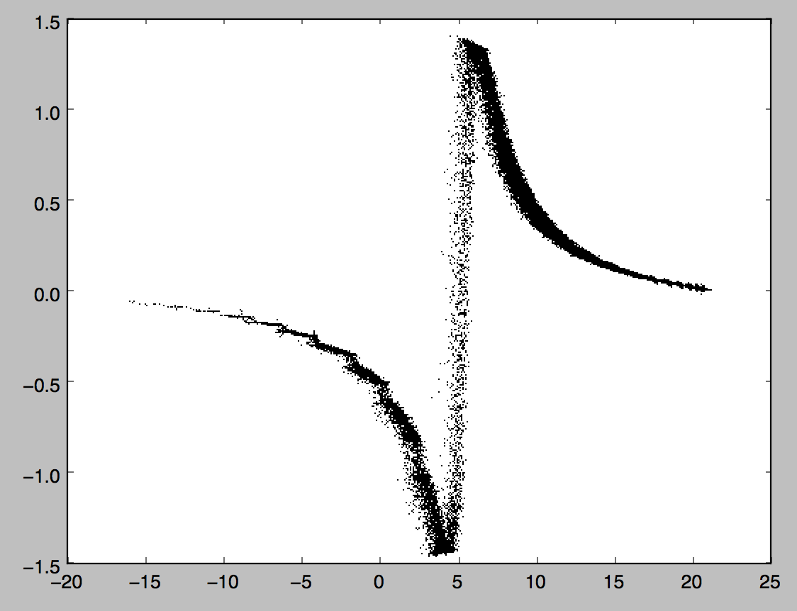

or 

>>> plot(xv_mock_unp[:,0]*R0,(xv_mock_per[:,4]-xv_mock_unp[:,4])*V0,'k,')

for the difference in :math:`v_Y` as a function of unperturbed :math:`X`:

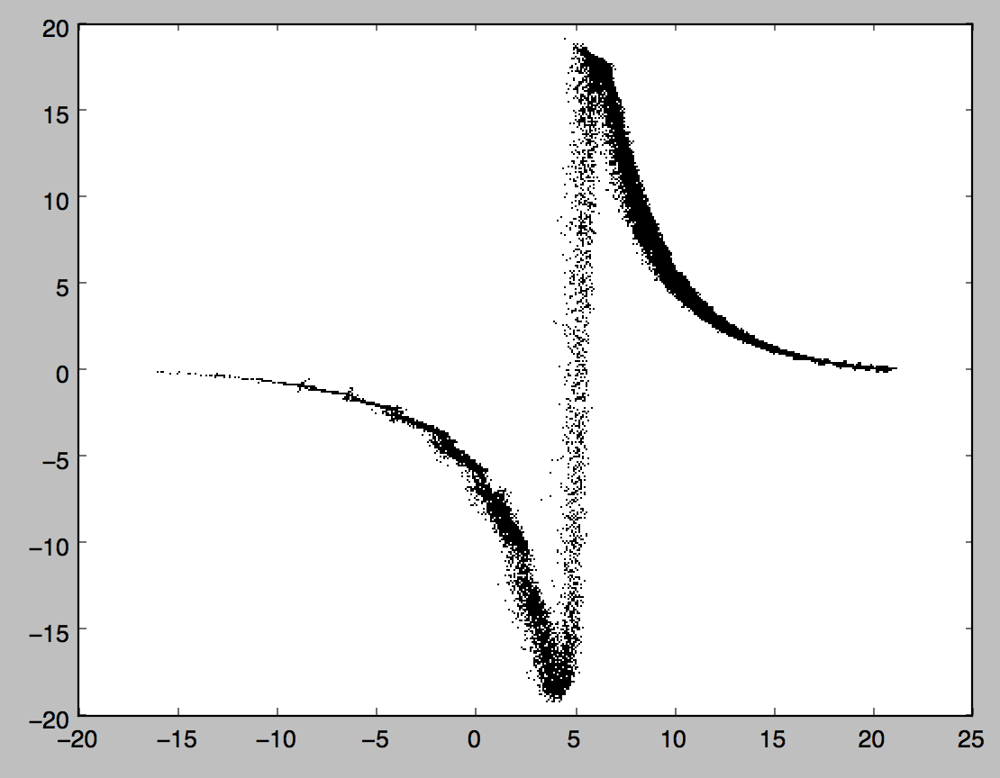
